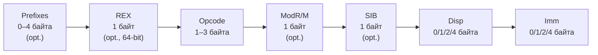

# Глава IV — Програмен модел и система команди на x86 микропроцесорите

---

## 1. Програмен модел. Регистри с общо предназначение

### 32-битов програмен модел (IA-32)

Програмно достъпните регистри в защитен 32-битов режим:

**Регистри с общо предназначение (GPR) — 8 × 32 бита** (EAX, EBX, ECX, EDX, ESI, EDI, ESP, EBP) и техните 16/8-битови частични подрегистри:

| 64-бита (x86-64) | 32-бита | 16-бита | 8H (15-8) | 8L (7-0) | Предназначение |
|---|---|---|---|---|---|
| RAX | EAX | AX | AH | AL | Акумулатор / резултат |
| RBX | EBX | BX | BH | BL | Базов регистър |
| RCX | ECX | CX | CH | CL | Брояч (loop, shift) |
| RDX | EDX | DX | DH | DL | Данни / I/O |
| RSI | ESI | SI | — | SIL | Изходен индекс |
| RDI | EDI | DI | — | DIL | Входен индекс |
| RSP | ESP | SP | — | SPL | Стеков указател |
| RBP | EBP | BP | — | BPL | Базов указател на кадъра |

**Указател на инструкциите:**
- `EIP` [31..0] — указва текущата инструкция

**Регистър на флаговете:**
- `EFLAGS` [31..0] — флагове за статус и управление

**Сегментни регистри (6 × 16 бита):**
- `CS` (Code Segment), `DS` (Data Segment), `SS` (Stack Segment)
- `ES`, `FS`, `GS` (допълнителни данни)

### 64-битов програмен модел (Intel 64 / AMD64)

**16 × 64-битови GPR** (RAX–RBP: разширения на IA-32; R8–R15: нови в x86-64):

| 64-бита | 32-бита | 16-бита | 8-бита | Бележки |
|---|---|---|---|---|
| RAX–RBP | EAX–EBP | AX–BP | AL/AH–BPL | Разширения на IA-32 (8 регистъра) |
| R8–R15 | R8D–R15D | R8W–R15W | R8B–R15B | Нови в x86-64 (8 регистъра) |
| RIP | EIP | — | — | Указател на инструкциите |
| RFLAGS | EFLAGS | FLAGS | — | Флагов регистър |

**Достъп към части на 64-битовите регистри:** RAX[63..0] → EAX[31..0] (нулира горните 32) → AX[15..0] → AH[15..8]/AL[7..0]; аналогично за R8 → R8D → R8W → R8B.

> **Важно:** Запис в 32-битов подрегистър (напр. `MOV EAX, 1`) **автоматично зануля** горните 32 бита (RAX[63..32] = 0). Запис в 8/16-битови подрегистри **не зануля** горните битове.

**Указател на инструкциите:** `RIP` [63..0]  
**Флагове:** `RFLAGS` [63..0] (горните 32 бита са резервирани)

**XMM/YMM/ZMM регистри:** виж Глава III (SIMD)

---

## 2. Система команди. Общ формат на x86 команда

### Формат на инструкция (променлива дължина: 1–15 байта)



### Префикси (Prefixes)
Не задължителни, могат да бъдат 0–4 байта:

| Група | Примери | Функция |
|-------|---------|---------|
| Група 1 | `LOCK`, `REP`, `REPE`, `REPNE` | Заключване/повторение |
| Група 2 | `CS:`, `SS:`, `DS:`, `ES:`, `FS:`, `GS:` | Сегментно заместване |
| Група 3 | `0x66` | Заместване на размера на операнда (32↔16) |
| Група 4 | `0x67` | Заместване на размера на адреса (32↔16) |

### REX Prefix (само в 64-битов режим)
Байт `0100WRXB`:
- **W**: оперира с 64-битови операнди (W=1) или 32-битови (W=0)
- **R**: разширява полето REG в ModR/M до 4 бита (достъп до R8–R15)
- **X**: разширява INDEX в SIB до 4 бита
- **B**: разширява R/M или BASE в SIB до 4 бита

### Opcode (1–3 байта)
Кодът на операцията. Може да съдържа вграден код на регистър.

### ModR/M байт
Присъства при инструкции с операнди регистър/памет:
```
Bits 7–6: Mod  (00=памет, 01=памет+disp8, 10=памет+disp32, 11=регистър)
Bits 5–3: Reg  (регистър или opcode разширение)
Bits 2–0: R/M  (регистър или адресиращ режим)
```

### SIB (Scale-Index-Base) байт
Допълнителен адресиращ байт (само когато R/M = 100 и Mod ≠ 11):
```
Bits 7–6: Scale (00=×1, 01=×2, 10=×4, 11=×8)
Bits 5–3: Index (регистър-индекс)
Bits 2–0: Base  (регистър-база)

Ефективен адрес = Base + (Scale × Index) + Displacement
```

### Displacement и Immediate
- **Displacement**: 0, 8 или 32 бита — отместване за изчисляване на адрес
- **Immediate**: 0, 8, 16 или 32 бита — непосредствена (литерална) стойност

---

## 3. Основни групи x86 команди

### 3.1 Команди за пренос на данни
| Инструкция | Действие |
|------------|---------|
| `MOV dst, src` | Копиране |
| `MOVZX dst, src` | Копиране с нулево разширение |
| `MOVSX dst, src` | Копиране със знаково разширение |
| `XCHG op1, op2` | Размяна (атомарна при LOCK) |
| `PUSH src` | Записване в стек (ESP−=4) |
| `POP dst` | Четене от стек (ESP+=4) |
| `LEA dst, [mem]` | Зареждане на ефективен адрес |
| `IN AL, port` / `OUT port, AL` | Вход/изход |

### 3.2 Аритметични команди
| Инструкция | Действие |
|------------|---------|
| `ADD dst, src` | Събиране |
| `ADC dst, src` | Събиране с пренос (CF) |
| `SUB dst, src` | Изваждане |
| `SBB dst, src` | Изваждане с заем (CF) |
| `INC op` / `DEC op` | Инкремент / декремент |
| `NEG op` | Отрицание (допълнителен код) |
| `MUL op` / `IMUL op` | Умножение без знак / знаково |
| `DIV op` / `IDIV op` | Деление без знак / знаково |
| `CMP op1, op2` | Сравнение (SUB без запис) |

### 3.3 Логически и битови команди
| Инструкция | Действие |
|------------|---------|
| `AND`, `OR`, `XOR`, `NOT` | Побитови операции |
| `SHL`/`SAL`, `SHR`, `SAR` | Логическо/аритметично отместване |
| `ROL`, `ROR`, `RCL`, `RCR` | Ротация (с/без CF) |
| `BT`, `BTS`, `BTR`, `BTC` | Тест/задаване/нулиране/инверт на бит |
| `BSF`, `BSR` | Сканиране за бит (напред/назад) |
| `TEST op1, op2` | AND без запис (само флагове) |

### 3.4 Команди за управление на потока
| Инструкция | Действие |
|------------|---------|
| `JMP label` | Безусловен преход (near/far) |
| `Jcc label` | Условен преход (по флагове: JZ, JNZ, JG, JL, JE, JNE...) |
| `CALL proc` | Извикване на процедура (записва EIP в стека) |
| `RET` / `RETF` | Връщане (near/far) |
| `LOOP` / `LOOPE` / `LOOPNE` | Цикъл с ECX брояч |
| `INT n` | Програмно прекъсване |
| `INTO` | Прекъсване при препълване (OF=1) |
| `IRET` / `IRETD` | Връщане от прекъсване |

### 3.5 Стрингови команди
`MOVS`, `CMPS`, `SCAS`, `LODS`, `STOS` — с REP/REPE/REPNE префикси

### 3.6 Системни команди (привилегировани)
`LGDT`, `LIDT`, `LLDT`, `LTR`, `MOV CRx`, `WRMSR`, `RDMSR`, `INVLPG`, `HLT`, `WBINVD`

---

## 4. Организация на адресното пространство в 32- и 64-битов режим. Линейни и физически адреси

### 32-битов режим (Protected Mode)

**Трипластова адресна трансформация:**

```
Логически адрес         Линеен адрес          Физически адрес
[Selector : Offset]  →  [0 … 4 GB]         →  [0 … 4 GB (max 64 GB с PAE)]
      (Сегментация)              (Странициране)
```

**Адресни пространства:**
- **Линейно адресно пространство**: 2<sup>32</sup> = **4 GB** (при 32-битов режим)
- **Физическо адресно пространство**: 2<sup>32</sup> = 4 GB (без PAE) или 2<sup>36</sup> = **64 GB** (с PAE)

### 64-битов режим (Long Mode / Intel 64)

**Двупластова адресна трансформация:**
```
Виртуален адрес (48 бита канонична форма)  →  Физически адрес (52 бита max)
           (Странициране на 4 нива)
```

**Канонична форма на 64-битов адрес:**
- Само 48 бита са значими: [47..0]
- Битовете [63..48] трябва да бъдат знакови разширения на бит 47
- Валидни диапазони: `0x0000_0000_0000_0000` – `0x0000_7FFF_FFFF_FFFF` (потребителски)
  и `0xFFFF_8000_0000_0000` – `0xFFFF_FFFF_FFFF_FFFF` (ядрото)

**Адресни пространства в 64-битов режим:**
- Виртуално: 2<sup>48</sup> = **256 TB** (с PML4 странициране)
- Физическо: до 2<sup>52</sup> = **4 PB** (при MAXPHYADDR=52)

### Изчисляване на ефективния (логически) адрес

В 32-битов режим различните **адресиращи режими** са:

| Режим | Пример | Формула |
|-------|--------|---------|
| Непосредствен | `[1000h]` | EA = 1000h |
| Регистров | `[EBX]` | EA = EBX |
| Базов + отм. | `[EBP+8]` | EA = EBP + 8 |
| Индексен | `[ESI×4]` | EA = ESI × 4 |
| Базов + индексен | `[EBX+ESI]` | EA = EBX + ESI |
| Пълен (SIB) | `[EBX+ESI×4+100h]` | EA = EBX + ESI×4 + 100h |

---

## Резюме за изпита

> - 32-битов модел: 8 GPR (EAX–EBP), EIP, EFLAGS, 6 сегментни регистри
> - 64-битов модел: 16 GPR (RAX–R15, 64 бита), RIP, RFLAGS; записът в 32-битов подрегистър нулира горните 32 бита
> - Инструкция: Prefixes + REX (само x86-64) + Opcode + ModR/M + SIB + Disp + Imm (1–15 байта)
> - REX.W=1 → 64-битов операнд; REX.R/X/B → достъп до R8–R15
> - Линеен адрес = Сегментна база + Ефективен адрес; Физически = след странициране
> - В 64-битов режим: виртуален адрес е 48-битов (канонична форма), физически до 52 бита
>
> [→ Речник на всички съкращения](glossary.md)


---

**Източници:**
- [X86-64 Instruction Encoding — OSDev Wiki](https://wiki.osdev.org/X86-64_Instruction_Encoding)
- [ModR/M — Wikipedia](https://en.wikipedia.org/wiki/ModR/M)
- Intel 64 and IA-32 Architectures Software Developer's Manual, Vol. 1 (Basic Architecture), Vol. 2 (Instruction Set Reference)
- Рускова Н. *Микропроцесорни системи.* ТУ-Варна, 1999
