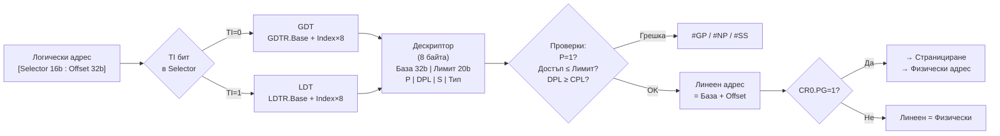

# Глава VI — Управление на паметта в защитен режим: Сегментация

---

## 1. Общи принципи за управлението на паметта

В архитектурата Intel се използват **два механизма** за управление на паметта:
1. **Сегментиране** — разделя линейното адресно пространство на защитени области
2. **Странициране** — допълнителна транслация на линейни към физически адреси

И двата механизма целят **изолиране на адресните пространства** на задачите в многозадачна среда. Защитите се базират на:
- Нива на привилегия
- Тип на съхраняваната информация
- Права на достъп
- Размер на адресираната област

---

## 2. Физическо адресно пространство в 32- и 64-битов режим

| Режим | Линейно п-во | Физическо п-во | Забележка |
|-------|-------------|---------------|-----------|
| 32-битов (без PAE) | 4 GB | 4 GB | CR4.PAE = 0 |
| 32-битов (с PAE) | 4 GB | 64 GB (2<sup>36</sup>) | CR4.PAE = 1, 36-битов физически адрес |
| 64-битов | 256 TB (2<sup>48</sup>) | до 4 PB (2<sup>52</sup>) | MAXPHYADDR = 52 (типично) |

---

## 3. Структури за сегментация: сегменти, сегментни дескриптори, дескрипторни таблици и селектори

### 3.1 Сегментен дескриптор

Всеки сегмент се описва с **8-байтова структура** — **дескриптор (descriptor)**:

```
Байтове 7    6    5    4   3   2   1   0
       [База 31..24][G|D|0|AVL|Lim 19..16][P|DPL|S|Тип][База 23..16][База 15..0][Лимит 15..0]
```

**Полета на дескриптора:**

| Поле | Размер | Описание |
|------|--------|---------|
| **Базов адрес** | 32 бита | Началният линеен адрес на сегмента (3 части: байтове 2,3,4 и 7) |
| **Лимит** | 20 бита | Размерът на сегмента (интерпретира се с флага G) |
| **G (Granularity)** | 1 бит | G=0 → лимитът е в байтове (1 B – 1 MB); G=1 → в 4 KB единици (4 KB – 4 GB) |
| **D/B (Default/Big)** | 1 бит | За кодов сегмент: D=1 → 32-bit; D=0 → 16-bit (адреси и операнди) |
| **L** | 1 бит | L=1 → 64-битов кодов сегмент (само в Long Mode) |
| **AVL** | 1 бит | Свободен за ОС |
| **P (Present)** | 1 бит | P=1 → сегментът е в паметта; P=0 → изключение #NP |
| **DPL** | 2 бита | Descriptor Privilege Level: нивото на привилегия (0–3) |
| **S (Segment)** | 1 бит | S=1 → даннов/кодов сегмент; S=0 → системен дескриптор |
| **Тип** | 4 бита | Типът и правата за достъп (виж по-долу) |
| **A (Accessed)** | 1 бит | Вдига се автоматично при обръщение; ОС го използва за swap |

**Типове сегменти (S=1):**

| Тип (4 бита) | Описание |
|-------------|---------|
| 0000B | Данни, само четене |
| 0001B | Данни, четене и запис |
| 0010B | Данни (стек), само четене, надолу нарастване |
| 0011B | Данни (стек), четене и запис, надолу нарастване |
| 1000B | Код, само изпълнение |
| 1001B | Код, изпълнение и четене |
| 1010B | Подчинен код, само изпълнение (conforming) |
| 1011B | Подчинен код, изпълнение и четене (conforming) |

**Системни дескриптори (S=0):**

| Тип | Описание |
|-----|---------|
| 2 | LDT дескриптор |
| 9 | TSS дескриптор (незает) |
| 11 | TSS дескриптор (зает) |
| 12 | Шлюз на извикване (Call Gate) |
| 14 | Шлюз на прекъсване (Interrupt Gate) |
| 15 | Шлюз на капан (Trap Gate) |

### 3.2 Дескрипторни таблици

Дескрипторите се съхраняват в специални таблици (макс. размер 64 KB = 8192 дескриптора):

**GDT (Global Descriptor Table) — Глобална дескрипторна таблица:**
- Съдържа дескриптори на **общи сегменти**, достъпни за всички задачи
- Локализира се чрез регистъра **GDTR** (32-битов базов адрес + 16-битов лимит)
- **Първият елемент (индекс 0) не се използва** — нулевият дескриптор
- Зареждане на CS или SS с нулев селектор → изключение #GP

**LDT (Local Descriptor Table) — Локална дескрипторна таблица:**
- За всяка задача може да съществува своя LDT с **локални за задачата сегменти**
- LDT се съхранява в сегмент, чийто дескриптор е в GDT
- Локализира се чрез **LDTR** (16-битов видим + 64-битов кеш-регистър)

**IDT (Interrupt Descriptor Table) — Дескрипторна таблица на прекъсванията:**
- Съдържа дескриптори на **шлюзове** (gates) за обработка на прекъсвания/изключения
- Локализира се чрез **IDTR** (32-битов базов адрес + 16-битов лимит)
- Може да бъде навсякъде в паметта

### 3.3 Сегментен селектор

Всеки сегментен регистър (CS, DS, SS, ES, FS, GS) съдържа **16-битов селектор**:

```
Bits 15–3: Index (13 бита) — номерът на дескриптора в таблицата
Bit  2:    TI (Table Indicator) — TI=0 → GDT; TI=1 → LDT
Bits 1–0:  RPL (Requested Privilege Level) — заявено ниво на привилегия
```

**Пример:**
```
Селектор 0x0008 = 0000 0000 0000 1 0 00
                                  │ │ └─ RPL = 0 (Ring 0)
                                  │ └── TI = 0 (GDT)
                                  └──── Index = 1 (втори дескриптор в GDT)
```

---

## 4. Регистри за управление на паметта

| Регистър | Видима | Невидима (кеш) | Зарежда се с |
|----------|--------|----------------|-------------|
| **GDTR** | 48 бита (лимит 16 + база 32) | — | `LGDT m48` |
| **IDTR** | 48 бита | — | `LIDT m48` |
| **LDTR** | 16 бита (селектор) | 64-битов дескриптор | `LLDT r/m16` |
| **TR** | 16 бита (селектор) | 64-битов дескриптор | `LTR r/m16` |

Към всеки **сегментен регистър** (CS, DS, SS...) е асоциран **64-битов кеш-регистър (сянка)**, в който автоматично се зарежда дескрипторът при зареждане на селектора. Кеш-регистрите са **невидими** за програмата.

---

## 5. Транслиране на логически в линеен адрес

**Логически адрес** = [Сегментен Регистър (Selector) : Ефективен адрес (Offset)]

**Стъпки на транслацията:**

```
1. Изчислява се ефективният (логически) адрес EA
2. От селектора в сегментния регистър:
   - TI бит → избира GDT (0) или LDT (1)
   - Index → номерът на дескриптора
3. МП извлича дескриптора от: Base(GDT/LDT) + Index × 8
4. Верификации: присъствие (P), привилегия (DPL), тип, лимит
5. Линеен адрес = Базов адрес (от дескриптора) + EA
```



**TLB кеширане на дескрипторите:**
- При зареждане на селектор в сегментен регистър → МП автоматично извлича и кешира дескриптора в **кеш-регистъра (сянка)**
- Следващите обръщения използват кешираните данни (без достъп до памет)

---

## 6. Сегментни модели на паметта

### 6.1 Базов плосък модел (Basic Flat Model)
- Системата и приложенията работят с **непрекъснато, несегментирано** адресно пространство
- Минимум **2 дескриптора**: 1 кодов + 1 даннов; и двата покриват цялото 4 GB линейно пространство (база = 0, лимит = 4 GB)
- **Скрива** сегментирането от програмиста
- **Без апаратна защита** при излизане извън физически достъпна памет

### 6.2 Защитен плосък модел (Protected Flat Model)
- Подобен на базовия, но сегментите покриват **само реално съществуващата** физическа памет
- При достъп извън дефинираните граници → изключение #GP
- Може да се усложни чрез странициране за по-детайлна защита
- Използва се в популярни ОС (например Linux, Windows)

### 6.3 Многосегментен модел (Multi-Segment Model)
- Пълно използване на механизма на сегментиране
- Всяка програма/задача има своя **LDT** с дескриптори на собствените и сегменти
- Максимална апаратна защита на код, данни и стек
- Всеки достъп до сегмент се контролира апаратно

---

## Резюме за изпита

> - Дескриптор = 8 байта: Базов адрес (32 бита), Лимит (20 бита), P, DPL, S, Тип, G, D, AVL
> - GDT: обща за системата; LDT: лична за задача; IDT: за прекъсвания
> - Селектор = 13-битов Index + TI (GDT/LDT) + RPL (0–3)
> - Линеен адрес = Дескриптор.База + Ефективен адрес
> - Три модела: Базов плосък (без защита), Защитен плосък (с ограничения), Многосегментен (пълна защита)
> - Кеш-регистри (сянки) ускоряват адресацията
>
> [→ Речник на всички съкращения](glossary.md)


---

**Източници:**
- Рускова Н. *Микропроцесорни системи.* ТУ-Варна, 1999 (OCR)
- Intel 64 and IA-32 Architectures Software Developer's Manual, Vol. 3A, Chapter 3 (Protected-Mode Memory Management)
