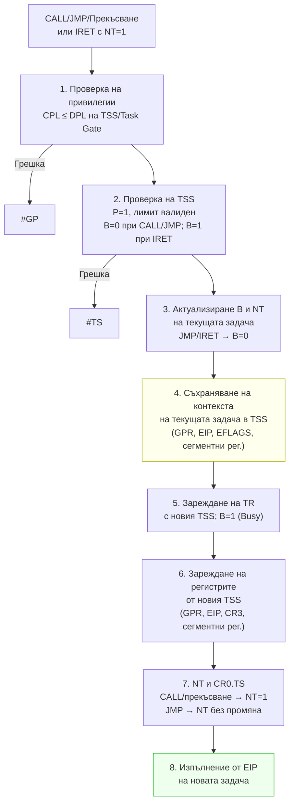

# Глава X — Управление на задачите при 32- и 64-разрядните x86 микропроцесори

---

## 1. Задача — концепция и структура

**Задачата** е единица работа, която микропроцесорът може да планира, изпълни и преустанови.

Компоненти на задача:
- **Област за изпълнение** — кодов сегмент, стеков сегмент, сегменти данни (и стекове за всяко ниво на привилегия)
- **Сегмент за съхранение на състоянието (TSS)** — пълен контекст на задачата

Задачата се идентифицира чрез **селектора на своя TSS**. При активиране:
- Селекторът се зарежда в регистъра **TR**
- Дескрипторът на TSS — в кеш-регистъра на TR

Структури, свързани с управлението на задачи:
- **TSS** — Сегмент за съхранение на контекста
- **Дескриптор на TSS** — в GDT
- **Шлюз към задача (Task Gate)** — косвен достъп до TSS
- **TR** (Task Register) — регистър, съдържащ селектора на TSS
- **Флаг NT** в EFLAGS — индикатор за вложена задача

---

## 2. Сегмент за състояние на задачата (TSS)

TSS съдържа **цялата информация**, необходима на процесора да управлява задача.

### Динамично множество (обновява се при всяко превключване)

| Поле | Описание |
|------|---------|
| **EAX, ECX, EDX, EBX, ESP, EBP, ESI, EDI** | Регистри с общо предназначение |
| **ES, CS, SS, DS, FS, GS** | Сегментни регистри |
| **EFLAGS** | Регистър на флаговете |
| **EIP** | Указател на инструкциите |
| **Previous Task Link** | Селектор на предходната задача (за вложени задачи) |

### Статично множество (само за четене от МП)

| Поле | Описание |
|------|---------|
| **LDT Selector** | Локалната дескрипторна таблица на задачата |
| **CR3 (PDBR)** | Базов адрес на каталога на страниците |
| **SS0:ESP0, SS1:ESP1, SS2:ESP2** | Стекове за нива 0, 1, 2 |
| **I/O Map Base Address** | Указател към двоичната карта за Вх/Изх |
| **T (Trap) флаг** | T=1 → генерира изключение при активиране |

**Минимален размер на TSS: 103 (0x67) байта**

### TSS структура в асемблер

```asm
struc task_state_segment
  back   dw ?     ; селектор към TSS на предходната задача
  back_h dw ?
  esp0   dd ?     ; стеков указател за DPL 0
  ss0    dw ?     ; селектор на стека за DPL 0
  ss0_h  dw ?
  esp1   dd ?     ; стеков указател за DPL 1
  ss1    dw ?
  ss1_h  dw ?
  esp2   dd ?     ; стеков указател за DPL 2
  ss2    dw ?
  ss2_h  dw ?
  tcr3   dd ?     ; базов адрес на каталога на страниците
  teip   dd ?     ; указател на инструкциите
  teflags dd ?    ; флагов регистър
  teax   dd ?     ; регистри с общо предназначение
  tecx   dd ?
  tedx   dd ?
  tebx   dd ?
  tesp   dd ?
  tebp   dd ?
  tesi   dd ?
  tedi   dd ?
  tes    dw ? ; ES
  tcs    dw ? ; CS
  tss    dw ? ; SS
  tds    dw ? ; DS
  tfs    dw ? ; FS
  tgs    dw ? ; GS
  tldt   dw ? ; LDT селектор
  trap   dw ?
  iomap  dw ?     ; карта на В/И
ends task_state_segment
```

---

## 3. Дескриптор на TSS

Дескрипторите на TSS се разполагат **само в GDT** (не в LDT).

Форматът е идентичен с обикновения сегментен дескриптор, с разлики:
- **S=0** (системен дескриптор)
- **Тип**: 9 (B=0 → незаета задача) или 11 (B=1 → заета задача)

| Тип | Значение |
|-----|---------|
| **9 (1001B)** | TSS незает (свободен) |
| **11 (1011B)** | TSS зает (изпълнява се или е направила вложено обръщение) |

**Битът B (Busy)** предпазва от повторно обръщение към заета задача — при опит МП генерира изключение. Промяната на B се извършва при **заключена шина** (LOCK#), за да предотврати едновременна активация от два процесора.

**DPL** на дескриптора на TSS определя привилегията: програма с CPL ≤ DPL може да активира задачата.

---

## 4. Регистър на задача (TR)

TR идентифицира текущо изпълняваната задача:
- **Видима (16-битова) część**: селектор към TSS
- **Кеш-регистър (невидим)**: дескриптор на TSS

### Инструкции

| Инструкция | Действие |
|-----------|---------|
| `STR r16/m16` | Прочита видимата част на TR |
| `LTR r16/m16` | Зарежда TR (маркира TSS като зает, **не** превключва задача); привилегирована (Ring 0) |

`LTR` се използва при инициализация за задаване на началната стойност на TR. След това TR се обновява автоматично при всяко превключване.

---

## 5. Дескриптор на шлюз към задача (Task Gate)

Шлюзът към задача осигурява **косвен, защитен достъп** до TSS.

```
Bits 63–48: запазени
Bits 47:    P (Present)
Bits 46–45: DPL
Bits 44:    S=0
Bits 43–40: Type = 0101 (Task Gate)
Bits 31–16: TSS Selector
```

**Правило за достъп**: `max(CPL, RPL) ≤ DPL(шлюза)`

Предимства на шлюзовете пред прекия TSS селектор:
- Задача може да има **един TSS дескриптор**, но да се достига **през няколко шлюза**
- Шлюзовете могат да са в **LDT** — позволяват достъп до задача от по-ниско привилегировани задачи
- Прекъсване или изключение може да сочи към Task Gate в **IDT** → пълна изолация на задачите

---

## 6. Превключване на задачи

### Начини за иницииране

1. Инструкция `CALL` или `JMP` към дескриптор на TSS
2. Инструкция `CALL` или `JMP` към шлюз към задача
3. Прекъсване или изключение, сочещо към Task Gate в IDT
4. Инструкция `IRET` при вдигнат флаг **NT** в EFLAGS

### Апаратни стъпки при превключване



> Ако стъпки 1–4 завършат неуспешно, МП се връща в контекста на текущата задача. Грешки след стъпка 4 се обработват в контекста на **новата** задача.

1. **Проверка на привилегии** — текущата задача има право да извика новата
2. **Проверка на TSS** — P=1, валиден лимит, B=0 (незает) при CALL/JMP/прекъсване; B=1 при IRET
3. **Актуализиране на флага B и NT** за текущата задача
4. **Съхраняване на контекста** на текущата задача в нейния TSS (динамично множество)
5. **Зареждане на TR** с селектора и дескриптора на новия TSS; маркира се зает (B=1)
6. **Зареждане на регистрите** на МП от TSS на новата задача
7. **Актуализиране на NT за новата задача** + вдигане на CR0.TS
8. **Стартиране на изпълнение** от инструкцията, посочена от новото EIP

> Ако стъпки 1–4 завършат неуспешно, МП се връща в контекста на текущата задача. Грешки след стъпка 4 се обработват в контекста на **новата** задача.

### Вложени задачи

При извикване с `CALL` или прекъсване → NT=1 в новата задача. Полето **Previous Task Link** в TSS съхранява селектора на извикващата задача. `IRET` с NT=1 автоматично се връща към предходната задача. Дълбочината на вложеност е неограничена.

---

## 7. Взаимодействие между задачи

Споделени данни/код се реализира чрез **припокриване на адресните пространства**:

| Модел | Описание |
|-------|---------|
| **Пълна изолация** | Всички сегменти в локалните LDT — без споделено пространство |
| **Пълно припокриване** | Всички сегменти в GDT — достъпни за всички задачи |
| **Частично припокриване** | Смесен модел — части в GDT (споделени), части в LDT (частни) |

Задачите имат еднакви права над общите сегменти, описани в GDT. Различни права върху общи сегменти могат да се постигнат чрез **синонимни дескриптори** в отделните LDT.

---

## 8. TSS в 64-битов режим (Long Mode)

В Long Mode TSS има разширен формат (16-байтни елементи):

```
Offset 0:    Reserved / Previous Task Link
Offset 4:    RSP0 (8 байта) — стек за Ring 0
Offset 12:   RSP1 (8 байта) — стек за Ring 1
Offset 20:   RSP2 (8 байта) — стек за Ring 2
Offset 28:   Reserved
Offset 36:   IST1 (8 байта)  ─┐
Offset 44:   IST2 (8 байта)   │ IST таблица — 7 стека за прекъсвания
...                            │
Offset 92:   IST7 (8 байта)  ─┘
Offset 100:  Reserved
Offset 102:  I/O Map Base Address (16 бита)
```

**IST (Interrupt Stack Table)** — 7 указателя (IST1–IST7) към стекове, задавани от полето IST в IDT дескриптора на шлюза. Дори при Ring 0 → Ring 0 преход, ако IST ≠ 0, се извършва задължително превключване на стека.

В 64-битов режим **задачи не се превключват апаратно** — OS управлява контекстния превключвател в софтуер; TSS се използва само за RSP0–RSP2 и IST.

---

## Резюме за изпита

> - TSS = контекст на задача: динамично (регистри) + статично (стекове, LDT, CR3, I/O карта)
> - Дескриптор на TSS: S=0, тип 9 (незает) / 11 (зает); само в GDT
> - TR: видима (селектор) + кеш (дескриптор); LTR зарежда, STR чете; само Ring 0
> - Task Gate: S=0, тип 5; съдържа TSS селектор; разрешава достъп от по-ниско ниво чрез DPL
> - Превключване: CALL/JMP/прекъсване/IRET с NT=1; 8 апаратни стъпки; предходна задача → TSS.Previous Link
> - NT=1 → задачата е вложена; IRET с NT=1 → връщане към предходната задача
> - 64-бит: TSS само за RSP0-2 и IST; хардуерно превключване на задачи не се поддържа
>
> [→ Речник на всички съкращения](glossary.md)


---

**Източници:**
- Рускова Н. *Микропроцесорни системи.* ТУ-Варна, 1999 (OCR)
- Intel 64 and IA-32 Architectures Software Developer's Manual, Vol. 3A, Chapter 7 (Task Management)
