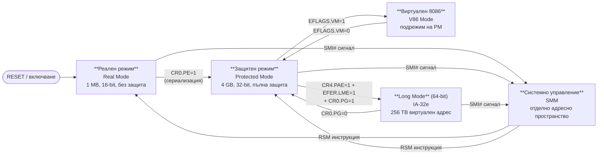

## 1. Режими на работа

Архитектурата на Intel поддържа **три режима** и **един подрежим**:

### Преходи между режимите

### 1.1 Защитен режим (Protected Mode — P-режим)
- **Нормалният** режим на процесора
- Достъпни всички инструкции и архитектурни възможности
- **Сегментиране и странициране** за управление на паметта
- **4 нива на привилегия** (0–3): ниво 0 (kernel), ниво 3 (user)
- Линейно адресно пространство: **4 GB**
- Апаратна среда за многозадачно изпълнение

### 1.2 Реален режим (Real Mode — R-режим)
- Базова 16-разредна архитектура (имитира i8086)
- Максимален размер на паметта: **1 MB** (20-разредна шина)
- Сегментен регистър × 16 + отместване = физически адрес
- При включване на захранването или RESET → МП **винаги** стартира в R-режим
- Няма защита на паметта

### 1.3 Режим на системно управление (SMM — System Management Mode)
- Специален режим за **управление на консумацията** на мощност
- Активира се от **системен сигнал SMI#** (System Management Interrupt)
- Процесорът съхранява контекста на прекъснатата задача
- Превключва към **отделно адресно пространство** (SMRAM)
- Връщане само с инструкцията `RSM`
- Въведен за пръв път в i386SL

### 1.4 Виртуален 8086 режим (V86 — V-режим, подрежим на P-режима)
- Не е самостоятелен режим — работи **в средата на P-режима**
- Позволява изпълнение на 8086 програми в **защитена мултизадачна среда**
- Задава се с бит VM = 1 в EFLAGS

### 64-битов режим (Long Mode) — само при Intel 64 / AMD64
- **IA-32e режим** включва два подрежима:
  - **64-битов режим**: пълна 64-битова архитектура (RIP-relative адресиране, 16 GPR)
  - **Compatibility режим**: изпълнение на 32/16-битови приложения без прекомпилиране

---

## 2. Флагове и полета в EFLAGS (RFLAGS)

EFLAGS е **32-разреден** регистър (RFLAGS е 64-битов в Long Mode, горните 32 бита са резервирани).

### Статусни флагове — задават се от аритметични инструкции

| Флаг | Наименование | Условие за вдигане |
|------|-------------|-------------------|
| **CF** | Carry Flag | Пренос/заем от старшия бит |
| **PF** | Parity Flag | Четен брой единични бита в младшия байт |
| **AF** | Auxiliary Carry | Пренос от бит 3 към бит 4 (BCD) |
| **ZF** | Zero Flag | Резултатът е нула |
| **SF** | Sign Flag | Знак на резултата (= старшия бит) |
| **OF** | Overflow Flag | Резултатът излиза извън знаковия диапазон |

### Системни и управляващи флагове

| Флаг | Наименование | Функция |
|------|-------------|---------|
| **DF** | Direction Flag | DF=0 → ESI/EDI нарастват; DF=1 → намаляват (стрингови инструкции) |
| **IF** | Interrupt Flag | IF=1 → INTR прекъсванията са разрешени; IF=0 → маскирани |
| **TF** | Trap Flag | TF=1 → стъпков режим; след всяка инструкция → #DB (дебъгер) |
| **IOPL** | I/O Privilege Level | Минимално ниво на привилегия за IN/OUT инструкции |
| **NT** | Nested Task | NT=1 → IRET превключва задача (а не връща от прекъсване) |
| **RF** | Resume Flag | Потиска #DB след breakpoint (избягва безкраен debug цикъл) |
| **VM** | Virtual 8086 Mode | VM=1 → виртуален 8086 режим (подрежим на PM) |
| **AC** | Alignment Check | AC=1 → изключение при неизравнен достъп до памет |
| **VIF** | Virtual Interrupt Flag | Виртуален образ на IF (за V86/VME) |
| **VIP** | Virtual Interrupt Pending | Чакащо виртуално прекъсване |
| **ID** | Identification | Ако може да се пише → процесорът поддържа `CPUID` |

> `IF` се управлява с `STI` (1) и `CLI` (0), или косвено чрез `POPF`, `IRET`.

---

## 3. Управляващи регистри, регистри за управление на паметта и команди за работа с тях

### Управляващи регистри CR0–CR4

#### CR0 (32/64 бита)
Управлява режима на работа и основните характеристики:

| Бит | Флаг | Функция |
|-----|------|---------|
| 0 | **PE** | Protection Enable: PE=1 → защитен режим |
| 1 | **MP** | Monitor Coprocessor |
| 2 | **EM** | Emulation: EM=1 → симулира отсъствие на FPU |
| 3 | **TS** | Task Switched: вдига се при всяко превключване на задача |
| 4 | **ET** | Extension Type (не се използва в Pentium/P6) |
| 5 | **NE** | Numeric Error: NE=1 → вътрешен механизъм за FPU грешки |
| 16 | **WP** | Write Protect: WP=1 → ядрото не може да пише в read-only потребителски страници |
| 18 | **AM** | Alignment Mask: AM=1 → разрешава контрол за изравняване |
| 29 | **NW** | Not Write-through: NW=0 → write-through кеширане |
| 30 | **CD** | Cache Disable: CD=1 → забранява вътрешен кеш |
| 31 | **PG** | Paging: PG=1 → странициране разрешено (само в P-режим) |

#### CR2
- Съдържа **линейния адрес**, предизвикал последното **странично нарушение (#PF)**

#### CR3 (PDBR — Page Directory Base Register)
- Битове 31–12: **физически базов адрес** на каталога на страниците (Page Directory)
- Бит 4: **PCD** (Page Cache Disable)
- Бит 3: **PWT** (Page Write-Through)
- При превключване на задача → CR3 се зарежда с новия адрес → TLB се инвалидира

#### CR4
Разширени архитектурни характеристики:

| Бит | Флаг | Функция |
|-----|------|---------|
| 0 | **VME** | Virtual-8086 Mode Extensions |
| 1 | **PVI** | Protected-mode Virtual Interrupts |
| 2 | **TSD** | Time Stamp Disable |
| 3 | **DE** | Debugging Extensions |
| 4 | **[PSE](/glossary/#pse)** | Page Size Extension: PSE=1 → 4 MB и 2 MB страници |
| 5 | **[PAE](/glossary/#pae)** | Physical Address Extension: PAE=1 → 36-битов физически адрес (64 GB) |
| 6 | **MCE** | Machine Check Enable |
| 7 | **PGE** | Page Global Enable: глобални страници (не се инвалидират при смяна на CR3) |

### Регистри за управление на паметта

| Регистър | Размер | Съдържание |
|----------|--------|-----------|
| **GDTR** | 48 бита (32-бит. лим. + 32-бит. база) | Линеен базов адрес и лимит на GDT |
| **IDTR** | 48 бита | Линеен базов адрес и лимит на IDT |
| **LDTR** | 16 бита (видима) + 64-бит. кеш | Селектор на LDT на текущата задача |
| **TR** | 16 бита (видима) + 64-бит. кеш | Селектор на TSS на текущата задача |

### Инструкции за работа с управляващите регистри

| Инструкция | Действие | Привилегия |
|-----------|---------|-----------|
| `MOV CR0–CR4, reg` | Зареждане на управляващ регистър | ниво 0 |
| `MOV reg, CR0–CR4` | Четене на управляващ регистър | ниво 0 |
| `LGDT m48` | Зареждане на GDTR | ниво 0 |
| `SGDT m48` | Съхраняване на GDTR | всяко ниво |
| `LIDT m48` | Зареждане на IDTR | ниво 0 |
| `SIDT m48` | Съхраняване на IDTR | всяко ниво |
| `LLDT r/m16` | Зареждане на LDTR | ниво 0 |
| `SLDT r/m16` | Съхраняване на LDTR | всяко ниво |
| `LTR r/m16` | Зареждане на TR | ниво 0 |
| `STR r/m16` | Съхраняване на TR | всяко ниво |

### Специфични за модела регистри (MSR)
- Масив от **64-разредни** регистри с адресиране чрез 32-битов номер
- Достъпни само на ниво 0
- Команди: `RDMSR` (чете MSR в EDX:EAX), `WRMSR` (пише EDX:EAX в MSR)
- Включват: регистри за тестване, наблюдение на производителността, управление на кеша (MTRR)

---

## 4. Видове системни данни структури

Системните структури от данни в защитен режим включват:

| Структура | Назначение |
|-----------|-----------|
| **GDT** (Global Descriptor Table) | Сегментни дескриптори, общи за всички задачи |
| **LDT** (Local Descriptor Table) | Сегментни дескриптори, специфични за задача |
| **IDT** (Interrupt Descriptor Table) | Дескриптори на шлюзове за прекъсвания/изключения |
| **TSS** (Task State Segment) | Контекст на задача (регистри, указатели към стекове) |
| **Page Directory** | Каталог на страниците (1024 PDE × 4 байта = 4 KB) |
| **Page Tables** | Таблици на страниците (1024 PTE × 4 байта = 4 KB) |

Всяка от тези структури се разглежда подробно в съответните глави.

---

## 5. Системен фърмуер и конфигурация

| Компонент | Описание |
|-----------|---------|
| **BIOS** | Традиционен фърмуер; стартира в реален режим; поддържа MBR/INT 13h |
| **UEFI** | Съвременен наследник; 32/64-битово изпълнение; Secure Boot; GPT дялове |
| **ACPI** | Стандарт за управление на захранването и хардуерни ресурси |
| **MCH/ICH** | Northbridge (MCH): процесор↔RAM↔GPU; Southbridge (ICH): USB, SATA, PCIe |

---

## Резюме за изпита

> - **P-режим** е нормалният режим; **R-режим** при RESET; **SMM** при SMI#; **V86** е подрежим на P-режима
> - **EFLAGS**: CF (пренос), ZF (нула), SF (знак), OF (препълване), IF (прекъсвания), TF (трасиране), IOPL (вх/изх. привилегия), NT (вложена задача), VM (виртуален 8086)
> - **CR0.PE=1** → защитен режим; **CR0.PG=1** → странициране; **CR4.PAE=1** → 36-битов физически адрес
> - **CR2** = адрес на последното странично нарушение; **CR3** = физически адрес на каталога на страниците
> - Системни структури: GDT, LDT, IDT, TSS, Page Directory/Tables
>
> [→ Речник на всички съкращения](/glossary/)

---

**Източници:**
- Рускова Н. *Микропроцесорни системи.* ТУ-Варна, 1999 (OCR)
- Intel 64 and IA-32 Architectures Software Developer's Manual, Vol. 3A, Chapter 2 (System Architecture Overview)
