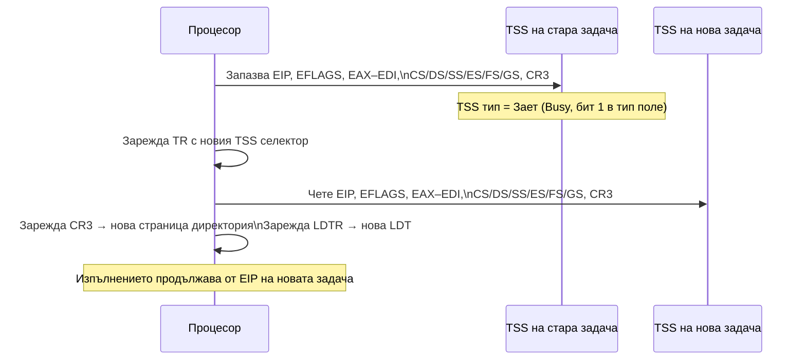

## 1. Общи принципи за управлението на паметта

В архитектурата Intel се използват **два механизма** за управление на паметта:
1. **Сегментиране** — разделя линейното адресно пространство на защитени области
2. **Странициране** — допълнителна транслация на линейни към физически адреси

И двата механизма целят **изолиране на адресните пространства** на задачите в многозадачна среда. Защитите се базират на:
- Нива на привилегия
- Тип на съхраняваната информация
- Права на достъп
- Размер на адресираната област

---

## 2. Физическо адресно пространство в 32- и 64-битов режим

| Режим | Линейно п-во | Физическо п-во | Забележка |
|-------|-------------|---------------|-----------|
| 32-битов (без PAE) | 4 GB | 4 GB | CR4.PAE = 0 |
| 32-битов (с PAE) | 4 GB | 64 GB (2<sup>36</sup>) | CR4.PAE = 1, 36-битов физически адрес |
| 64-битов | 256 TB (2<sup>48</sup>) | до 4 PB (2<sup>52</sup>) | MAXPHYADDR = 52 (типично) |

---

## 3. Структури за сегментация: сегменти, сегментни дескриптори, дескрипторни таблици и селектори

### 3.1 Сегментен дескриптор

Всеки сегмент се описва с **8-байтова структура** — **дескриптор (descriptor)**:

| Байт 7 | Байт 6 | Байт 5 | Байт 4 | Байтове 3–2 | Байтове 1–0 |
|--------|--------|--------|--------|-------------|-------------|
| База 31..24 | G \| D \| 0 \| AVL \| Лим 19..16 | P \| DPL \| S \| Тип | База 23..16 | База 15..0 | Лимит 15..0 |

**Полета на дескриптора:**

| Поле | Размер | Описание |
|------|--------|---------|
| **Базов адрес** | 32 бита | Началният линеен адрес на сегмента (3 части: байтове 2,3,4 и 7) |
| **Лимит** | 20 бита | Размерът на сегмента (интерпретира се с флага G) |
| **G (Granularity)** | 1 бит | G=0 → лимитът е в байтове (1 B – 1 MB); G=1 → в 4 KB единици (4 KB – 4 GB) |
| **D/B (Default/Big)** | 1 бит | За кодов сегмент: D=1 → 32-bit; D=0 → 16-bit (адреси и операнди) |
| **L** | 1 бит | L=1 → 64-битов кодов сегмент (само в Long Mode) |
| **[AVL](/glossary/#avl)** | 1 бит | Свободен за ОС |
| **P (Present)** | 1 бит | P=1 → сегментът е в паметта; P=0 → изключение #NP |
| **[DPL](/glossary/#dpl)** | 2 бита | Descriptor Privilege Level: нивото на привилегия (0–3) |
| **S (Segment)** | 1 бит | S=1 → даннов/кодов сегмент; S=0 → системен дескриптор |
| **Тип** | 4 бита | Типът и правата за достъп (виж по-долу) |
| **A (Accessed)** | 1 бит | Вдига се автоматично при обръщение; ОС го използва за swap |

**Типове сегменти (S=1):**

| Тип (4 бита) | Описание |
|-------------|---------|
| 0000B | Данни, само четене |
| 0001B | Данни, четене и запис |
| 0010B | Данни (стек), само четене, надолу нарастване |
| 0011B | Данни (стек), четене и запис, надолу нарастване |
| 1000B | Код, само изпълнение |
| 1001B | Код, изпълнение и четене |
| 1010B | Подчинен код, само изпълнение (conforming) |
| 1011B | Подчинен код, изпълнение и четене (conforming) |

**Системни дескриптори (S=0):**

| Тип | Описание |
|-----|---------|
| 2 | LDT дескриптор |
| 9 | TSS дескриптор (незает) |
| 11 | TSS дескриптор (зает) |
| 12 | Шлюз на извикване (Call Gate) |
| 14 | Шлюз на прекъсване (Interrupt Gate) |
| 15 | Шлюз на капан (Trap Gate) |

### 3.2 Дескрипторни таблици

Дескрипторите се съхраняват в специални таблици (макс. размер 64 KB = 8192 дескриптора):

**GDT (Global Descriptor Table) — Глобална дескрипторна таблица:**
- Съдържа дескриптори на **общи сегменти**, достъпни за всички задачи
- Локализира се чрез регистъра **[GDTR](/glossary/#gdtr)** (32-битов базов адрес + 16-битов лимит)
- **Първият елемент (индекс 0) не се използва** — нулевият дескриптор
- Зареждане на CS или SS с нулев селектор → изключение #GP

**LDT (Local Descriptor Table) — Локална дескрипторна таблица:**
- За всяка задача може да съществува своя LDT с **локални за задачата сегменти**
- LDT се съхранява в сегмент, чийто дескриптор е в GDT
- Локализира се чрез **[LDTR](/glossary/#ldtr)** (16-битов видим + 64-битов кеш-регистър)

**IDT (Interrupt Descriptor Table) — Дескрипторна таблица на прекъсванията:**
- Съдържа дескриптори на **шлюзове** (gates) за обработка на прекъсвания/изключения
- Локализира се чрез **[IDTR](/glossary/#idtr)** (32-битов базов адрес + 16-битов лимит)
- Може да бъде навсякъде в паметта

### 3.3 Сегментен селектор

**Селекторът е "адресът" на дескриптора** — той не съдържа самия сегмент, а казва на процесора *кой запис от GDT/LDT* да прочете, за да намери базата и лимита на сегмента.

Всеки сегментен регистър (CS, DS, SS, ES, FS, GS) съдържа **16-битов селектор**:

```
 15                   3   2    1  0
 ┌───────────────────┬───┬────────┐
 │    Index (13b)    │TI │  RPL  │
 └───────────────────┴───┴────────┘
```

| Поле | Размер | Значение |
|------|--------|---------|
| **Index** | 13 бита | Номерът на дескриптора в таблицата (0–8191) |
| **TI** (Table Indicator) | 1 бит | TI=0 → търси в GDT; TI=1 → търси в LDT |
| **RPL** (Requested Privilege Level) | 2 бита | Заявеното ниво на привилегия (0–3) |

**Как процесорът използва селектора:**
1. Взима TI бит → избира GDT (при TI=0) или LDT (при TI=1)
2. Умножава Index × 8 → това е отместването в таблицата (всеки дескриптор е 8 байта)
3. Чете дескриптора от: Таблица.База + Index × 8
4. Взима базовия адрес от дескриптора → **Линеен адрес = База + Offset**

**Примери:**

```
Селектор 0x0008 = 0000 0000 0000 1  0  00
                                 │  │  └─ RPL = 0 (Ring 0, kernel)
                                 │  └──── TI = 0 (GDT)
                                 └─────── Index = 1 → GDT[1] → 2-ри дескриптор

Селектор 0x0023 = 0000 0000 0010 0  0  11
                                 │  │  └─ RPL = 3 (Ring 3, потребителски)
                                 │  └──── TI = 0 (GDT)
                                 └─────── Index = 4 → GDT[4] → 5-ти дескриптор

Селектор 0x000F = 0000 0000 0000 1  1  11
                                 │  │  └─ RPL = 3 (Ring 3)
                                 │  └──── TI = 1 (LDT)
                                 └─────── Index = 1 → LDT[1]
```

> **Забележка:** RPL е *заявеното* ниво — за сравнение с DPL на дескриптора. Действителното текущо ниво на привилегия (CPL) е в битове 1–0 на **CS** регистъра.

---

## 4. Регистри за управление на паметта

| Регистър | Видима | Невидима (кеш) | Зарежда се с |
|----------|--------|----------------|-------------|
| **[GDTR](/glossary/#gdtr)** | 48 бита (лимит 16 + база 32) | — | `LGDT m48` |
| **[IDTR](/glossary/#idtr)** | 48 бита | — | `LIDT m48` |
| **[LDTR](/glossary/#ldtr)** | 16 бита (селектор) | 64-битов дескриптор | `LLDT r/m16` |
| **TR** | 16 бита (селектор) | 64-битов дескриптор | `LTR r/m16` |

Към всеки **сегментен регистър** (CS, DS, SS...) е асоциран **64-битов кеш-регистър (сянка)**, в който автоматично се зарежда дескрипторът при зареждане на селектора. Кеш-регистрите са **невидими** за програмата.

---

### 4.1 TR (Task Register) и TSS (Task State Segment)

**TR** е 16-битов регистър, чийто **селектор сочи към дескриптор на TSS в GDT**. Невидимата (кеш) част съдържа самия TSS дескриптор — база, лимит и атрибути.

```
TR:  [ Селектор 16 бита ]  →  GDT[Index]  →  TSS дескриптор (тип 9 или 11)
                                                    ↓
                                              TSS в паметта
```

**TSS (Task State Segment)** е специална структура в паметта (минимум 104 байта в 32-битов режим), която ОС поддържа за всяка задача. Съдържа:

| Поле в TSS | Предназначение |
|-----------|---------------|
| **EIP, EFLAGS** | Указател и флагове на задачата |
| **EAX–EDI** | Снимка на регистрите с общо предназначение |
| **CS, DS, SS, ES, FS, GS** | Сегментни регистри на задачата |
| **CR3** | Адрес на Page Directory (адресно пространство на задачата) |
| **ESP0, SS0** | Стеков указател и сегмент за Ring 0 (ядрото) |
| **ESP1, SS1** | Стек за Ring 1 |
| **ESP2, SS2** | Стек за Ring 2 |
| **LDT Selector** | Селектор на LDT на тази задача |
| **I/O Permission Bitmap** | Битова маска: кои I/O портове са достъпни от Ring 3 |
| **Previous Task Link** | Селектор на предишния TSS (при вложени задачи, NT=1) |

**Как се ползва TR при превключване на задача:**



**Важни особености на TR:**
- Зарежда се с инструкцията **`LTR r/m16`** (само Ring 0) — само веднъж при инициализация; при превключване на задача TR се обновява автоматично от процесора
- `STR r/m16` чете текущия TR (достъпна от всяко ниво)
- TSS дескрипторът в GDT е **тип 9 (незает / Available)** или **тип 11 (зает / Busy)** — процесорът автоматично превключва типа при Task Switch, за да предотврати рекурсивно превключване
- Дори ОС, която не използва апаратно превключване на задачи (като Linux и Windows), **трябва да зареди валиден TSS** — процесорът го ползва за стека при преход от Ring 3 към Ring 0 (системно повикване или прекъсване): зарежда ESP0 и SS0 от TSS

---

## 5. Транслиране на логически в линеен адрес

**Логически адрес** = [Сегментен Регистър (Selector) : Ефективен адрес (Offset)]

Всеки логически адрес се превежда до линеен по следния начин:

```
Логически адрес:    [  Selector (CS/DS/SS...)  :  Offset (32 бита)  ]
                              │
                    TI=0 → GDTR.Base + Index×8
                    TI=1 → LDTR.Base + Index×8
                              │
                    Дескриптор (8 байта):
                       База (32b) + Лимит (20b) + права
                              │
           Проверки: P=1? Offset ≤ Лимит? DPL ≥ CPL?
                              │
           Линеен адрес = Дескриптор.База + Offset
```


**Стъпки на транслацията:**
1. Изчислява се ефективният адрес (Offset) от инструкцията
2. От селектора: TI бит → GDT или LDT; Index → номер на дескриптора
3. МП взима дескриптора от: Таблица.База + Index × 8
4. Проверява: P=1 (в памет), Offset ≤ Лимит, DPL ≥ CPL → иначе #GP/#NP/#SS
5. **Линеен адрес = Дескриптор.База + Offset**
6. Ако CR0.PG=1 → линейният адрес се превежда допълнително до физически чрез странициране

**TLB кеширане на дескрипторите:**
- При зареждане на селектор в сегментен регистър → МП автоматично извлича и кешира дескриптора в **кеш-регистъра (сянка)**
- Следващите обръщения използват кешираните данни (без достъп до памет)

---

## 6. Сегментни модели на паметта

### 6.1 Базов плосък модел (Basic Flat Model)
- Системата и приложенията работят с **непрекъснато, несегментирано** адресно пространство
- Минимум **2 дескриптора**: 1 кодов + 1 даннов; и двата покриват цялото 4 GB линейно пространство (база = 0, лимит = 4 GB)
- **Скрива** сегментирането от програмиста
- **Без апаратна защита** при излизане извън физически достъпна памет

### 6.2 Защитен плосък модел (Protected Flat Model)
- Подобен на базовия, но сегментите покриват **само реално съществуващата** физическа памет
- При достъп извън дефинираните граници → изключение #GP
- Може да се усложни чрез странициране за по-детайлна защита
- Използва се в популярни ОС (например Linux, Windows)

### 6.3 Многосегментен модел (Multi-Segment Model)
- Пълно използване на механизма на сегментиране
- Всяка програма/задача има своя **[LDT](/glossary/#ldt)** с дескриптори на собствените и сегменти
- Максимална апаратна защита на код, данни и стек
- Всеки достъп до сегмент се контролира апаратно

---

## Резюме за изпита

> - Дескриптор = 8 байта: Базов адрес (32 бита), Лимит (20 бита), P, DPL, S, Тип, G, D, AVL
> - GDT: обща за системата; LDT: лична за задача; IDT: за прекъсвания
> - Селектор = 13-битов Index + TI (GDT/LDT) + RPL (0–3)
> - Линеен адрес = Дескриптор.База + Ефективен адрес
> - Три модела: Базов плосък (без защита), Защитен плосък (с ограничения), Многосегментен (пълна защита)
> - Кеш-регистри (сянки) ускоряват адресацията
>
> [→ Речник на всички съкращения](/glossary/)


---

**Източници:**
- Рускова Н. *Микропроцесорни системи.* ТУ-Варна, 1999 (OCR)
- Intel 64 and IA-32 Architectures Software Developer's Manual, Vol. 3A, Chapter 3 (Protected-Mode Memory Management)
