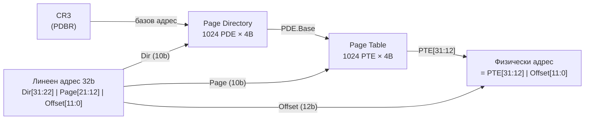
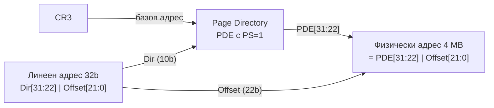
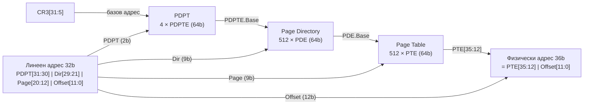
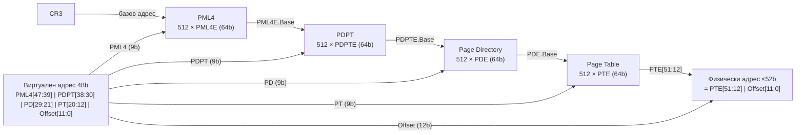

## 1. Режими на странициране при x86-64 микропроцесорите

Страницирането е **второто ниво** на управление на паметта (след сегментацията). Управлява се от три флага:

| Флаг | Регистър | Функция |
|------|----------|---------|
| **[PG](/05-system-architecture/)** | CR0[31] | Разрешава/забранява странициране (от i386) |
| **[PSE](/glossary/#pse)** | CR4[4] | Page Size Extension: разрешава 4 MB и 2 MB страници (от Pentium) |
| **[PAE](/glossary/#pae)** | CR4[5] | Physical Address Extension: 36-битов физически адрес (от Pentium Pro) |

| Режим | PG | PAE | PSE | Размери страници | Физически адрес |
|-------|----|----|-----|-----------------|-----------------|
| Странициране изключено | 0 | x | x | — | 32 бита |
| 32-битово странициране | 1 | 0 | 0 | 4 KB | 32 бита (4 GB) |
| 32-битово + big pages | 1 | 0 | 1 | 4 KB и 4 MB | 32 бита |
| PAE странициране | 1 | 1 | 0 | 4 KB | 36 бита (64 GB) |
| PAE + big pages | 1 | 1 | 1 | 4 KB и 2 MB | 36 бита |
| **4-нивово** (Long Mode) | 1 | 1 | — | 4 KB, 2 MB, 1 GB | 52 бита |

---

## 2. Йерархични структури за странициране

**Основна идея:**

Страничното адресно пространство е огромно (4 GB или 256 TB). Ако се опитаме да пазим пълна таблица с всяка 4 KB страница — при 4 GB тя би имала 1 милион записа (4 MB само за таблицата на **всяка** задача). Решението е **йерархия от таблици** — вместо една огромна таблица, пазим таблица от таблици, и зареждаме само тези, които реално са нужни.

**Аналогия:** Представете си телефонен указател с 256 тома, организиран така:
- **Ниво 1 (PML4):** главен индекс — коя рафтова група (512 варианта)
- **Ниво 2 (PDPT):** коя рафтова полица в групата (512 варианта)
- **Ниво 3 (PD):** кой том в полицата (512 варианта)
- **Ниво 4 (PT):** коя страница в тома (512 варианта)
- **Offset:** кой ред на страницата (4096 байта)

Всяко ниво е таблица от **512 записа × 8 байта = 4 KB** (точно 1 страница памет). CR3 пази физическия адрес на таблицата от ниво 1.

**Ключови компоненти:**
- **Страница** (page): фиксиран блок от линейното (виртуалното) адресно пространство — обикновено 4 KB
- **Страничен кадър** (frame): съответстващ 4 KB блок от физическата памет
- **TLB (Translation Lookaside Buffer)**: хардуерен кеш, запомня последните транслации (виртуален → физически адрес), за да не се обхождат всички нива при всяко обращение

**Формат на елемент PDE/PTE (32-битово странициране):**
```
Bits 31–12: Base Address (20 бита — физически адрес на страница/таблица)
Bit 11–9:  AVL (за ОС)
Bit 8:     G (Global — не инвалидира в TLB при смяна на CR3)
Bit 7:     PS (Page Size — 0=4KB, 1=4MB в PDE)
Bit 6:     D (Dirty — вдига се при запис в страница)
Bit 5:     A (Accessed — вдига се при достъп)
Bit 4:     PCD (Page Cache Disable)
Bit 3:     PWT (Page Write-Through)
Bit 2:     U/S (User/Supervisor — 0=само ядро, 1=потребителски)
Bit 1:     R/W (Read/Write — 0=само четене, 1=четене и запис)
Bit 0:     P (Present — 0=не в паметта → #PF)
```

---

## 3. 32-битово странициране

Линейният адрес (32 бита) се разделя на **три части** (Dir[31:22] = 10 бита, Page[21:12] = 10 бита, Offset[11:0] = 12 бита):



**Двуниивова структура:**
- CR3 → Page Directory (4 KB, 1024 PDE)
- PDE[Dir] → Page Table (4 KB, 1024 PTE)
- PTE[Page] → Physical Page (4 KB) + Offset → Физически адрес

**Стъпки на транслация:**

1. CR3 (PDBR) → физически адрес на Page Directory
2. Dir (bits 31–22) × 4 → индексира PDE в Page Directory
3. PDE дава физическия адрес на Page Table
4. Page (bits 21–12) × 4 → индексира PTE в Page Table
5. PTE дава физическия базов адрес на страницата
6. **Физически адрес = PTE[31:12] | Offset[11:0]**

**Капацитет:**
- 1024 PDE × 1024 PTE = **1 048 576 (1M) странични кадри** × 4 KB = **4 GB**

**TLB (Translation Lookaside Buffer):**
- Кешира актуалните PDE и PTE
- Инвалидира се при превключване на задача (нов CR3) или с `INVLPG`
- При P6: **глобални страници** (G=1 в PTE, PGE=1 в CR4) не се инвалидират при смяна на CR3

**Страниране с 4 MB страници (PSE=1):**
- При PS=1 в PDE → само едно ниво (Page Directory → 4 MB физическа страница)
- Линеен адрес: Dir[31:22] + Offset[21:0]



---

## 4. PAE странициране (Physical Address Extension)

Въведено с **Pentium Pro** (CR4.PAE=1). Разширява физическия адрес до **36 бита** → **64 GB** физическа памет.

**Трени нива** (PDPT[31:30] = 2 бита, Dir[29:21] = 9 бита, Page[20:12] = 9 бита, Offset[11:0] = 12 бита):



**Структура:**
- **PDPT (Page Directory Pointer Table)**: 4 × 64-битови записа (заредени от CR3[31:5])
- **Page Directory**: 512 × 64-битови PDE
- **Page Table**: 512 × 64-битови PTE
- Йерархия: CR3 → PDPT → Page Directory → Page Table → Physical Page (4 KB или 2 MB)

**Ключови разлики от 32-битово:**
- Всички елементи са **64-битови** (8 байта)
- Физическият адрес е **36 бита** (bits 35:12 от PTE)
- При PSE: 2 MB (не 4 MB) страници

---

## 5. Странициране на 4 нива (IA-32e / Long Mode)

В **64-битов режим** (Long Mode) е задължително 4-нивово странициране (CR4.PAE трябва да е 1).

**Линеен адрес (48-битова канонична форма)** — PML4[47:39] + PDPT[38:30] + PD[29:21] + PT[20:12] + Offset[11:0] (9+9+9+9+12 бита):



**Четириниивова структура:**
- CR3 → PML4 (512 записа × 8 байта = 4 KB)
- PML4E[47:39] → PDPT (512 PDPTE × 8B = 4 KB)
- PDPTE[38:30] → PD (512 PDE × 8B = 4 KB)
- PDE[29:21] → PT (512 PTE × 8B = 4 KB)
- PTE[20:12] → Physical Page (4 KB) + Offset[11:0] → Физически адрес (до 52 бита)

**Поддържани размери на страници в Long Mode:**
- **4 KB**: пълна 4-нивова структура
- **2 MB**: PS=1 в PDE → само 3 нива (PML4 → PDPT → PD → 2 MB страница)
- **1 GB**: PS=1 в PDPTE → само 2 нива (PML4 → PDPT → 1 GB страница) — от Ivy Bridge нататък

**Физически адрес:**
- До **52 бита** (MAXPHYADDR = 52 → 4 PB физическа памет)
- Типична стойност: 39 бита (512 GB) или 46 бита (64 TB) за сървърни платформи

**Адресен диапазон:**
- Потребителски: `0x0000_0000_0000_0000` – `0x0000_7FFF_FFFF_FFFF` (128 TB)
- Ядро: `0xFFFF_8000_0000_0000` – `0xFFFF_FFFF_FFFF_FFFF` (128 TB)

---

## Резюме за изпита

> - **32-битово странициране**: 2 нива (PD + PT), 10+10+12 бита, 4 KB или 4 MB (PSE) страници, 32-битов физически адрес
> - **PAE странициране**: 3 нива (PDPT + PD + PT), 2+9+9+12 бита, 4 KB или 2 MB (PSE) страници, 36-битов физически адрес (64 GB)
> - **4-нивово (Long Mode)**: 4 нива (PML4 + PDPT + PD + PT), 9+9+9+9+12 бита, 4 KB / 2 MB / 1 GB, до 52-битов физически адрес
> - PTE/PDE флагове: P (присъствие), R/W (защита), U/S (привилегия), A (достъп), D (мръсна), G (глобална)
> - CR3 = физически адрес на PML4/PD; TLB кешира PTE/PDE; инвалидира се с INVLPG или нов CR3
>
> [→ Речник на всички съкращения](/glossary/)


---

**Източници:**
- Рускова Н. *Микропроцесорни системи.* ТУ-Варна, 1999 (OCR)
- Intel 64 and IA-32 Architectures Software Developer's Manual, Vol. 3A, Chapter 4 (Paging)
- [x86-64 — Wikipedia](https://en.wikipedia.org/wiki/X86-64)
