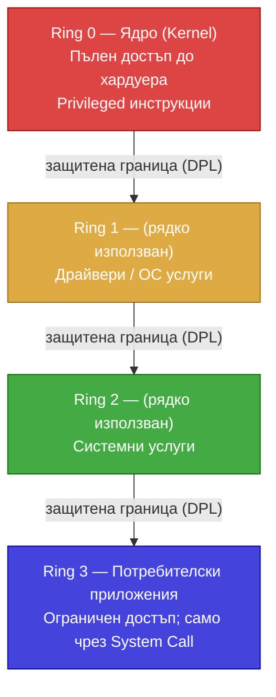

## 1. Нива на привилегии. Полета и флагове за защити при сегментация и странициране

### Нива на привилегии (Privilege Levels)

x86 дефинира **4 нива на привилегия** (0–3), известни като "пръстени" (rings):



На практика повечето ОС (Linux, Windows) използват само **Ring 0** и **Ring 3**.

### Ключови полета за привилегия

| Поле                                                   | Местоположение    | Описание                                  |
| ------------------------------------------------------ | ----------------- | ----------------------------------------- |
| **[CPL](/glossary/#cpl)** (Current Privilege Level)    | CS[1:0]           | Текущото ниво на изпълнение на програмата |
| **[DPL](/glossary/#dpl)** (Descriptor Privilege Level) | Дескриптор[14:13] | Нивото на привилегия на сегмента/шлюза    |
| **[RPL](/glossary/#rpl)** (Requested Privilege Level)  | Selector[1:0]     | Нивото, заявено в селектора               |

> **По-малко число = по-голяма привилегия** (Ring 0 > Ring 3)

### Флагове за защити при сегментация

- **P (Present)**: P=0 → изключение #NP (сегментът не е в паметта)
- **[DPL](/glossary/#dpl)**: Нивото на привилегия на сегмента
- **S=0 (System)**: Системен дескриптор — само за ядрото
- **Тип**: Определя разрешените операции (четене/запис/изпълнение)

### Флагове за защити при странициране (PTE/PDE)

| Флаг                          | Функция                                                                             |
| ----------------------------- | ----------------------------------------------------------------------------------- |
| **P=0**                       | Страницата не е в паметта → изключение #PF                                          |
| **[R/W](/07-paging/)**        | R/W=0: само четене; R/W=1: четене и запис                                           |
| **[U/S](/07-paging/)**        | U/S=0 (Supervisor): достъп само от Ring 0–2; U/S=1 (User): достъп от Ring 0–3       |
| **[XD/NX](/glossary/#xd-nx)** | Execute Disable (Intel XD / AMD NX): 1 → забрана за изпълнение на кода в страницата |

---

## 2. Защити при пряк достъп до сегменти

### Правила за директен достъп

**При четене/запис до даннов сегмент:**

```
CPL ≤ DPL (числово)  AND  RPL ≤ DPL
```

(max(CPL, RPL) ≤ DPL)

**При прехвърляне на управлението (JMP/CALL) към кодов сегмент:**

- За **непрекъснат (non-conforming) кодов сегмент**: CPL = DPL (само на същото ниво)
- За **прекъснат (conforming) кодов сегмент**: CPL ≥ DPL (може от по-ниско привилегировано ниво)
  - При conforming код: CPL не се променя

**При нарушение на горните правила → изключение #GP (General Protection Fault)**

### Видове проверки

1. **Проверка на тип**: Кодови сегменти → само за изпълнение (не за запис); Даннови → не за изпълнение
2. **Проверка за лимит**: Ефективен адрес + операнд размер ≤ Лимит (за кодов/даннов) или ≥ Лимит (за стек)
3. **Проверка за привилегия**: max(CPL, RPL) ≤ DPL

---

## 3. Защити при косвен достъп до сегменти чрез шлюзове

### Шлюзове (Gates)

Шлюзовете са специален механизъм за **контролирано преминаване** към по-привилегирован код. Видове:

| Тип шлюз                                | Приложение                                           |
| --------------------------------------- | ---------------------------------------------------- |
| **Call Gate** (Шлюз на извикване)       | Достъп до код с по-ниско ниво (по-голяма привилегия) |
| **Interrupt Gate** (Шлюз на прекъсване) | Обработка на прекъсвания (IF се нулира)              |
| **Trap Gate** (Шлюз на капан)           | Обработка на изключения (IF не се нулира)            |
| **Task Gate** (Шлюз на задача)          | Превключване на задача                               |

### Call Gate (Шлюз на извикване)

Дескрипторът на Call Gate съдържа:

```
Bits 63–48: Offset [31:16]         — горна част от адреса на процедурата
Bits 47:    P (Present)
Bits 46–45: DPL (2 бита)           — минимална привилегия на извикващия
Bits 44:    S=0 (системен)
Bits 43–40: Type = 1100 (32-bit Call Gate)
Bits 39–37: Запазени
Bits 36–32: Word Count (5 бита)    — брой параметри за копиране в новия стек
Bits 31–16: Selector               — селектор на целевия кодов сегмент
Bits 15–0:  Offset [15:0]          — долна част от адреса на процедурата
```

**Правило за достъп:**

```
DPL(целеви сегмент) ≤ max(RPL, CPL) ≤ DPL(шлюза)
```

**Автоматичен стек switch:**
При преминаване към по-висока привилегия МП автоматично:

1. Зарежда новия стек от TSS (SS0:ESP0 за Ring 0)
2. Копира **Word Count** параметъра от стария стек в новия
3. Записва: стар SS, стар ESP, EFLAGS (при CALL), CS, EIP

### Interrupt Gate и Trap Gate

(Разгледани подробно в Глава IX)

---

## 4. Защити при достъп до страници

### Проверки при странициране

При всеки достъп до страница МП проверява (в PDE **и** PTE):

1. **Присъствие (P=0)** → изключение #PF (Page Fault)
2. **R/W защита**:
   - R/W=0 → само четене
   - Ядрото (CPL=0–2) може да пише в R/W=0 страница **само ако CR0.WP=0**
   - CR0.WP=1 → ядрото също не може да пише в R/W=0 потребителски страници
3. **Привилегия U/S**:
   - U/S=0 (supervisor) → достъп само от CPL=0–2
   - U/S=1 (user) → достъп от всяко ниво
4. **Execute Disable (XD/NX)**:
   - XD=1 (в PAE/Long Mode PTE) → процесорът не може да изпълнява код от тази страница
   - → изключение #PF с Error Code I/D=1

### Код за грешка при #PF

При изключение #PF процесорът записва в стека **Error Code**:

```
Bit 0: P  — 0=страницата не е налична; 1=нарушение на защитата
Bit 1: W/R — 0=четене; 1=запис
Bit 2: U/S — 0=supervisor; 1=user (потребителски достъп)
Bit 3: RSVD — 1=нарушение на резервирани битове в PDE/PTE
Bit 4: I/D — 1=опит за изпълнение на код (Instruction Fetch)
```

### Комбиниран модел сегментация + странициране

```
Ring 3 (User)
  ↓ (Сегментация: DPL≥3 или conforming)
Ring 0 (Kernel)
  ↓ (Странициране: U/S=1 за user данни)
Physical Memory
```

- Сегментацията проверява **привилегията на достъпа до сегмента**
- Страницирането добавя **дребнозърнест контрол** на ниво страница (4 KB)

---

## Резюме за изпита

> - 4 нива на привилегия (0=kernel, 3=user); CPL = текущо, DPL = на сегмента/шлюза, RPL = заявено
> - Директен достъп: max(CPL, RPL) ≤ DPL; non-conforming код: CPL = DPL
> - Call Gate: единственият начин за преминаване към по-привилегиран код; копира параметри в новия стек
> - Странициране: P (присъствие), R/W (четене/запис), U/S (ниво), XD/NX (изпълнение)
> - CR0.WP=1 → ядрото не може да пише в R/W=0 потребителски страници
> - #GP при нарушение на сегментна защита; #PF при нарушение на странична защита
>
> [→ Речник на всички съкращения](/glossary/)

---

**Източници:**

- Рускова Н. _Микропроцесорни системи._ ТУ-Варна, 1999 (OCR)
- Intel 64 and IA-32 Architectures Software Developer's Manual, Vol. 3A, Chapter 5 (Protection)
