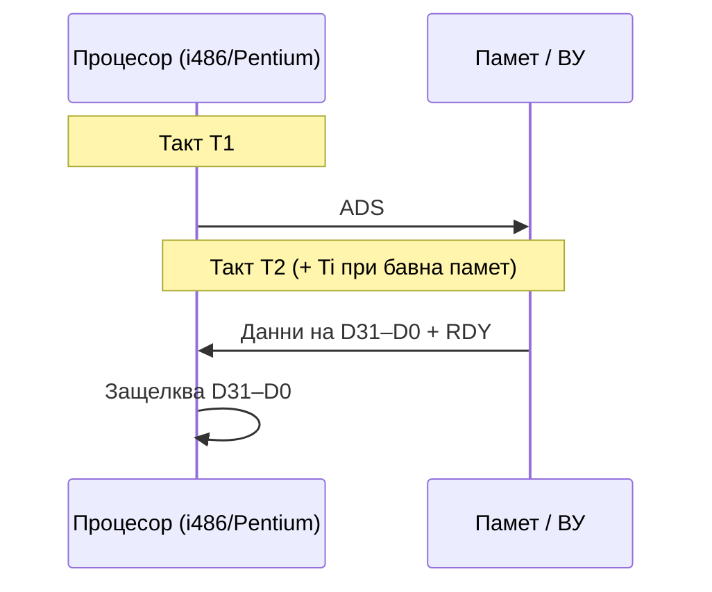
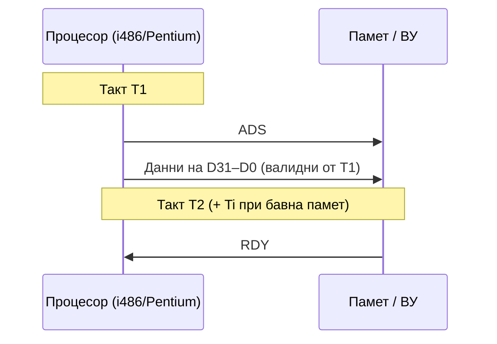
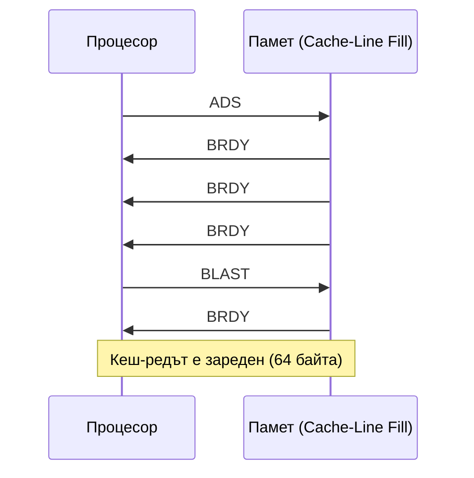
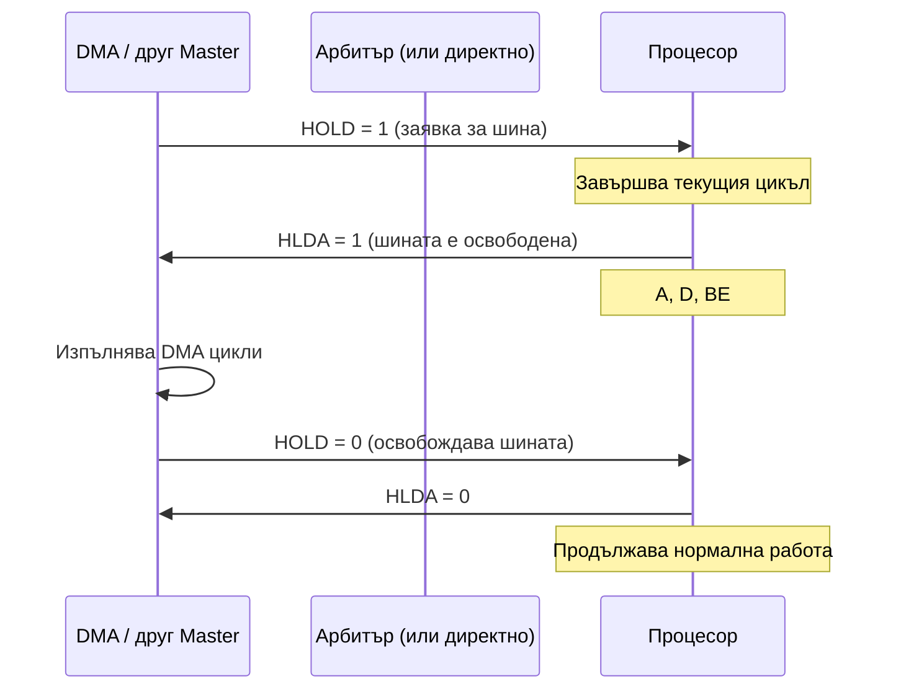

## 1. Основни принципи на шинния интерфейс

Шинният интерфейс на процесора осигурява достъп до **системната памет** и **входно-изходните устройства** чрез системната шина. Всяко предаване по шината се изгражда от **цикъл на шината** (bus cycle).

### Шини при i486 и Pentium

| Характеристика | i486 | Pentium |
|---------------|------|---------|
| **Данни** | 32 бита (D0–D31) | 64 бита (D0–D63) |
| **Адреси** | A2–A31 (4 GB) | A3–A31 (4 GB) |
| **Байтово разрешение** | BE0#–BE3# | BE0#–BE7# |
| **Тип на цикъла** | M/IO#, D/C#, W/R# | M/IO#, D/C#, W/R# |
| **Пакетно предаване** | Да (до 4×32 бита) | Да (до 4×64 бита) |
| **Честота** | до 66 MHz | до 66 MHz |

---

## 2. Функционални групи сигнали

### 2.1 Адресна шина и байтово разрешение

| Сигнал | Посока | Описание |
|--------|--------|---------|
| **A31–A2** | Изход | Физически адрес (линейно → физическо след страноване) |
| **BE3#–BE0#** | Изход | Byte Enable — указва кои байтове са валидни в 32-битова дума |
| **BE7#–BE0#** | Изход | (само Pentium) за 64-битова шина |
| **[ADS#](/glossary/#ads)** | Изход | Address Strobe — активен, когато адресът и тип-сигналите са валидни |

Байтовото разрешение се декодира:

```
BE0# → байт D7–D0   (адрес xxx0)
BE1# → байт D15–D8  (адрес xxx1)
BE2# → байт D23–D16 (адрес xxx2)
BE3# → байт D31–D24 (адрес xxx3)
```

### 2.2 Сигнали за тип на цикъла

| Сигнал | Описание |
|--------|---------|
| **M/IO#** | 1 = достъп до памет; 0 = достъп до В/И пространство |
| **D/C#** | 1 = данни; 0 = управление (код) |
| **W/R#** | 1 = запис; 0 = четене |

Комбинациите определят типа на цикъла:

| M/IO# | D/C# | W/R# | Тип цикъл |
|-------|------|------|-----------|
| 0 | 0 | 0 | Потвърждаване на прекъсване (INTA) |
| 0 | 0 | 1 | Специален цикъл |
| 0 | 1 | 0 | Четене от В/И |
| 0 | 1 | 1 | Запис в В/И |
| 1 | 0 | 0 | Извличане на код (Instruction Fetch) |
| 1 | 0 | 1 | — (резервиран) |
| 1 | 1 | 0 | Четене от памет (данни) |
| 1 | 1 | 1 | Запис в памет (данни) |

### 2.3 Сигнали за готовност и пакетно предаване

| Сигнал | Посока | Описание |
|--------|--------|---------|
| **[RDY#](/glossary/#rdy)** | Вход | Ready — паметта е готова (за непакетен цикъл) |
| **[BRDY#](/glossary/#brdy)** | Вход | Burst Ready — готовност при пакетно предаване |
| **[BLAST#](/glossary/#blast)** | Изход | Burst Last — последният цикъл от пакетното предаване |
| **[BOFF#](/glossary/#boff)** | Вход | Backoff — принуждава процесора да освободи шината |
| **[AHOLD](/glossary/#ahold)** | Вход | Address Hold — задържа адреса (използва се от Кеш-снифера) |

### 2.4 Сигнали за управление на кеша

| Сигнал | Описание |
|--------|---------|
| **[KEN#](/glossary/#ken)** | Cache Enable — разрешава кеширане на текущия цикъл |
| **[WB/WT#](/glossary/#wb-wt)** | Write Back / Write Through — задава метода на кеширане |
| **FLUSH#** | Принуждава процесора да изпише Кеша |
| **[PWT](/glossary/#pwt)** | Page Write Through (от PTE) |
| **[PCD](/glossary/#pcd)** | Page Cache Disable (от PTE) |

### 2.5 Сигнали за шинен арбитраж

| Сигнал | Описание |
|--------|---------|
| **[HOLD](/glossary/#hold)** | Заявка за шина от друг master |
| **[HLDA](/glossary/#hlda)** | Hold Acknowledge — процесорът предоставя шината |
| **LOCK#** | Шината е заключена — друг master не може да я заеме |
| **[PLOCK#](/glossary/#plock)** | Pseudo-Lock (i486) — псевдозаключване за операнди > 32 бита |

### 2.6 Сигнали за прекъсвания и управление

| Сигнал | Описание |
|--------|---------|
| **[INTR](/glossary/#intr)** | Maskable Interrupt Request |
| **[NMI](/glossary/#nmi)** | Non-Maskable Interrupt |
| **RESET** | Нулиране на процесора |
| **[SMI#](/glossary/#smi)** | System Management Interrupt |
| **IGNNE#** | Ignore Numeric Error (игнорира FPU грешка) |
| **FERR#** | Floating-point Error (от FPU) |

---

## 3. Видове цикли на шината

### Фази на шинния цикъл (T1, T2, Ti)

Всеки шинен цикъл при i486/Pentium се разделя на стандартни такт-фази:

| Фаза | Описание |
|------|----------|
| **T1** | Процесорът задава адреса (A31–A2/A3), сигналите за тип (M/IO#, D/C#, W/R#), BE# и активира **ADS#**. ADS# сигнализира, че новият цикъл е стартиран. |
| **T2** | Процесорът чака потвърждение от паметта/В/И. При четене — паметта поставя данните на D шината и активира **RDY#**. При запис — процесорът задава данните на D шината; паметта активира RDY# при готовност. |
| **Ti** | Такт(ове) на изчакване (wait states), вмъкнати между T1 и T2 при бавна памет. Ti се повтаря докато не пристигне RDY#. |
| **Th** | Hold — процесорът задържа шината след завършване на цикъла (при конвейеризиране). |

Минимален цикъл = **T1 + T2** (2 такта). Всеки Ti удължава цикъла с 1 такт.

### 3.1 Непакетен (non-burst) цикъл на четене

Стандартен цикъл при i486 — 2 такта (при нулеви RDY# цикли на изчакване):



При бавна памет се добавят такт(ове) на изчакване (Ti) между T1 и T2.

### 3.2 Пакетен (burst) цикъл

### 3.1а Непакетен цикъл на запис

При запис процесорът задава **едновременно адрес и данни** в T1:



> При запис данните са валидни **още от T1** (за разлика от четенето, при което паметта поставя данни в T2). Записите могат да се **буферират** вътрешно в процесора (Write Buffer) и да се изпращат по шината асинхронно — подобрява производителността, но изисква внимание при синхронизация в SMP.

### 3.2 Пакетен (burst) цикъл

Пакетното предаване позволява **4 последователни четения** (при кеш-зареждане) с 1 адрес + 3 автоматично инкрементирани адреси:



Пакетният цикъл значително повишава ефективността при зареждане на кеш-редове (64 байта = 8×64b Pentium думи).

### 3.3 Цикъл за потвърждаване на прекъсване (INTA)

При INTR прекъсване процесорът генерира **два последователни INTA цикъла**:
1. Първи INTA: ADS# активен с M/IO#=D/C#=W/R#=0; контролерът на прекъсванията се подготвя
2. Втори INTA: контролерът изнася **вектора** (номер 0–255) на D0–D7

```
Между двата цикъла има 4 празни такта.
```

### 3.4 Специални цикли

При M/IO#=0, D/C#=0, W/R#=1 — специален цикъл, кодиран в BE#:

| BE3# | BE2# | BE1# | BE0# | Специален цикъл |
|------|------|------|------|----------------|
| 1 | 1 | 1 | 0 | Shutdown (двойна грешка) |
| 1 | 1 | 0 | 1 | Flush (изписване на Кеш) |
| 1 | 0 | 1 | 1 | Halt (спиране) |
| 0 | 1 | 1 | 1 | Write-Back (обратен запис на Кеш) |

---

## 4. Заключване на шината (Bus Locking)

**LOCK#** осигурява **атомарни** (неделими) операции при мултипроцесорни системи:

- Докато LOCK# е активен, шинният арбитър **не разрешава** на друг master да заеме шината
- Автоматично активиране при: `XCHG r, [mem]`, дескрипторни достъпи, потвърждаване на прекъсване, превключване на задача
- Програмно: префикс `LOCK` пред инструкция (напр. `LOCK CMPXCHG`)

При **i486** — псевдозаключване (PLOCK#) за предавания > 32 бита (кеш-редове, FPU операнди).

При **P6**: ако заключваният операнд е в Кеш с обратен запис (WB), LOCK# може да не се активира — правилността се гарантира от MESI протокола.

---

## 4а. Шинен арбитраж — HOLD/HLDA протокол

Когато **DMA контролер или друг bus master** иска достъп до шината:



**Важни детайли:**
- Процесорът завършва **текущия** шинен цикъл преди да освободи шината — незаключен цикъл
- При активен **LOCK#**: процесорът *не* отговаря на HOLD докато LOCK# е активен
- При **BOFF#** (Backoff): паметта може да принуди процесора да освободи шината веднага (дори по средата на цикъл) — процесорът замразява и рестартира прекъснатия цикъл след BOFF# = 0
- В многопроцесорни системи арбитражът се управлява от **ARB** схема с приоритети (статичен) или с ротация (динамичен/fair)

## 4б. Адресен pipeline при Pentium

Pentium поддържа **конвейеризиране на адресите** (Address Pipelining / Pipelined Addressing):

```
Цикъл 1: T1 [Адрес 1 + ADS#] → T2 [Данни 1 + RDY#]
Цикъл 2:              T1 [Адрес 2 + ADS#] → T2 [Данни 2 + RDY#]
```

Процесорът изпраща адреса на **следващия** цикъл докато текущият цикъл все още чака данни (T2/Ti). Паметта сигнализира готовност с **NA#** (Next Address), което разрешава на процесора да задава нов адрес. Резултатът: практически **1 такт/цикъл** при бърза памет вместо 2+.

При i486 — **няма** адресен pipeline; всеки цикъл трябва да завърши изцяло преди следващия адрес.

## 5. Пакетно предаване — ред на адресите

При пакетно четене адресите не нарастват линейно по 4 — следват специален ред за максимизиране на кеш ефективността (Pentium 64-bit burst order):

```
Адрес на кеш-реда: A31..A5 (константна горна част) + A4..A3 (2 бита за 4 блока)
Ред при начало от 00: 00 → 01 → 10 → 11
Ред при начало от 10: 10 → 11 → 00 → 01
```

Тази схема минимизира броя такти (pipeline на четене и адреса).

---

## 5а. Подреждане на паметта (Memory Ordering)

Редът на изпълнение на четения и записи по шината може да се различава от програмния ред — важно за SMP коректност.

### Модели на подреждане

| Модел | Процесор | Описание |
|-------|----------|---------|
| **Строго (Strong)** | i486, Pentium | Четения и записи се изпълняват в програмния ред с малко изключения (четене може да изпревари буфериран запис към различен адрес) |
| **Процесорно (Processor)** | P6 и по-нови | Четенията могат да се изпълняват **спекулативно** — изпреварват буферирани записи; записите винаги следват програмния ред |

### Типове кеш области — MTRR

Управляващите регистри **MTRR** (Memory Type Range Registers, въведени в P6) задават тип на кеширане за до 96 физически области:

| Тип | Съкращение | Подреждане | Кеш | Буфериране запис | Употреба |
|-----|-----------|------------|-----|-----------------|----------|
| Uncacheable | UC | Строго | Не | Не | I/O регистри, ROM |
| Write Combining | WC | Слабо | Не | Да (буфер) | Видео framebuffer |
| Write Through | WT | Строго | Четене | Не | Само-четими области |
| Write Back | WB | Процесорно | Да | Да (обратен запис) | RAM — по подразбиране |
| Write Protected | WP | Строго | Четене | Не | ROM, BIOS сенки |

> За i486 и Pentium подобен ефект се постига с хардуерни сигнали **KEN#** и **WB/WT#**.

### Сериализиращи инструкции

Сериализиращата инструкция задължава процесора да **завърши всички предишни** операции (четения, записи, промени на регистри) преди да продължи. Използват се при превключване между режими и при синхронизация:

| Привилегировани | Непривилегировани |
|-----------------|-------------------|
| `MOV CRn`, `MOV DRn` | `CPUID` |
| `WRMSR`, `INVLPG` | `IRET` |
| `LGDT`, `LIDT`, `LLDT`, `LTR` | `RSM` |
| `WBINVD`, `HLT` | — |

> `CPUID` се използва като портативна сериализираща инструкция в ядра (преди критични секции след `MOV CR0`).

## 6. Шинен интерфейс на P6 / Pentium Pro

P6 въвежда **транзакционна шина** с разделени фази:
- **Request phase**: процесорът изпраща заявка (адрес + тип)
- **Snoop phase**: всички агенти проверяват кешовете (HIT#, HITM#)
- **Response phase**: контролерът на паметта отговаря
- **Data phase**: данните се предават (64-битова шина)

Заявките могат да се **конвейеризират** (до 4 Outstanding) — различни фази на различни транзакции едновременно. Сигналите:

| Сигнал | Описание |
|--------|---------|
| **DEFER#** | Транзакцията не е завършена "in order" |
| **[HIT#](/glossary/#hit)** | Друг процесор има немодифициран ред |
| **[HITM#](/glossary/#hitm)** | Друг процесор има модифициран ред (обратен запис) |

---

## Резюме за изпита

> - Цикъл: T1 (адрес + ADS#) → Ti (чакане) → T2 (данни + RDY#); запис: данни от T1
> - i486: 32-битова данна шина, BE0#–BE3#; ADS# маркира валиден адрес; без адресен pipeline
> - Pentium: 64-битова данна шина, BE0#–BE7#; пакетен цикъл 4×64 бита; адресен pipeline с NA#
> - Тип на цикъла: M/IO# + D/C# + W/R# (8 комбинации)
> - RDY# (непакетен) / BRDY# (пакетен) — паметта сигнализира готовност
> - INTA: 2 цикъла с 4 такта помежду; векторът се поставя на D0–D7 при втория
> - HOLD/HLDA: DMA/bus master протокол; BOFF# — принудително освобождаване; LOCK# блокира HOLD
> - LOCK#: атомарни операции; PLOCK# при i486 за > 32-битови операнди
> - MTRR: UC / WC / WT / WB / WP — тип на кеш; CPUID = непривилегирована сериализация
> - P6: транзакционна шина с конвейеризирани заявки; HIT#, HITM#, DEFER#
>
> [→ Речник на всички съкращения](/glossary/)


---

**Източници:**
- Рускова Н. *Микропроцесорни системи.* ТУ-Варна, 1999 (OCR)
- Intel 64 and IA-32 Architectures Software Developer's Manual, Vol. 3A, Chapter 8 (Multiple Processor Management)
- [Intel i486 Processor Data Book, 1990](https://archive.org/details/bitsavers_inteli486aookSept90_37779167)
- [Pentium Processor Family Developer's Manual, Vol. 3, 1994](https://www.intel.com/content/dam/www/public/us/en/documents/manuals/pentium-processor-family-developers-manual-vol3.pdf)
