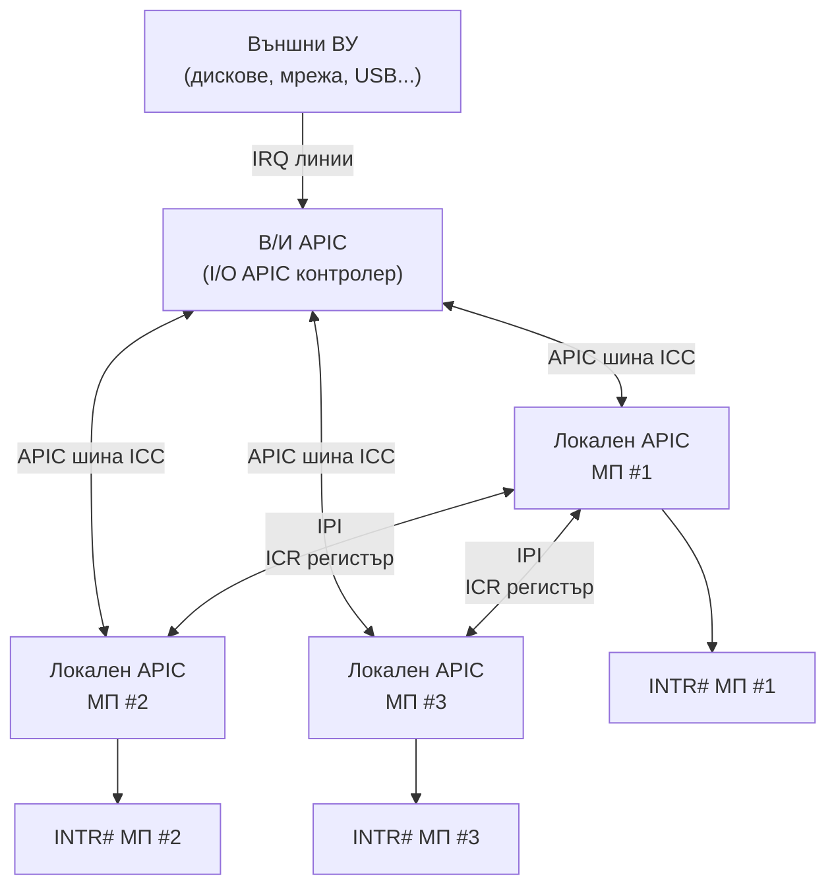
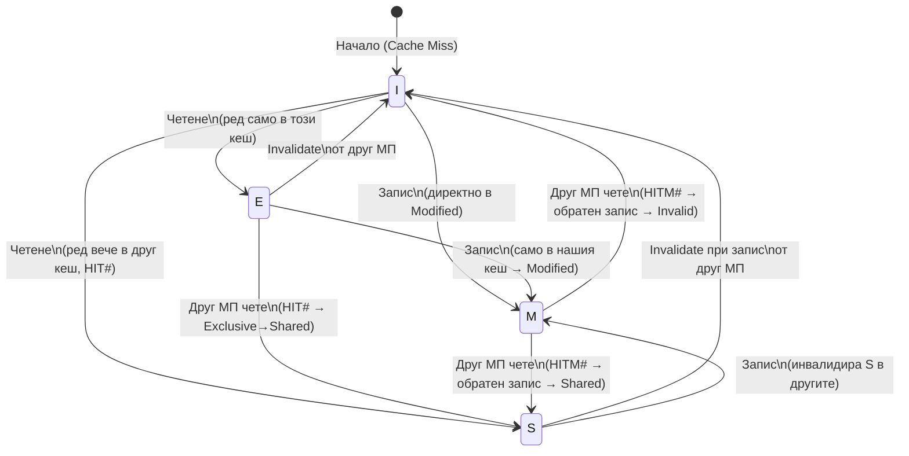

## 1. Принципи на SMP

**SMP (Symmetric Multi-Processing)** — архитектура, при която **всички процесори** споделят обща системна памет и имат равни права върху нея.

### Компоненти на SMP система на базата на обща шина


Поддържани функции:

- Заключване на шината (атомарни операции)
- Сериализиращи средства
- Консистентност на Кеш памет (MESI протокол)
- APIC за разпределение на прекъсвания

---

## 2. Заключване на шината (Bus Locking)

### Необходимост

При мултипроцесорни системи е критично да се осигурят **атомарни** (неделими) операции върху споделени данни (семафори, дескриптори, таблици на страниците).

### Механизъм

Сигналът **LOCK#** блокира арбитража на шината:

- Докато LOCK# е активен, шинният арбитър **не разрешава** друг процесор да заеме шината
- Всяко начало на цикъл, докато LOCK# е активен, трябва да изчака

Докато LOCK# е активен (LOW): CPU #1 извършва транзакция 1, след това транзакция 2. Всички останали процесори чакат освобождаването на шината. Когато LOCK# се снема (HIGH), шинният арбитър може да предостави шината на друг процесор.

### Автоматично активиране на LOCK#

Процесорът автоматично вдига LOCK# при:

1. `XCHG` инструкция с операнд в памет
2. Достъп до дескрипторна таблица (при зареждане на сегментен регистър)
3. Обновяване на дескриптора на TSS при превключване на задача
4. Потвърждаване на прекъсване (INTA цикъл)
5. Обновяване на идентификатор на страниците (Page Directory / Table)

### Програмно активиране

Префиксът **LOCK** пред поддържани инструкции:

```asm
lock xchg [mutex], eax     ; атомарна размяна
lock cmpxchg [var], ecx    ; compare-and-swap
lock add [counter], 1      ; атомарно инкрементиране
lock bts [flags], 3        ; атомарен bit-test-and-set
```

### PLOCK# (i486)

При i486 за операнди > 32 бита (Кеш-ред, FPU операнди) се използва **псевдозаключване** (PLOCK#): текущият и следващите цикли се третират като единно неделимо предаване.

### LOCK# при P6

При P6, ако заключваният операнд е в кеш (WB типа), LOCK# може да **не** се вдига — правилността се гарантира от MESI протокола. Вместо физическо заключване шина, кешовете се координират вътрешно.

---

## 3. Сериализиращи средства

### 3.1 Подреждане на обръщенията към паметта

**Строго подреждане (Strong Ordering)** — i386 и по-ранни: обръщенията към памет се изпълняват в реда на срещане в потока инструкции.

**Процесорно подреждане (Processor Ordering)** — i486, Pentium, P6:

- Четенията могат да **изпреварват** буферираните записи (спекулативно)
- Записите се буферират, но **винаги** се изпълняват по реда в програмата
- Четене/запис **не** могат да изпреварват В/И операции, заключени операции или сериализиращи инструкции

### 3.2 MTRR (Memory Type Range Registers)

Позволяват дефиниране на **тип на подреждане** за отделни области от физическата памет:

| Тип             | Символ | Кеширане    | Подреждане           |
| --------------- | ------ | ----------- | -------------------- |
| Uncacheable     | UC     | Не          | Строго               |
| Write Combining | WC     | Частично    | Слабо                |
| Write Through   | WT     | Да (WT)     | Строго               |
| Write Protected | WP     | Само четене | Строго               |
| Write Back      | WB     | Да (WB)     | Слабо (спекулативно) |

До **96 области** могат да се дефинират с MTRR.

### 3.3 Сериализиращи инструкции

Сериализиращите инструкции принуждават процесора да **завърши всички предишни** операции (флагове, регистри, записи в памет) преди следващата инструкция:

**Привилегировани** (само Ring 0):

- `MOV CR0–CR4, reg` / `MOV DR0–DR7, reg`
- `WRMSR`, `WBINVD`, `INVD`
- `LGDT`, `LLDT`, `LIDT`, `LTR`

**Непривилегировани**:

- `CPUID` — стандартна сериализация
- `IRET` — възстановяване на EFLAGS
- `RSM` — изход от SMM

> **Пример**: след `MOV CR0, eax` (разрешаване на защитен режим) процесорът **трябва** да изпълни сериализираща операция, за да гарантира завършване на всички реален-режим инструкции.

> **Внимание**: динамичното предсказване на преходи може да предизвика извличане на инструкции преди сериализиращата да е изпълнена — затова сериализиращата инструкция трябва да е **след** инструкцията за преход.

---

## 4. Програмируем интелигентен контролер на прекъсвания (APIC)

### 4.1 Защо APIC?

В SMP системи **[IRQ](/glossary/#irq)** линиите от периферните устройства постъпват в **[IOAPIC](/glossary/#ioapic)** (I/O APIC), откъдето се разпределят към локалните APIC контролери на отделните ядра.

В SMP системи прекъсванията трябва да се разпределят ефективно:

- Да се прекъсне процесорът с **най-нисък приоритет**
- Обработката може да е от **различен** процесор от стартиралия В/И операцията
- По-голяма ефективност — обработка от процесора с **кеширан** код на обработващата програма
- Поддържане на **междупроцесорни прекъсвания (IPI)**

### 4.2 Структура на APIC система



- **Локален APIC**: вграден в процесора (от P6 нататък); в отделна ИС (i82489DX) при i486
- **В/И APIC**: получава сигнали от ВУ и ги разпределя към локалните APIC

APIC регистрите са в адресното пространство на МП, на адрес **0xFEE00000** (4 KB), достъпни без шинни цикли при P6+.

---

### 4.3 Вектори и приоритети в APIC

Поддържат се **240 вектора** (16–255), разделени в **15 приоритетни нива** (1–15):

```
Приоритет = Вектор / 16
```

Пример: вектор 123 → приоритет 7.

### 4.4 Структура на локалния APIC

**[LAPIC](/glossary/#lapic)** (Local Advanced Programmable Interrupt Controller) — контролер на прекъсванията, вграден директно в процесорния кристал. Всеки CPU-ядро притежава собствен LAPIC.

#### Регистри за приемане (256-битови)

| Регистър                                               | Описание                                      |
| ------------------------------------------------------ | --------------------------------------------- |
| **[IRR](/glossary/#irr)** (Interrupt Request Register) | Получени, но необработени прекъсвания         |
| **[ISR](/glossary/#isr)** (In-Service Register)        | Прекъсвания в момента на обработка            |
| **TMR** (Trigger Mode Register)                        | Начин на приемане: по фронт (0) / по ниво (1) |

Всеки бит `i` отговаря на вектор `i`. Битове 0–15 не се използват (резервирани вектори).

#### Локална векторна таблица (LVT)

Всеки от локалните източници на прекъсвания се програмира с 32-битов регистър в LVT:

| Вход                    | Описание                         |
| ----------------------- | -------------------------------- |
| **LINT[0]**             | Локален В/И вход 0               |
| **LINT[1]**             | Локален В/И вход 1               |
| **Timer**               | Вграден таймер                   |
| **Performance Counter** | Брояч на производителността (P6) |
| **Error**               | Вътрешна грешка на APIC          |

Всеки LVT регистър съдържа: вектор, начин на доставка, начин на задействане, маска, флаг за Remote IRR, статус.

**Начини на доставка**:

- **Fixed** — INTR# към локалния процесор (използва вектора от LVT)
- **[NMI](/glossary/#nmi)** — NMI# към локалния процесор (векторът се игнорира)
- **ExtINT** — предизвиква INTA цикъл към външен 8259A; само един вход може да е ExtINT

#### Регистър за приоритет на задачата (TPR)

Блокира прекъсвания с приоритет ≤ TPR. OC задава TPR при превключване между задачи:

```
Прекъсване се обработва само ако: Приоритет(прекъсване) > TPR
```

Зареждане TPR=15 маскира всички APIC прекъсвания.

---

### 4.5 Изпращане на съобщения (ICR)

**ICR (Interrupt Command Register)** — 64-битов; записването предизвиква изпращане на съобщение по APIC шината:

| Поле                             | Описание                                                                        |
| -------------------------------- | ------------------------------------------------------------------------------- |
| **Вектор** [7:0]                 | Идентифицира прекъсването                                                       |
| **Режим на доставка** [10:8]     | Fixed, Lowest Priority, NMI, INIT, Start-Up, INIT Level De-assert               |
| **Режим на назначение** [11]     | Физически (0) / Логически (1)                                                   |
| **Съкратено назначение** [19:18] | 00=чрез полето за назначение; 01=само себе си; 10=всички; 11=всички без себе си |
| **Начин на приемане** [15]       | По ниво (1) / по фронт (0)                                                      |
| **Назначение** [63:56]           | Идентификатор на получателя                                                     |

---

### 4.6 Схеми за адресация на прекъсвания

**Физическа адресация**: APIC ID 0–14 за единичен, 15 за broadcast.

**Логическа адресация**: 8-битов адрес (MDA), сравнен с LDR (Logical Destination Register), интерпретиран от DFR (Destination Format Register):

| Модел                    | Макс. контролери     | Адресация                                    |
| ------------------------ | -------------------- | -------------------------------------------- |
| **Плосък**               | 8                    | Бит в MDA → номер контролер                  |
| **Клъстерен плосък**     | 15 клъстера × 4 = 60 | 4-битов ID на клъстер + 4-битов ID в клъстер |
| **Клъстерен йерархичен** | Неограничен          | Мрежа от клъстерни APIC шини                 |

### 4.7 Арбитраж на APIC шината

- Всеки APIC има арбитражен приоритет в **Arb_ID** (0–15)
- Преди изпращане: арбитражна фаза → победителят изпраща
- Победилият: Arb_ID → 0; загубилите: Arb_ID += 1
- Справедлив Round-Robin механизъм

### 4.8 Край на обработка (EOI)

Преди `IRET` в обработващата програма — запис в EOI регистъра:

```asm
mov dword ptr [APIC_BASE + 0B0h], 0  ; EOI запис
```

- APIC нулира най-приоритетния бит в ISR
- Ако TMR[i]=1 → изпраща EOI съобщение до всички В/И APIC

---

## 5. Консистентност на кеш паметите (MESI протокол)

### Проблем

При SMP система: процесор A зарежда данни от памет → Кеш A. Процесор B модифицира същите данни → Кеш B. Ако A чете отново — получава **остарели** данни.

### MESI протокол

Всеки ред в Кеш е в едно от **4 състояния**:

| Буква | Състояние | Описание                                               |
| ----- | --------- | ------------------------------------------------------ |
| **M** | Modified  | Редът е модифициран и не е записан обратно в памет     |
| **E** | Exclusive | Редът е в кеша само на този процесор; не е модифициран |
| **S** | Shared    | Редът е в кешовете на повече от един процесор          |
| **I** | Invalid   | Редът е невалиден (не може да се използва)             |



### Следяща логика (Bus Snooping)

Всеки процесор следи предаванията на другите по шината:

| Сценарий                                  | Действие                                                                           |
| ----------------------------------------- | ---------------------------------------------------------------------------------- |
| Ред **не** е в кеша                       | Не се намесва                                                                      |
| Ред е в кеша, **немодифициран** (E или S) | Активира HIT#; изменя реда от E→S                                                  |
| Ред е в кеша, **модифициран** (M)         | Активира HITM#; извършва обратен запис; другият процесор получава обновените данни |
| Следящата логика не е готова              | Активира едновременно HIT# + HITM# (задържа предаването)                           |

### Сигнали за съгласуваност (P6)

| Сигнал                       | Описание                                        |
| ---------------------------- | ----------------------------------------------- |
| **[HIT#](/glossary/#hit)**   | Немодифициран ред в Кеш                         |
| **[HITM#](/glossary/#hitm)** | Модифициран ред в Кеш                           |
| **DEFER#**                   | При неактивен — текущото предаване е "in order" |

### i486 — опростен протокол

При i486 е реализиран протокол само с **две** състояния: валидно и невалидно. Обявяване за невалиден чрез сигнала AHOLD# от externa схема.

---

## Резюме за изпита

> - SMP: всички МП споделят обща памет; равни права върху ресурси
> - LOCK#: блокира арбитража; автоматично при XCHG, дескриптори, INTA; програмно — префикс lock
> - Процесорно подреждане: четенията могат да изпреварват записи; MTRR управлява типовете области
> - Сериализиращи инструкции: CPUID, IRET, MOV CRx, WRMSR, LGDT... завършват всички предишни операции
> - Локален APIC: вграден в МП; IRR (заявки), ISR (в обработка), TMR (начин приемане)
> - ICR: запис → IPI; поля: вектор, режим на доставка, назначение
> - TPR: блокира прекъсвания с приоритет ≤ TPR; EOI → нулира ISR
> - MESI: M (modified), E (exclusive), S (shared), I (invalid); HIT# / HITM# за съгласуваност
>
> [→ Речник на всички съкращения](/glossary/)

---

**Източници:**

- Рускова Н. _Микропроцесорни системи._ ТУ-Варна, 1999 (OCR)
- Intel 64 and IA-32 Architectures Software Developer's Manual, Vol. 3A, Chapter 8 (Multiple Processor Management) и Chapter 10 (Advanced Programmable Interrupt Controller)
- [Intel Multi-Processor Specification v1.4](https://pdos.csail.mit.edu/6.828/2014/readings/ia32/MPspec.pdf)
