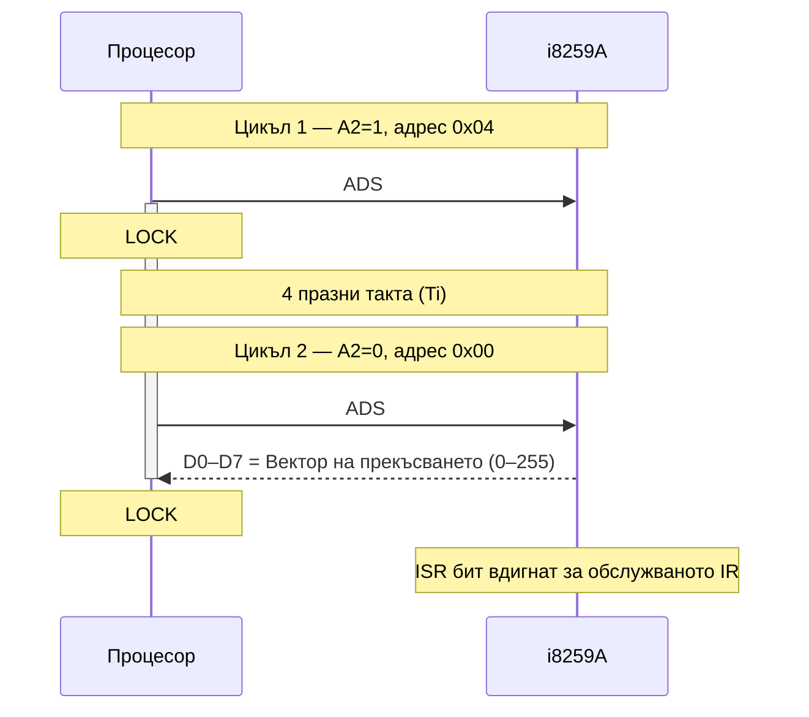
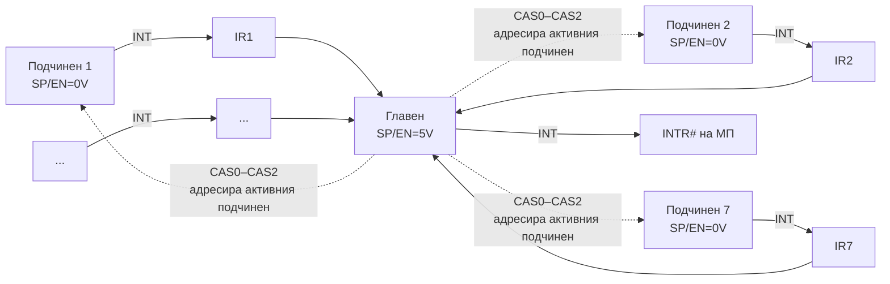

## 1. Цикъл за потвърждаване на прекъсване (INTA)

При получено маскируемо прекъсване (INTR активен), процесорът завършва текущата инструкция и — ако IF=1 — стартира **цикъл за потвърждаване на прекъсване**.

### Механизъм (i386/i486/Pentium)

Процесорът изпълнява **два последователни цикъла за четене**, разделени с 4 празни такта:

**Цикъл 1 (адрес 0x04):**

- ADS# активен
- M/IO# = D/C# = W/R# = 0 (тип цикъл = INTA)
- A2 = 1 (адрес 0x04), BE0# активен
- LOCK# активен (за осигуряване неделимост на двата цикъла)
- Данните от D0–D7 се **игнорират**

**[4 празни такта]**

**Цикъл 2 (адрес 0x00):**

- ADS# активен
- M/IO# = D/C# = W/R# = 0
- A2 = 0 (адрес 0x00), BE0# активен
- При RDY# — **номерът на прекъсването** (0–255) се прочита от D0–D7
- LOCK# се снема след края на цикъл 2



---

## 2. Контролер на прекъсванията i8259A (**PIC**)

**i8259A** е програмируем контролер, управляващ до 8 маскируеми прекъсвания (IR0–IR7). Чрез каскадно свързване — до 64 входа.

### 2.1 Вътрешна структура


> **[IRQ](/glossary/#irq)** (Interrupt Request) — входните линии на 8259A (IR0–IR7), по които периферните устройства заявяват прекъсване.

### 2.2 Основни регистри

> **[IRQ](/glossary/#irq)** (Interrupt Request) — входните линии на 8259A (IR0–IR7), по които периферните устройства заявяват прекъсване.

### 2.2 Основни регистри

| Регистър                                               | Описание                                        |
| ------------------------------------------------------ | ----------------------------------------------- |
| **[IRR](/glossary/#irr)** (Interrupt Request Register) | Запомня постъпилите заявки (IR0–IR7) асинхронно |
| **[ISR](/glossary/#isr)** (In-Service Register)        | Прекъсванията, чието обслужване е започнало     |
| **[IMR](/glossary/#imr)** (Interrupt Mask Register)    | Маски на заявките — бит=1 → маскирано           |

**Приоритетна логика** анализира IRR, ISR и IMR → определя най-приоритетното необслужено прекъсване.

### 2.3 Алгоритъм на работа

1. Заявки постъпват асинхронно на IR0–IR7 → запомват се в **[IRR](/glossary/#irr)**
2. Приоритетната логика определя най-приоритетната неблокирана заявка
3. Активира **INT** → постъпва на INTR# на процесора
4. Процесорът изпраща **INTA#** (цикъл 1) — контролерът запомва прекъсването
5. При **INTA#** (цикъл 2) — контролерът поставя **номера на прекъсването** на D0–D7 и вдига съответния бит в **[ISR](/glossary/#isr)** (маскира повторна заявка от същия източник)
6. В края на обработката — ОС записва **[EOI](/glossary/#eoi)** (End of Interrupt) → нулира ISR бита
7. Нова заявка се приема, ако не е маскирана и има **по-висок приоритет** от текущо обслужваната

### 2.4 Приоритет

**Статичен** (по подразбиране): IR0 = най-висок, IR7 = най-нисък.

**Динамичен (ротационен)**: приоритетите на IR0–IR7 се ротират след всяко обслужване — осигурява равенство.

### 2.5 Каскадно свързване

При каскадно свързване: **един главен** (SP/EN = 5V) + до 8 **подчинени** (SP/EN = 0V):



- При INTA (цикъл 1): главният определя кой подчинен е активен → изпраща номера му по **CAS0–CAS2**
- При INTA (цикъл 2): **само активираният подчинен** поставя вектора на шината данни
- Главният определя **адресния компаратор** на подчинените чрез CAS0–CAS2

### 2.6 Програмиране

**[ICW](/glossary/#icw)** (Initialization Command Words) — четири инициализиращи думи, задаващи режима на работа на 8259A.
**[OCW](/glossary/#ocw)** (Operation Command Words) — три оперативни думи за управление по време на работа.

Контролерът се програмира чрез две групи командни думи:

#### Инициализиращи командни думи (ICW1–ICW4)

Изпращат се **последователно** при начало:

| Дума     | Функция                                                                                                             |
| -------- | ------------------------------------------------------------------------------------------------------------------- |
| **ICW1** | Режим на заявки (по фронт/ниво); дали следват ICW3/ICW4; единичен/каскаден режим                                    |
| **ICW2** | Старшите 5 бита на вектора (биговете 7–3); IR0→вектор=ICW2[7:3]+000 ... IR7→...+111                                 |
| **ICW3** | (само при каскаден режим) За главен: кои IR входове са свързани с подчинени; За подчинен: неговия CAS идентификатор |
| **ICW4** | Режим на вложена обработка; автоматичен EOI или ръчен; 8086/8080 режим                                              |

#### Операционни командни думи (OCW1–OCW3)

Използват се по всяко време:

| Дума     | Функция                                                                  |
| -------- | ------------------------------------------------------------------------ |
| **OCW1** | Управление на маските (IMR) — задава/снема индивидуални маски на IR0–IR7 |
| **OCW2** | EOI — нулира ISR бит; задава ротация на приоритета                       |
| **OCW3** | Избира кой регистър (IRR или ISR) да се прочете при следващото четене    |

#### Адресиране на регистрите

| A0  | D4  | D3  | RD# | WR# | CS# | Операция                       |
| --- | --- | --- | --- | --- | --- | ------------------------------ |
| 0   | 0   | 0   | 1   | 0   | 0   | Запис в OCW2                   |
| 0   | 0   | 1   | 1   | 0   | 0   | Запис в OCW3                   |
| 0   | 1   | x   | 1   | 0   | 0   | Запис в ICW1                   |
| 1   | x   | x   | 1   | 0   | 0   | Запис в OCW1, ICW2, ICW3, ICW4 |
| 0   | —   | —   | 0   | 1   | 0   | Четене от IRR или ISR          |
| 1   | —   | —   | 0   | 1   | 0   | Четене от IMR                  |

---

## 3. Локален APIC — преглед

(Разгледан подробно в Глава XIII.)

Основна разлика с 8259A:

| Характеристика            | i8259A                        | Локален APIC                |
| ------------------------- | ----------------------------- | --------------------------- |
| **Входове**               | 8 (разширяемо до 64 каскадно) | Практически неограничени    |
| **Вектори**               | Задава се чрез ICW2           | 240 вектора (16–255)        |
| **Интеграция**            | Отделна ИС                    | Вграден в процесора (от P6) |
| **[IMR](/glossary/#imr)** | Явен регистър                 | Нняма; чрез TPR             |
| **[IPI](/glossary/#ipi)** | Не                            | Да (ICR регистър)           |
| **Приоритет**             | По IR номер                   | TPR (задача-базиран)        |

### Взаимодействие 8259A и APIC

При P6 системи с външен 8259A:

- 8259A е свързан към вход **LINT0** на локалния APIC с режим **ExtINT**
- При прекъсване от 8259A: APIC предизвиква INTA цикъл към 8259A → получава вектора
- Само един APIC вход може да е конфигуриран като ExtINT

---

## 4. Обработка на прекъсвания при P6 (суперскаларни особености)

- Прекъсванията и изключенията се приемат на **границата между инструкции** в завършващото устройство (Retire Unit)
- Спекулативното изпълнение **не влияе** на реда на обработка — само завършени инструкции могат да генерират изключения
- Изключение **#MC** (Machine Check, вектор 18) е въведено при P6 — генерира код за грешка автоматично
- Externes прекъсвания: чрез LINT[0–1] на APIC или чрез серийния APIC интерфейс (PICD[1–0])

---

## 5. Пример за инициализация на 8259A (реален режим)

```asm
; Инициализация на 8259A в IBM PC
; Вектори IR0-IR7 → 08h-0Fh (системни BIOS вектори)

mov al, 11h         ; ICW1: по фронт, каскаден, следват ICW4
out 20h, al         ; порт A0=0 (командна дума)

mov al, 08h         ; ICW2: стартов вектор 08h (IR0=INT 8)
out 21h, al         ; порт A0=1

mov al, 04h         ; ICW3: IR2 е свързан с подчинен контролер
out 21h, al

mov al, 01h         ; ICW4: режим 8086, ръчен EOI
out 21h, al

; Маски: забранява всички освен IR0 (таймер)
mov al, 0FEh        ; 11111110 — само IR0 разрешен
out 21h, al

; EOI в края на обработка
mov al, 20h         ; Non-Specific EOI
out 20h, al
```

---

## Резюме за изпита

> - INTA цикъл: 2 цикъла четене (A2=1 и A2=0), разделени с 4 такта; LOCK# за неделимост; векторът на D0–D7 при втория
> - i8259A: IRR (заявки), IMR (маски), ISR (в обработка); приоритетна логика → INT
> - Алгоритъм: IR→IRR→(IMR)→приоритет→INT→INTA×2→ISR вдигнат→обработка→EOI→ISR нулиран
> - ICW1–ICW4: инициализация (последователно); OCW1–OCW3: оперативно управление
> - ICW2: горни 5 бита на вектора; IR0–IR7 добавят 000–111 в долните 3 бита
> - Каскадно: CAS0–CAS2 адресират подчинения; подчиненият дава вектора при INTA#2
> - Локален APIC: вграден в процесора; без явен IMR (TPR); 240 вектора; IPI (ICR)
> - ExtINT режим: APIC вход свързан с 8259A; APIC предизвиква INTA цикъл
>
> [→ Речник на всички съкращения](/glossary/)

---

**Източници:**

- Рускова Н. _Микропроцесорни системи._ ТУ-Варна, 1999 (OCR)
- Intel 8259A Programmable Interrupt Controller Datasheet
- Intel 64 and IA-32 Architectures Software Developer's Manual, Vol. 3A, Chapter 10 (Advanced Programmable Interrupt Controller)
