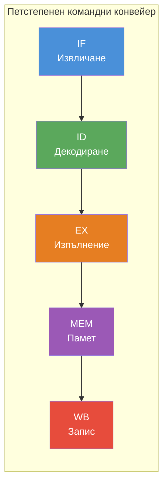

Конвейерната обработка е едно от най-фундаменталните нововъведения в историята на процесорната архитектура. Идеята е заимствана директно от промишления конвейер: вместо да се чака пълното завършване на една операция преди стартиране на следващата, различни етапи на множество операции протичат едновременно в различни апаратни блокове. Резултатът е драматично увеличение на производителността, без да се налага ускоряване на самата хардуерна логика — паралелизмът идва от организацията, не от технологията.

## 1. Въведение

**Конвейерната обработка** (*pipelining*) увеличава производителността на процесора чрез въвеждане на паралелизъм *във времето*. Подлежащата за изпълнение базова функция се разделя на малки части — *подфункции* — всяка от които се изпълнява от отделен апаратен блок, наречен *степен* на конвейера. Подобно на физически производствен конвейер, командите и данните се преместват последователно през степените, като на всеки тактов цикъл в конвейера влиза нова операция.

Скоростта на конвейера не зависи от неговата дължина (броя степени), а от времето за обработка в най-бавната степен — тя задава тактовия цикъл.

**Пример: конвейер за събиране на вектори с плаваща запетая.** Базовата функция — събиране на числа с плаваща запетая — може да се разбие на три подфункции:

а) Изравняване на порядъците — мантисата на числото с по-малкия порядък се измества надясно с разликата между двата порядъка.
б) Сумиране на мантисите.
в) Нормализация на резултата.

Тристепенен конвейер изпълнява тези подфункции паралелно. При вектор с $n$ елемента са необходими само $n + 2$ такта вместо $3n$ при последователна обработка:

$$S = \frac{3n}{n + 2} \xrightarrow{n \to \infty} 3$$

В общия случай за конвейер с $L$ степени:

$$S = \frac{Ln}{L + n - 1} \xrightarrow{n \to \infty} L$$

Конвейерната обработка е особено ефективна при дълги вектори. При малки $n$ значителна част от времето се изразходва за запълване и изпразване на конвейера.

```mermaid
gantt
    title Времедиаграма на тристепенен конвейер (4 операции)
    dateFormat  X
    axisFormat %s

    section Степен 1 (изравняване)
    Оп. 1 :a1, 0, 1
    Оп. 2 :a2, 1, 2
    Оп. 3 :a3, 2, 3
    Оп. 4 :a4, 3, 4

    section Степен 2 (сумиране)
    Оп. 1 :b1, 1, 2
    Оп. 2 :b2, 2, 3
    Оп. 3 :b3, 3, 4
    Оп. 4 :b4, 4, 5

    section Степен 3 (нормализация)
    Оп. 1 :c1, 2, 3
    Оп. 2 :c2, 3, 4
    Оп. 3 :c3, 4, 5
    Оп. 4 :c4, 5, 6
```

*Всяка степен обработва различна операция в един и същи такт. От 4-ти такт насетне конвейерът работи на пълна мощност.*

### 1.1 Формална дефиниция и условия

Конвейерността означава осигуряване на съвместяване *във времето* на различни действия по изчислението на базовите функции чрез тяхното разбиване на подфункции. За да се реализира коректна конвейерна обработка, трябва да са изпълнени пет условия:

1. Изчислението на базовата функция е еквивалентно на последователност от подфункции.
2. Входните величини на всяка подфункция са изходни величини на предходната.
3. Между подфункциите няма никакви взаимодействия освен предаването на данни.
4. Всяка подфункция се реализира от отделен апаратен блок.
5. Апаратните блокове изразходват приблизително едно и също време.

Всяка *степен* се изгражда от два вътрешни блока: **логика (Л)** — осъществява самите изчисления — и **фиксатор (Ф)** — свръхбърза памет, която подава данните към следващата степен в строго определен момент. Конвейерът е синхронно изчислително устройство.

Ако дори едно от условията не е изпълнено, правилният термин е **препокриване на операциите** (*operation overlapping*), а не конвейерна обработка. Типичен пример е препокриването на вход-изходни операции с изчисления: централният процесор (степен 1) и процесорът за вход-изход (степен 2) работят паралелно, но между тях може да съществуват зависимости, нееднородно времетраене или различни вериги от подфункции.

*Четиристепенен конвейер: всеки правоъгълник представлява отделна инструкция, цветовете показват в коя степен тя се обработва в даден тактов цикъл. (Wikimedia Commons)*

## 2. Видове конвейери

Конвейерите се класифицират по два основни критерия: брой функции, които могат да изпълняват, и структурата на пътищата за данните.

### 2.1 Еднофункционален и многофункционален конвейер

**Еднофункционалният конвейер** изпълнява само един тип базова функция — например само събиране на числа с плаваща запетая. Структурата му е фиксирана и проста.

**Многофункционалният конвейер** може да изчислява функции от различни типове. Освен вход за данни той притежава управляващ вход, регулиращ действието на конвейера. Многофункционалните конвейери се подразделят по честотата на смяна на функцията:

- **Статичен конвейер** — смяната на функцията е относително рядка и се извършва под явно управление на програмата. Типичен пример е аритметичният конвейер на векторен процесор.
- **Динамичен конвейер** — смяната на функцията е непрекъсната и динамична. Използва се при изпълнение на машинни команди, всяка от които по правило се различава по формат и тип от предходната. Съвременните процесори използват динамичен конвейер; неговата реализация обикновено е скрита от програмиста.

### 2.2 Еднолинеен и многолинеен конвейер

**Еднолинейните (еднопътните)** конвейери пропускат потока данни от степен към степен по един фиксиран маршрут, независимо от типа операция.

**Многолинейните (многопътните)** конвейери разполагат с различни пътища за различните операции. Например конвейер, изпълняващ събиране и умножение на цели и реални числа, използва само подмножество от наличните блокове за всяка операция. Основният недостатък е лошото използване на апаратните блокове: при равна вероятност за изпълнение на четирите аритметични операции средното натоварване може да бъде само около 40%.

## 3. Проблеми на конвейерната обработка

Увеличената скорост на изчисление поражда специфични проблеми, непознати при класическата последователна обработка. Основните от тях са свързани с прекъсванията, задръжките в конвейера и запълването му.

### 3.1 Прекъсвания

Системата от прекъсвания при конвейерните процесори се усложнява съществено. При класическата архитектура обработката на прекъсване е ясна: спира се текущата команда и се извършва прехвърляне на управлението. При конвейерна обработка обаче множество фрагменти от различни команди се намират едновременно в различни степени. Прекъсванията са асинхронни спрямо нормалното изпълнение, което поставя два трудни въпроса:

- Точно *кога* (след коя степен) трябва да се постави форсираният преход към манипулатора на прекъсването?
- Как точно да се възстанови прекъснатата програма след обработката?

С нарастването на броя степени и двата проблема се задълбочават.

### 3.2 Задръжки в конвейера (Hazards)

**Задръжките** (*hazards*) са забавяния, пречещи на конвейера да работи с максималната си скорост. Биват два вида:

**Структурни задръжки** (*structural hazards*) — възникват когато два различни фрагмента от данни се опитват едновременно да използват една и съща степен. Наричат се *стълкновения* (*collisions*). Пример: при многофункционален многопътен конвейер, изпълняващ последователно „събиране с плаваща запетая" и „събиране с фиксирана запетая", двете операции могат да се окажат в едни и същи степени в един и същ такт. Управляващият механизъм трябва да предотврати конфликта. Тези задръжки **подлежат на аналитично изследване** и могат да бъдат отстранени още по времена проектирането.

**Задръжки, зависещи от данните** (*data hazards*) — възникват когато резултатът от обработката в една степен влияе на работата на друга. Типичен случай: две степени се нуждаят едновременно от достъп до общата памет; едната трябва да „изчаква" напразно, докато другата завърши. За разлика от структурните, тези задръжки **не се поддават на пълно аналитично изследване** — зависят изцяло от конкретните данни.

**Командни зависимости** (*control hazards*) — специфичен проблем при конвейерното изпълнение на команди. Едновременното изпълнение на съседни команди може да породи конфликт: i-та команда чете операнд, а (i+1)-та го модифицира в следваща степен. С увеличаване на броя степени повече команди се намират едновременно в конвейера и проблемът се задълбочава значително. Методите за разрешаване на командни зависимости се дискутират подробно в Тема 5.

*Петстепенен RISC командни конвейер (IF → ID → EX → MEM → WB). Всяка степен обработва различна команда в един и същи тактов цикъл.*

### 3.3 Проблем със запълването на конвейера

За максимална ефективност всички степени на конвейера трябва да са постоянно натоварени. Ако дължината на обработвания вектор е съизмерима с броя степени, или ако програмата съдържа чести команди за преход, степените ще остават незаети или ще изпълняват ненужни команди. В резултат производителността спада значително — конвейерното ускорение $S \to L$ се постига само при достатъчно дълги и непрекъснати потоци от операции.

## Резюме

- Конвейерната обработка разбива базовата функция на подфункции и ги изпълнява паралелно в отделни апаратни степени, постигайки ускорение $S \to L$ при дълги вектори.
- За коректна конвейерна обработка е необходимо изпълнението на пет условия; нарушаването на което и да е от тях прави по-правилно да се говори за „препокриване на операции".
- Конвейерите биват еднофункционални и многофункционални (статични и динамични), еднолинейни и многолинейни; многопътните конвейери страдат от ниско средно натоварване на блоковете.
- Структурните задръжки (*collisions*) могат да бъдат предотвратени при проектирането; задръжките зависещи от данните и командните зависимости изискват динамични механизми за управление по време на изпълнение.
- Ефективността на конвейера намалява при кратки вектори и чести условни преходи — проблемът „запълване на конвейера" е централен за оптимизацията на конвейерни процесори.
