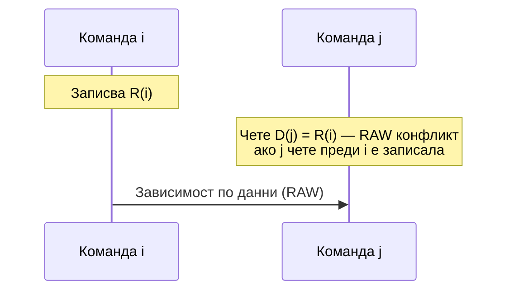
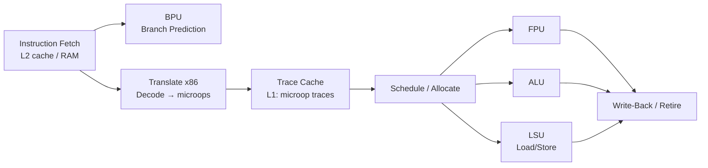

Конвейерното изпълнение на командите е основна техника за повишаване на производителността на съвременните процесори. За програмиста, пишещ приложни програми, тази структура остава невидима — набор команди се дефинира за цяло процесорно семейство и всеки негов член изпълнява едни и същи програми, независимо от конкретния начин за реализация. Следенето и управлението на всяка команда в конвейера е прекалено сложно на програмно ниво, затова конвейерното изпълнение остава скрито за програмиста.

## 1. Въведение

Изпълнението на всяка команда включва няколко последователни етапа. В най-простия случай те са два: извличане (Fetch) и изпълнение (Execute). В хода на изпълнителния етап възникват интервали без обръщения към паметта — те могат да се използват за предварително извличане на следващи команди, реализирайки по този начин двустепенен pipeline.

При такъв конвейер първата степен — **IF устройство (Instruction Fetch Unit)** — извлича и буферира командата; втората — **E-устройство (Execution Unit)** — я изпълнява. Докато E-степента работи, IF-степента използва свободните цикли за зареждане на следващата команда. Това е известно като *предварително извличане на команди*.

Удвояване на скоростта в идеалния случай е малко вероятно по две причини:
- Времето за изпълнение на командата, като правило, е значително по-голямо от времето за извличане.
- При команди за преход изходът е неизвестен, докато командата не се изпълни — конвейерът трябва да изчака, което въвежда принудителни забавяния.

За увеличаване на ускорението се прилагат два основни прийома:

**а)** Двустепенен конвейер, в чиято първа степен се извършват повече функции: извличане, декодиране, определяне на адреса на операнда — така се изравняват времената на двете степени. Фиксаторът между тях може да бъде прост регистър или регистров файл; вторият вариант осигурява по-голяма независимост на скоростта на двете степени.

**б)** Конвейер с повече степени, всяка реализираща отделна подфункция (извличане, декодиране, адресно изчисление и т.н.). С нарастването на степените се увеличава и сложността на управляващата логика за отчитане на зависимостите между командите — недостатък, компенсиран от нарастващото тактово ускорение.

По-старите процесори (напр. i8086) са използвали двустепенния подход; съвременните предпочитат многостепенните конвейери.

## 2. Работа на конвейера

### 2.1 Примерен програмен фрагмент

Работата на конвейера се илюстрира с хипотетична RISC програма:

```text
LOAD A,M1
LOAD B,M2
ADD  A,B
STORE M3,A
JUMP X
```

При RISC команди аритметично-логическите операции имат две фази: **IF** (извличане) и **E** (изпълнение). Операциите за достъп до паметта (LOAD/STORE) имат три фази: **IF**, **E** (изчисление на адреса) и **D** (обръщение към паметта). Без конвейер изпълнението изисква 13 такта.

### 2.2 Случай А — обща памет за данни и команди

Когато процесорът има обща памет, фазите IF и D на различни команди не могат да стартират едновременно — те претендират за един и същ ресурс. Командата ADD се задържа с два такта; следващата след JUMP команда — с един такт. Резултатът е 8 такта — повишаване на производителността с 62,5%.

### 2.3 Случай Б — разделени памети за данни и команди

При отделни памети за данни и команди фазите IF и D могат да протичат едновременно. Разписанието изисква 7 такта (85,7% ускорение). Теоретично максималното ускорение е 3×, тъй като в конвейера могат да бъдат едновременно до 3 команди. Ако фаза E се раздели на E1 и E2 (например четене на регистровия файл и изпълнение в аритметично-логическото устройство), тактовата продължителност намалява наполовина, а производителността нараства 2,6 пъти спрямо неконвейерното изпълнение.

### 2.4 Програмни решения: NOP и оптимизирано разклонение

Зависимостите между командите могат да се разрешат на **програмно ниво** чрез вмъкване на команди от типа `NOP` (концепцията на Станфорд) или чрез задържане на конвейера (концепцията на Бъркли). Алтернатива е **оптимизираното разклонение**: компилаторът разменя местата на командата за преход и непосредствено предхождащата я полезна команда, така че "слотът за забавяне" след командата за преход се запълва с реална работа вместо с NOP.

За преодоляване на конвейерните прекъсвания при преходи се прилагат апаратни техники:
- **Предварителен избор на адреса на разклонение** — при засичане на условен преход се извлича и неговата цел.
- **Няколко потока команди** (IBM System 370/168) — два буфера за команди; при вземане на прехода конвейерът се превключва към спомагателния буфер.
- **Прогнозирано разклонение** — асоциативна памет съхранява историята на преходите и предварително зарежда най-вероятната следваща команда.

## 3. Междукомандни зависимости

### 3.1 Същност на зависимостите

При неконвейерните процесори всяка команда завършва напълно преди да стартира следващата. При конвейерното изпълнение командите се препокриват по време, което може да породи конфликти, ако операции, стартирани от команда *j*, зависят от резултата на все още незавършила команда *i*.

Формално дефинираме:
- **D(i)** — *областта на определяне* на команда *i*: множеството обекти (регистри, клетки от паметта, флагове), четени от нея.
- **R(i)** — *областта на значенията* на команда *i*: множеството обекти, модифицирани от нея.

Съществуват три класа **конфликти (hazards)** между произволна двойка команди *i* и *j* (при j след i):

| Тип | Условие | Описание |
|-----|---------|----------|
| **RAW** (Read After Write) | R(i) ∩ D(j) ≠ ∅ | j чете обект, записан от i, преди i да е завършила записа |
| **WAR** (Write After Read) | D(i) ∩ R(j) ≠ ∅ | j записва обект, четен от i, преди i да го е прочела |
| **WAW** (Write After Write) | R(i) ∩ R(j) ≠ ∅ | и двете команди записват в един обект; i-то записване може да настъпи след j-то |

Симетричният случай RAR (Read After Read) не е конфликтна ситуация. RAW е най-честият и най-критичен тип конфликт.



### 3.2 Откриване и отстраняване

**На апаратно ниво** се прилагат два подхода:

а) В първата степен на конвейера се определят D(i) и R(i) и се сравняват с тези на командите в конвейера. При открит конфликт цялата колона от команди i и следващите след нея се задържа, докато конфликтната команда напусне конвейера.

б) По-гъвкав вариант: изпълнението продължава до точката, в която се изисква конфликтният обект. При липса на конфликт командата i+1, i+2… могат да "задминат" i-та команда (out-of-order изпълнение).

**На програмно ниво** конфликтите се отстраняват чрез:
- Вмъкване на `NOP` команди (*отложено разклонение*).
- Реорганизация на кода — *оптимизирано разклонение*: разместване на независими команди, за да се запълнят задръжките с полезна работа.

## 4. Конвейери в процесорите на Intel

### 4.1 Архитектура P5 (Pentium)

**P5 (Pentium)** интегрира в един чип две целочислени аритметично-логически устройства (U и V), едно FPU, отделни 8 KB кеш памети за код и данни, **BTB (Branch Target Buffer)** за предсказване на преходи и устройство за управление на паметта. Процесорът е *суперскаларен* — при определени условия завършва до 2 целочислени операции за такт.

**Целочислени конвейери U и V** — всеки от тях изпълнява командите в пет фази:

| Фаза | Наименование | Описание |
|------|-------------|---------|
| IF | Instruction Fetch | Извличане от кеш |
| D1 | Instruction Decode | Декодиране на командата |
| D2 | Address Decode | Формиране на адреса на операнда |
| EX | Execute | Аритметично-логически операции и достъп до кеш за данни |
| WB | Write Back | Актуализиране на регистровия файл |

Конвейерът U изпълнява всяка x86 команда; конвейерът V — само *прости* (апаратно реализируеми) команди и `FXCHG`. Двойките команди за U и V се формират по строги правила: двете команди не трябва да имат регистрови зависимости, и двете трябва да са "прости", командата за V е винаги втора в двойката. Правилното сдвояване е ключово — неправилните последователности прекъсват паралелното изпълнение.

**BTB** поддържа история на преходите (history bits) и прогнозира дали следващият условен преход ще бъде взет или не, позволявайки предварително зареждане на кода по предвидения клон. При грешна прогноза конвейерите се изчистват изцяло.

**FPU конвейер** — 8-степенен (IF, D1, D2, EX, X1, X2, WF, ER). Командата `FXCHG` може да се изпълни паралелно с друга FP команда за квази-нула такта. Паралелното изпълнение на целочислени и FP команди не е разрешено.

В P5 редът на изпълнение не може да се променя — зависимостите се разрешават чрез строги правила в управлението на конвейерите.

### 4.2 Архитектура P6 (Pentium Pro / II / III)

**P6** е суперскаларна архитектура с три целочислени конвейера и 14-степенен pipeline, разделен на три секции: поредно изпълнение, непоредно изпълнение (out-of-order) и оттегляне (retire).

Ключовите нововъведения спрямо P5 са четири:

1. **Микрооперации (microops)** — всяка x86 команда се транслира вътрешно в RISC-подобни операции, улеснявайки конвейерната обработка.
2. **Непоредно изпълнение** — командите, готови за изпълнение, се изпращат напред, заобикаляйки забавени команди. *Станцията за резервиране* (reservation station) буферира микрооперациите.
3. **Смяна на имената на регистрите (register renaming)** — елиминира WAR и WAW конфликти и позволява паралелно изпълнение на команди, работещи с едни и същи архитектурни регистри.
4. **Дълбоко прогнозиране на преходите** — многобитова история на преходите.

Разделянето на секциите чрез буфериране позволява трите части на конвейера да работят относително независимо. P6 изисква 32-битова ОС и 32-битови приложения, за да изяви пълния си потенциал — при 16-битов код се появяват значителни забавяния (до 7+ цикъла при четене от цял регистър след запис в 8/16-битова му част).

### 4.3 Архитектура P4P (Pentium 4 — NetBurst)

**P4P (NetBurst)** се появява на пазара през ноември 2000 г. като първа нова x86 архитектура на Intel след Pentium Pro. Конвейерът е дълбок — общо 28 степени, приблизително двойно повече спрямо P6. По-дълбокият конвейер позволява по-висока тактова честота, но увеличава цената на грешно предсказан преход и изисква непрекъснато захранване с команди.

Основните структурни елементи на P4P:

- **Trace Cache** — L1 кеш, съхраняващ не x86 команди, а вече транслирани и декодирани микрооперации, наредени в *следи (traces)*. Така при цикли транслацията не се повтаря многократно.
- **BPU (Branch Prediction Unit)** — интегриран с Trace Cache; предсказването е вградено в самата следа.
- **Execution Engine** — планиращ блок и изпълнителни устройства (FPU, ALU, LSU).
- **Микрокодова ROM** — за дълги x86 команди (напр. операции с низове), транслирани в стотици микрооперации.

Дълбокият конвейер предполага огромен брой команди в различни степени (до 126 едновременно). Малкото ефективно L1 пространство (12 KB Trace Cache ≈ 16–18 KB стандартна кеш) е достатъчно, защото вместо сурови байтове то съхранява компактни микрооперации.



*Обобщена структура на конвейерите в P4P (NetBurst). BPU — Branch Prediction Unit; LSU — Load/Store Unit.*

## Резюме

- Конвейерното изпълнение на командите остава прозрачно за програмиста: програмите са коректни независимо от броя конвейерни степени.
- Три класа конфликти (hazards) ограничават паралелизма: **RAW** (Read After Write), **WAR** (Write After Read) и **WAW** (Write After Write); разрешават се апаратно (задържане, out-of-order изпълнение) или програмно (NOP, оптимизирано разклонение).
- **P5 (Pentium)** използва двоен in-order 5-степенен конвейер (U+V) с BTB; паралелното изпълнение изисква стриктно спазване на правила за сдвояване.
- **P6 (Pentium Pro/II/III)** въвежда 14-степенен out-of-order конвейер с микрооперации, резервационна станция и смяна на регистърни имена — елиминира повечето конфликти динамично по време на изпълнение.
- **P4P (NetBurst)** задълбочава конвейера до 28 степени и въвежда Trace Cache — L1 кеш за вече транслирани микрооперации, спестяващ циклите за повторно декодиране на горещ код.
