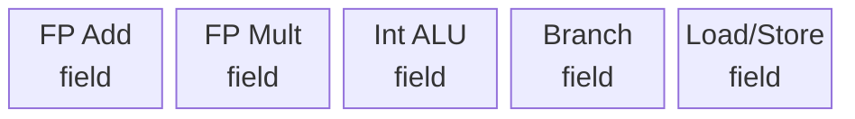
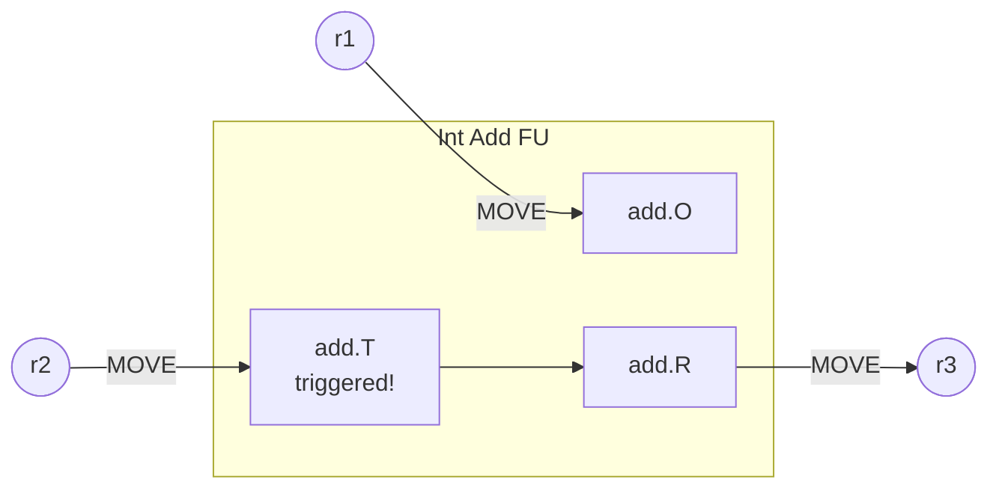

Конвейерното изпълнение не е единственият начин за постигане на висока изчислителна скорост. Друг подход е интегрирането на множество **ФУ (функционални устройства)** вътре в единичния процесор. Всяко ФУ се активира от отделна команда и може да бъде универсално или специализирано по функция, просто (следващата операция чака предишната) или конвейерно (самото ФУ прилага конвейерен принцип). За разлика от векторните процесори, ефективното използване на множеството ФУ не изисква регулярност на данните — максимална производителност се постига и за скаларни операции. За разлика от мултипроцесорните архитектури, комуникационните разходи между устройствата са минимални.

Ключовият проблем при множество ФУ е **синхронизацията**: различните команди изпълняват в различно време, резултатите от едни могат да са операнди за други, а няколко команди могат едновременно да претендират за един ресурс. Решението се търси по два пътя — апаратно и програмно — като и в двата случая се реализира паралелизъм на ниско ниво, известен като **ILP (Instruction Level Parallelism)**.

## 2. Синхронизация на апаратно ниво

Апаратната синхронизация се реализира по време на изпълнение на програмата. Исторически е приложена за пръв път в компютъра **CDC 6600** (1964). Архитектурата представлява конвейер за команди, в чиято изпълнителна степен са включени няколко паралелно работещи ФУ — реализиращ *функционален паралелизъм*. Тя е известна и под популярното наименование **суперскаларна архитектура**.

Ако ФУ взаимодействат само с регистрите (не директно с паметта), зависимостта на времето за изпълнение от местоположението на данните се елиминира. Почти всички съвременни процесори — Intel Pentium III, P4, AMD K6/K7, Alpha, PowerPC 601/602, UltraSPARC — са суперскаларни.

Паралелното изпълнение в суперскаларен процесор е невъзможно при три типа конфликти:
- **Конфликти при достъп до ресурси** — няколко команди претендират едновременно за едно ФУ. Решение: дублиране на ФУ.
- **Зависимост по управление** — неопределеност при разклонения; при x86 CISC командите с променлива дължина не може да се декодира следващата команда преди да завърши декодирането на текущата. Затова суперскаларната архитектура е по-подходяща за RISC.
- **Конфликти по данни** — следващата команда се нуждае от резултата на предишната. Тази зависимост е вродена в програмата и не може да се отстрани нито от компилатора, нито с апаратни средства. Решение: *стратегия за непоредно изпълнение (out-of-order execution)* — задминаване на блокирани команди и изпълнение на готовите.

За ефективно непоредно изпълнение е необходим достатъчно голям **прозорец на изпълнение (Window of Execution)** — набор от команди-кандидати за изпълнение в даден момент. Метрика за ефективност е **CPI (Cycles Per Instruction)** — идеалната стойност е 1 за единичен конвейер, а при множество ФУ може да бъде по-малка от 1.

Две стратегии за висока производителност: *"широк и плитък"* конвейер (повече конвейери с малко степени, напр. Motorola G4) срещу *"тесен и дълбок"* конвейер (по-малко конвейери с много степени, напр. Intel P4P).

### 2.1 Алгоритъм Scoreboard

**Scoreboarding** е централизиран метод за динамично планиране на командите, въведен в CDC 6600. Изпълнението на всяка команда преминава през четири фази:

1. **Issue (издаване)** — проверява се наличността на ФУ и за WAW конфликти. При наличие на WAW или при липса на свободно ФУ командата се задържа (stall).
2. **Read Operands (четене на операндите)** — изчаква се наличността на изходните операнди (разрешаване на RAW конфликти). Изпълнението може да стартира след прочитане.
3. **Execution (изпълнение)** — ФУ извършва операцията; при завършване известява Scoreboard.
4. **Write Result (запис на резултата)** — проверява се за WAR конфликти. Записът в регистровия файл настъпва само след като всички по-ранни команди, четящи операнда, са приключили.

Scoreboard поддържа три таблици за статус:
- **Таблица на командите** — за коя фаза се намира всяка команда.
- **Таблица на ФУ** — за всяко ФУ: заето/свободно, операция, изходни/целеви регистри, готовност.
- **Таблица на регистрите** — кое ФУ ще запише резултат в даден регистър.

Ограничения на Scoreboard: липса на forwarding, малък прозорец на изпълнение (рамките на основния блок), структурни конфликти при ограничен брой ФУ, задържане при WAR конфликти.

### 2.2 Алгоритъм на Томасуло (Tomasulo)

**Алгоритъмът на Томасуло** е разработен за IBM System/360 Model 91 (~1967 г.) и представлява разпределен вариант на Scoreboard с ключово нововъведение — **смяна на имената на регистрите (register renaming)**. Тя елиминира WAW и WAR конфликти, позволявайки истинско out-of-order изпълнение.

Основните компоненти на алгоритъма са:

- **Станции за резервиране (Reservation Stations, RS)** — всяко ФУ разполага с собствени RS. Те буферират командата заедно с операндите или с *таговете* на ФУ, очаквани да ги произведат.
- **Обща шина за данни (Common Data Bus, CDB)** — при завършване на изпълнение ФУ излъчва резултата по CDB, заедно с тага на RS. Всички чакащи RS и регистри прихващат стойността едновременно.


*Структурна схема на алгоритъма на Томасуло — резервационни станции, ФУ и обща шина за данни (CDB). Изображение: Wikimedia Commons.*

Трите фази на алгоритъма:

1. **Issue** — командата се изпраща към свободна RS. Ако RS не е свободна, командата чака. Операндите се записват директно в RS, ако са вече налични; в противен случай се поставя таг на производящото ФУ.
2. **Execute** — когато и двата операнда в RS са налични, ФУ стартира изпълнението. Резултатите могат да пристигнат по CDB и да запълнят чакащите тагове.
3. **Write Result** — резултатът се излъчва по CDB; всички RS и регистрови записи, носещи тага на това ФУ, получават стойността.

Разпределеният контрол (по RS) е основната разлика спрямо централизирания Scoreboard. Смяната на имената на регистрите чрез тагове позволява на командите да се изпълняват в различен ред, без да се наруши коректността — WAW и WAR конфликти не блокират конвейера. Единствените истински ограничения са RAW зависимостите.

## 3. Синхронизация на програмно ниво

При програмната синхронизация компилаторът носи отговорността за планирането на изпълнението на командите и разпределението им към ФУ. Резултатът е архитектурата **VLIW (Very Long Instruction Word)** — процесор със свръхдълга команда.

VLIW е логическо разширение на RISC: компилаторът пакетира няколко прости команди в една дълга дума, като всяко поле на думата директно управлява едно ФУ. Процесорът има единствен програмен брояч (SIMD-подобна обработка) и статично планирано изпълнение.



*Формат на VLIW команда: всяко поле управлява директно едно ФУ.*

Характеристики на VLIW архитектурата:
- Всяка дълга команда инициира няколко **елементарни и независими** операции.
- Всяка операция заема *предварително известен* брой цикли — без хардуерни блокировки.
- Всяко ФУ може да работи конвейерно.

Компилаторът изгражда граф на изпълнимата програма на ниво отделни команди, избира най-вероятния изпълнителен път и пакетира операциите в дълги думи, отчитайки зависимостите по данни, наличността на ФУ, регистри и шини.

**Пример:** За програмен фрагмент с изрази `c = 2*i*(2*a+3*b)` и `q = (a+b+c) - 4*(i+j)`, при процесор с INT1, INT2, FP1, FP2, LS1, LS2 — компилаторът опакова 16 асемблерни операции в 7 свръхдълги думи. Коефициентът на ускорение е S ≈ 2.29, а ефективността E ≈ 0.38 — не всички ФУ се използват паралелно.

**EPIC (Explicit Parallel Instruction Computing) — IA-64 (Itanium):** Intel и HP разработват от 1993 г. 64-битова VLIW-базирана архитектура. Форматът е 128-битов пакет от три 41-битови команди и 5-битов указател за вида на ФУ. Конвейерът е 8-степенен. IA-64 поддържа *спекулативно изпълнение* (изпълняват се и двата клона на преход; отхвърля се неизползваният резултат) и *спекулативно зареждане* на данни (преди да е известна тяхната необходимост).

Процесорите **Transmeta Crusoe** (TM5700/TM5900 — 128-битова дума, до 4 x86 команди) и **Efficeon TM8800** (256-битова, до 8 x86 команди) реализират VLIW за преносими компютри.

## 4. Сравнение на двата подхода за синхронизация

**Апаратна синхронизация (суперскаларна архитектура):**
- Код, написан за по-стара генерация процесори, работи коректно на по-нова — *двоична съвместимост*.
- Не изисква рекомпилация при преминаване към нов хардуер.
- Декодиращата логика е сложна и скъпа в транзистори — вижте PowerPC 620, AMD K5/K6/K7, Intel P5/P6/P4P.
- Фазите на декодиране и издаване имат най-голяма латентност в суперскаларните и суперконвейерните процесори, ограничавайки максималната тактова честота.

**Програмна синхронизация (VLIW):**
- По-проста хардуерна логика → по-висока тактова честота.
- Лесно мащабиране: добавянето на нови ФУ е почти механичен процес.
- Не изисква намеса на програмиста за реструктуриране на кода.
- Взаимните блокировки в суперскаларен процесор отнемат до ~15% от такта — при VLIW те отсъстват.
- **Ограничение:** компилаторът трябва да знае детайлите на микроархитектурата; генерираният код е специфичен за конкретния чип. При преминаване към ново поколение процесори се налага *рекомпилация*.
- Условните преходи са по-трудни за обработка — специална схема на приоритети при множество преходи в една дълга команда (TRACE компютри).

| Критерий | Суперскаларна (апаратна) | VLIW (програмна) |
|----------|--------------------------|-----------------|
| Планиране | Динамично (по време на изпълнение) | Статично (по време на компилация) |
| Двоична съвместимост | Да | Не (рекомпилация при нов хардуер) |
| Хардуерна сложност | Висока | Ниска |
| Тактова честота | Ограничена от декодиращата логика | По-висока при равна технология |
| Адаптивност към динамични условия | Добра | Ограничена |

## 5. TTA процесор

**TTA (Transport Triggered Architecture)** е краен вариант на RISC с множество ФУ — процесор само с една команда: `MOVE`. Другото наименование е *MOVE processor*. Архитектурата е предложена от Хенк Корпорал от университета в Делфт.

Докато традиционните ОТА (Operation Triggered Architecture) процесори описват операции като `ADD r1, r2 → r3`, TTA разбива всяка такава команда на три самостоятелни трансфера:

```text
r1  → add_O   ; зарежда първи операнд
r2  → add_T   ; зарежда задействащ операнд → ФУ стартира
add_R → r3    ; запазва резултата
```

Зареждането на *задействащия регистър* (`_T`) стартира операцията в ФУ. Резултатът е достъпен в регистъра за резултат (`_R`) след изтичане на *мъртвото време* на ФУ — следенето на това мъртво време е задача на компилатора.

Регистрите в TTA се делят на четири групи: регистри за операнд (O), регистри за задействане (T), регистри за резултат (R) и регистри с общо предназначение (r1…rN). Първите три са присъщи на ФУ, именовани и достъпни за компилатора. Транзитът на резултат директно в следващо ФУ е възможен: `add_R → mul_O` — без преминаване през общ регистър, спестявайки код и такт.



*Изпълнение на събиране в TTA процесор чрез три команди MOVE.*

Условните преходи се реализират чрез директно зареждане на нова стойност в програмния брояч (достъпен за софтуера):

```text
r2  → eq_O     ; операнд за сравнение
r3  → eq_T     ; задействане на Compare Unit
eq_R → b4      ; резултатен бит
b4? label → pc ; условен преход
```

Предимства на TTA:
- Висока тактова честота — долната граница на такта е времето за трансфер между два регистъра по транспортната мрежа.
- По-малко общи регистри са необходими — резултатите могат да се препращат директно между ФУ.
- Лесно мащабиране: добавянето на нови ФУ и транспорти е механичен процес.
- Нови компилаторни оптимизации: по-голяма свобода при преподреждане на операции.
- Опитен образец е демонстрирал 25–50% по-висока производителност спрямо класически процесор с еквивалентен брой ФУ и същата тактова честота.

## Резюме

- Процесорите с множество ФУ реализират **ILP** без изискване за регулярност на данните, поддържайки и скаларни операции с максимална ефективност.
- **Scoreboard** е централизиран механизъм за динамично планиране (CDC 6600): 4 фази (Issue, Read Operands, Execute, Write Result), 3 таблици за статус; блокира при WAR конфликти.
- **Алгоритъмът на Томасуло** разпределя контрола по резервационни станции и въвежда register renaming, елиминирайки WAW и WAR; разпространява резултати по Common Data Bus.
- **VLIW** прехвърля планирането на компилатора: по-проста хардуерна логика и по-висока честота, но за сметка на двоична съвместимост — при нов хардуер се изисква рекомпилация.
- **TTA (MOVE processor)** е екстремен VLIW вариант с единствена команда MOVE; транзитните регистри на ФУ са именовани и видими за компилатора, осигурявайки максимална гъвкавост и висока честота.
