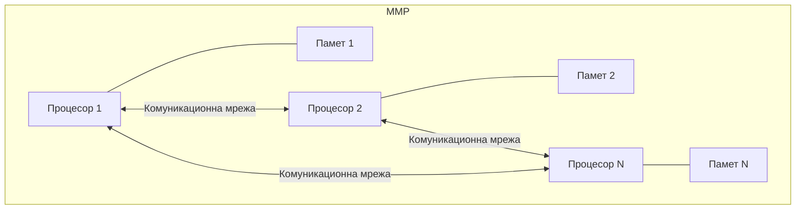

## 1. Въведение

Паралелните компютри могат да бъдат класифицирани по степента на свързаност на процесорите. **Силно свързаните системи** обединяват процесори, комуникиращи директно с обща памет чрез комуникационна мрежа. **Слабо свързаните системи** се изграждат от локални компютри, обединени в мрежа. Двата класа носят имената **SMP** (Symmetrical/Shared Memory Processors) и **MMP** (Massively Multi Processors) съответно.

При SMP компютрите времето за обмен на информация между процесорите е съизмеримо с времето за изпълнение на машинни операции; при MMP компютрите времето за обмен е по-голямо.

### 1.1. SMP архитектура

**SMP** е зрял и широко разпространен модел. "Симетрична" означава, че всеки процесор може да изпълнява всяка задача. Налице е единствена памет, единствена операционна система и единствена подсистема за вход/изход. Всеки процесор има пряк и бърз достъп до паметта. Предимствата включват: опростено системно и приложно програмиране, прозрачно разпределение на нишки от операционната система, лесна синхронизация.

Основният недостатък е лошата **мащабируемост**: добавянето на нови процесори бързо насища комуникационната мрежа към паметта. Решенията включват кеш-памети към всеки процесор и подходящо разпределение на данните по модулите памет — но кеш паражда нов проблем: **cache coherence** (вижте тема 13).

### 1.2. MMP архитектура

**MMP** използва разпределена памет — всеки процесор разполага с локална памет, до която другите процесори имат непряк и по-бавен достъп. В системата няма обща памет, поради което конфликтите за достъп до паметта са елиминирани. Броят на процесорите варира от стотици до хиляди.

*Обобщена структура на MMP компютър — всеки процесор разполага с локална памет; комуникацията е само чрез съобщения.*

Практически единственият начин за програмиране е чрез **обмен на съобщения** — технологиите **PVM** (Parallel Virtual Machine) и **MPI** (Message-Passing Interface). Благодарение на масовия паралелизъм системата е добре мащабируема, но преработката на съществуващи програми за MMP е трудоемка. Представители: Intel iPSC, IBM Scalable Power Parallel System, NCUBE, Connection Machine.

### 1.3. NUMA архитектура

**NUMA** (Non Uniform Memory Access) се стреми да обедини предимствата на двата класа. Компютърът се изгражда от *възли*, всеки от които е малък SMP (няколко процесора + локална памет), свързани помежду си чрез комуникационна мрежа. Всеки процесор може да адресира цялата памет в системата, но локалните обръщения са значително по-бързи от отдалечените.

В класическите SMP компютрите достъпът е еднакво бърз от всеки процесор — т.нар. **UMA** (Uniform Memory Access). При съвременните NUMA компютри разликата между локален и отдалечен достъп е 200–700%, което налага внимателно проектиране на разпределението на данните. Броят на процесорите в SMP сървъри е 8–16, докато NUMA архитектурата обединява 256 и повече. Примери: NUMA_Q на IBM, Alpha Wildfire на Compaq, MIPS64 на SGI.

Специална модификация — **ccNUMA** (cache coherent NUMA) — решава проблема с несъгласуваността на кеш-паметите чрез специализирани протоколи, прозрачни за програмиста.

### 1.4. Клъстерни системи

**Клъстерна система** е съвкупност от компютри, обединени в мрежа за решаване на обща задача. Изчислителните възли са стандартно произвеждани машини — еднопроцесорни или малки SMP сървъри, всеки работещ под свое копие на операционната система. Хетерогенността на системата е допустима. Примери: проект Beowulf (NASA), KLAT2, серията SGI Origin.

## 2. Абстрактен модел за изчисление в MMP компютрите

Хоар предлага модела **CSP** (Communicating Sequential Processes), описващ паралелния изчислителен процес като изпълнение на независими конкуриращи се процеси, обменящи данни чрез *канали*.

**Процес.** Описва поведението на отделен дискретен компонент от приложението. Може да включва под-процеси и може да бъде разполаган върху произволен процесор в мрежата.

**Канал.** Двупосочна или еднопосочна "точка-точка" връзка между точно два процеса. Каналът изпълнява две функции: осигурява пътя за данни и синхронизира комуникацията — процесът-приемник трябва да потвърди получаването, а процесът-изпращач изчаква потвърждението.

CSP моделът е имплементиран в езика Occam и отговаря интуитивно на паралелизма в реалния свят.

## 3. Проблеми на компютрите с разпределена памет

### 3.1. Комуникационни загуби и програмиране

Главното предизвикателство при MMP компютрите е **ефективното взаимодействие между процесорите** — достъпът до данни в нелокалните памети изисква бавни входно-изходни операции. Програмирането се извършва чрез написване на отделни програми за всеки процесор, свързани чрез низкониво операции от типа изпрати/получи съобщение. Обичайният стил е **SPMD** (Single Program Multiple Data) — всички възли изпълняват копия на една програма.

### 3.2. Фин и груб паралелизъм

Ключов въпрос при конструирането на паралелни алгоритми за MMP е минимизирането и групирането на комуникациите. Примерът с умножение на матрици върху четири процесора илюстрира разликата:

| Размерност n | Последователно | Фин паралелизъм | Груб паралелизъм |
|---|---|---|---|
| Малка | 0.005 s | 0.007 s | 0.003 s |
| Средна | 0.129 s | 0.200 s | 0.043 s |
| Голяма | 0.593 s | 0.843 s | 0.165 s |

*Резултати от измервания с транспютър T805/30 (INMOS), среда TOOLSET ANSI C.*

**Фин паралелизъм** (съобщения с размер 1 елемент) е по-бавен дори от последователното изпълнение — комуникационните разходи поглъщат цялото ускорение. **Груб паралелизъм** (процесорите работят самостоятелно върху големи сегменти, после обменят kn² елемента) постига средно 3.5× ускорение. Изводът: MMP архитектурите са подходящи предимно за алгоритми с груб паралелизъм.

### 3.3. Балансиране на натоварването

**Балансираното натоварване** изисква равномерно разпределение на задачата между процесорите, така че всички процесори да са заети максималното време. Дисбалансът увеличава броя на комуникациите и снижава производителността. Проблемът засяга едновременно алгоритмичното проектиране и работата на операционната система.

## Резюме

- **SMP** (обща памет) е лесен за програмиране, но ограничен по мащабируемост поради насищане на комуникационната мрежа.
- **MMP** (разпределена памет) поддържа хиляди процесори и добра мащабируемост, но изисква явен обмен на съобщения (PVM, MPI) и разработка на нови паралелни алгоритми.
- **NUMA** съчетава двата подхода: програмира се като SMP, но локалните обръщения са значително по-бързи; ccNUMA решава проблема с кеш-кохерентността.
- CSP моделът на Хоар (процеси + канали) е естественият абстрактен модел за MMP изчисления.
- MMP архитектурите са подходящи за **груб паралелизъм** — алгоритми с малко, но обемни комуникации; финият паралелизъм може да бъде по-бавен от последователното изпълнение.
- **Балансирането на натоварването** е критично — неравномерното разпределение на задачите пряко намалява производителността.
