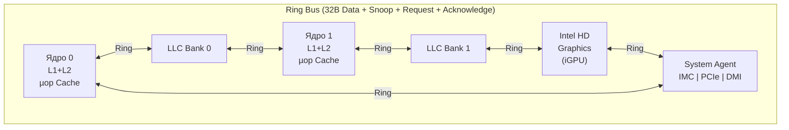

## 1. Фамилия P6: Вътрешна структура и организация на Pentium II

### Основна концепция на P6

RISC ядрото на Pentium Pro/II/III е реализирано чрез **три независими вътрешни устройства**, комуникиращи чрез **пул на инструкциите (ROB — Reorder Buffer)**:

Пулът позволява инструкциите да се **стартират извън ред**, но да **завършват по реда** им в програмата.

### 1.1 Устройство „Извличане/Декодиране"

- Получава от L1 кеш за инструкции **32 байта** за такт, указвани от **NextIP**
- **IFU (Instruction Fetch Unit)** формира 3 степени конвейер: предварително извличане → изравняване → маркиране на границите на инструкциите
- **3 паралелни декодера** разпознават инструкциите и ги преобразуват в **µops** (микрооперации):
  - Декодер 0: до 4 µops от 1 инструкция
  - Декодери 1 и 2: по 1 µop от 1 инструкция (тройка 4-1-1)
  - Сложни инструкции → µkod от **MS (Microcode Instruction Sequencer)**
- **RAT (Register Alias Table)**: преобразува архитектурните регистри в **40 физически регистъра** (синонимни регистри)
- **BTB (Branch Target Buffer)**: динамично предсказване на преходи (512 елемента); предсказва и адресите за връщане от процедури (**RSB — Return Stack Buffer**)
- Устройството заема **7 степени** от конвейера

### 1.2 Устройство „Диспечер/Изпълнение"

- **RS (Reservation Station)**: избира от ROB **готови µops** (с достъпни операнди) и ги стартира **извън ред**
- 5 изпълнителни порта: до **5 µops/такт**
- Изпълнителни устройства:
  - 2× целочислени (IU)
  - 2× плаваща запетая (FPU)
  - 1× зареждане/съхранение (Load/Store)
- **JPU (Jump Prediction Unit)**: проверява правилността на предсказания преход; при грешен — сигнализира BTB и рестартира конвейера от алтернативния адрес

### 1.3 Завършващо устройство (RRF — Retire Retire File)

- Открива завършилите µops и ги отстранява **по реда им в програмата**
- Завършва до **3 µops/такт**
- Записва резултатите в архитектурните регистри или в паметта
- Обработва прекъсвания, изключения и трасировка

### 1.4 Шинен интерфейс

- **64-разредна** системна шина, организирана на базата на **транзакции** (разделно управление на фазите адресация и данни) → конвейерна организация
- **6 × 8-разредна шина** свързва с L2 кеш; до **4 паралелни достъпа** до L2
- Подреждащ буфер за заявките към паметта

---

## 2. Архитектура NetBurst: Pentium 4

### Основна идея

NetBurst е разработена с цел **максимална тактова честота**. Постигнато чрез **много дълбок конвейер** — при Willamette/Northwood: **20 степени** (срещу 10 при P6).

> **Принципът:** По-малко работа на такт → по-висока честота → повече тактове за изпълнение.

### Ключови характеристики

| Характеристика              | Описание                                                                        |
| --------------------------- | ------------------------------------------------------------------------------- |
| **Хипер-тръбна технология** | 20-степенен конвейер (Prescott: 31 степени)                                     |
| **Execution Trace Cache**   | Кешира вече декодирани µops, не CISC байтове                                    |
| **Rapid Execution Engine**  | Целочислената ALU работи на **2× тактова честота** на ядрото                    |
| **Replay System**           | Повтаря µops при грешка в предсказването на латентността                        |
| **Quad-pumped FSB**         | Предна системна шина работи на 4× честотата (800 MHz ефективно при 200 MHz FSB) |
| **Hyper-Threading**         | Две логически нядра върху един физически (виж т.3)                              |

### Проблеми на NetBurst

- **Дълбокият конвейер** = голяма наказателна цена при грешно предсказан преход (20–31 такта загуба)
- Консумация на мощност нараства рязко с честотата
- Pentium 4 не успява да достигне планираните 10 GHz → архитектурата е изоставена
- Заменена от Core микроархитектурата (базирана на P6, не на NetBurst)

**Поколения NetBurst:**

- Willamette (180 nm, 2000) → Northwood (130 nm, 2002) → Prescott (90 nm, 2004) → Cedar Mill (65 nm, 2006)

---

## 3. Технология Hyper-Threading (HTT)

### Какво е Hyper-Threading?

**Симултанно многонишково изпълнение (SMT)** — технология, при която един физически процесорен кристал се представя на операционната система като **два логически процесора**.

### Как работи?

Един физически процесор представя на ОС **два логически процесора** — всеки с дублирано архитектурно състояние (GPR, EFLAGS, EIP, сегментни и управляващи регистри), но **споделени изпълнителни ресурси** (ALU, FPU, кеш, шинен интерфейс).

- **Дублирани**: регистри на архитектурното състояние (GPR, EFLAGS, EIP, сегментни регистри, управляващи регистри, APIC регистри)
- **Споделени**: изпълнителни устройства, L1/L2 кеш, шинен интерфейс

### Принцип на действие

1. Когато нишка 0 е в **изчакване** (напр. кеш пропуск), изпълнителните ресурси стоят **празни**
2. HTT позволява нишка 1 да **използва тези ресурси** вместо тях да пропадат
3. ОС планира две независими нишки → по-добро натоварване на процесора

### Исторически бележки

- Въведена в Pentium 4 (Northwood) и Xeon (2002)
- Изоставена в Core (2006) — заради конфликт на ресурси при P6 ядрото
- Върната в **Nehalem** (2008) и всички следващи Intel архитектури

### Ефективност

- Теоретично до ~30% подобрение на производителността при многонишкови приложения
- Зависи силно от приложението — при сходни нишки могат да влязат в конфликт за ресурси

---

## 4. Многоядрени архитектури: Core, Core 2, Nehalem, Sandy Bridge, Skylake

### 4.1 Intel Core (Yonah, 2006)

- Базирана на **P6**, не на NetBurst → 14-степенен конвейер (много по-кратък)
- **Двуядрен** от изхода
- Споделен L2 кеш между ядрата
- Без HTT (върна се по-късно)
- Macro-op fusion: комбинира CMP+Jcc в 1 µop

### 4.2 Intel Core 2 (Conroe/Merom, 2006)

- **Нов, по-широк** frontend: 4 µops декодирани на такт (спрямо 3 при P6)
- 14-степенен конвейер
- Wide execution: до **6 µops изпълнени на такт**
- **Micro-op fusion**: зареждане+ALU в 1 ROB запис
- Двуядрени и четириядрени конфигурации
- 65 nm процес (Conroe) → 45 nm (Penryn/Wolfdale)

### 4.3 Nehalem (2008)

- Ново **32 nm** производство; първо поколение **Core i7**
- **Нова системна шина**: FSB заменена с **QPI (QuickPath Interconnect)** — директна точка-до-точка връзка между процесора и chipset
- Завърнат **Hyper-Threading** (2 нишки/ядро)
- **3-ниво кеш йерархия**: L1 (32 KB) + L2 (256 KB) + L3 (8–24 MB, споделен между всички ядра)
- Вградена **контролер за памет** в процесора (IMC)
- Двуядрени, четириядрени и шестядрени варианти

### 4.4 Sandy Bridge (2011)

Sandy Bridge е **пълно преработване** на микроархитектурата — новостта е в механизма за OoO изпълнение.

**Ключови нови характеристики:**

- **µop Cache (Decoded ICache)**: кешира вече декодирани µops (≈1536 µop); при попадание — **заобикаля декодерите** → по-бърз и по-енергоспестяващ fetch
- **Физически регистров файл**: µops носят само **указатели** към регистрите, не самите данни → по-ефективен OoO engine
- **Ring Bus**: 4 независими пръстена (**Request, Snoop, Acknowledge, Data**) свързват ядрата, L3 кеш блоковете, GPU и системния агент

- Вграден **GPU** (Intel HD Graphics) на същия кристал (die) — първото истинско интегриране
- **AVX инструкции** (256-битови SIMD операции с плаваща запетая)
- 32 nm процес; 22 nm (Ivy Bridge е следника, с 3D транзистори)

### 4.5 Skylake (2015)

Skylake е еволюционен наследник на Haswell (2013).

**Ключови характеристики:**

- 14 nm процес
- **µop Cache**: разширен до 1536 µops, bandwidth 6 µops/такт (спрямо 4 при Haswell)
- **Out-of-Order window**: 224 ROB записа (спрямо 192 при Haswell)
- **Нови execution портове**: порт 7 за съхранение с адресиране; подобрена целочислена и FP производителност
- **DDR4 и LPDDR3** поддръжка; нов **DMI 3.0** за chipset
- **Intel Speed Shift Technology**: по-бързо управление на честотата
- **TSX (Transactional Synchronization Extensions)**: хардуерна транзакционна памет
- Ring Bus остава в еднопроцесорни конфигурации; Skylake-EP (Purley) мигрира към **mesh мрежа**

### Сравнение на многоядрените архитектури

| Архитектура     | Год. | Конвейер | Нишки/ядро | L3 кеш      | Процес   | Ключова новост             |
| --------------- | ---- | -------- | ---------- | ----------- | -------- | -------------------------- |
| Core (Yonah)    | 2006 | 14       | 1          | Споделен L2 | 65 nm    | P6 завръщане               |
| Core 2 (Conroe) | 2006 | 14       | 1          | 4–12 MB     | 65/45 nm | Широк OoO, macro-op fusion |
| Nehalem         | 2008 | 14       | 2 (HTT)    | 8–24 MB     | 45 nm    | QPI, IMC, L3               |
| Sandy Bridge    | 2011 | 14       | 2 (HTT)    | 6–20 MB     | 32 nm    | µop кеш, Ring Bus, iGPU    |
| Skylake         | 2015 | 14       | 2 (HTT)    | 8–32 MB     | 14 nm    | Разширен ROB, DDR4         |

---

## Резюме за изпита

> - **P6** е first out-of-order RISC ядро с ROB, BTB, RAT и 3 декодера
> - **NetBurst** = дълбок конвейер (20–31 степени) за висока честота, но голяма наказателна цена при грешни преходи
> - **Hyper-Threading** = дублирано архитектурно състояние + споделени изпълнителни ресурси → 2 логически процесора от 1 физически
> - **Sandy Bridge** въвежда µop кеш и ring bus; **Skylake** разширява OoO прозореца и µop bandwidth-а
>
> [→ Речник на всички съкращения](/microprocessor-systems/glossary/)

---

**Източници:**

- [NetBurst — Wikipedia](https://en.wikipedia.org/wiki/NetBurst)
- [The Microarchitecture of the Pentium 4 Processor — UMass](http://www.ecs.umass.edu/ece/koren/ece568/papers/Pentium4.pdf)
- [Hyper-threading — Wikipedia](https://en.wikipedia.org/wiki/Hyper-threading)
- [Sandy Bridge — Wikipedia](https://en.wikipedia.org/wiki/Sandy_Bridge)
- [Sandy Bridge: Setting Intel's Modern Foundation — Chips and Cheese](https://chipsandcheese.com/p/sandy-bridge-setting-intels-modern-foundation)
- [Skylake: Intel's Longest Serving Architecture — Chips and Cheese](https://chipsandcheese.com/p/skylake-intels-longest-serving-architecture)
- [Nehalem (microarchitecture) — Wikipedia](<https://en.wikipedia.org/wiki/Nehalem_(microarchitecture)>)
- [The Microarchitecture of Intel, AMD, and VIA CPUs — Agner Fog](https://www.agner.org/optimize/microarchitecture.pdf)
- Рускова Н. _Микропроцесорни системи._ ТУ-Варна, 1999
