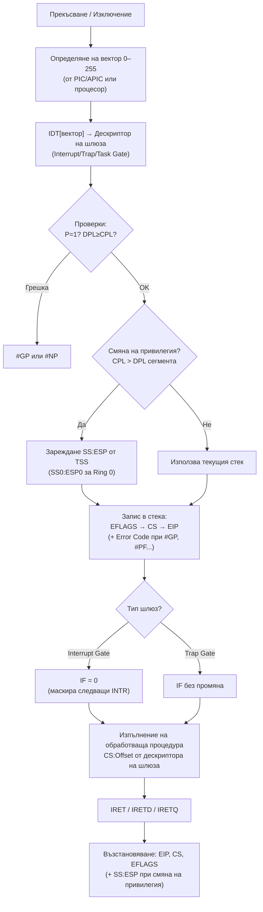
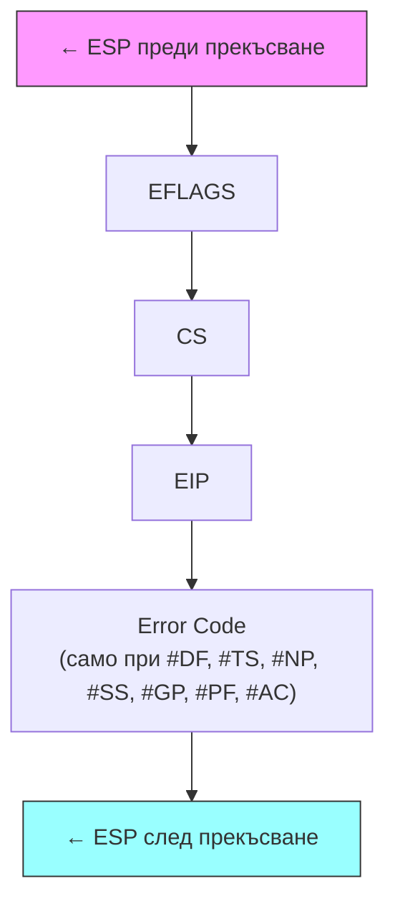
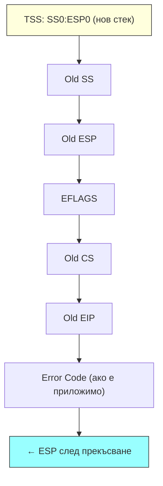
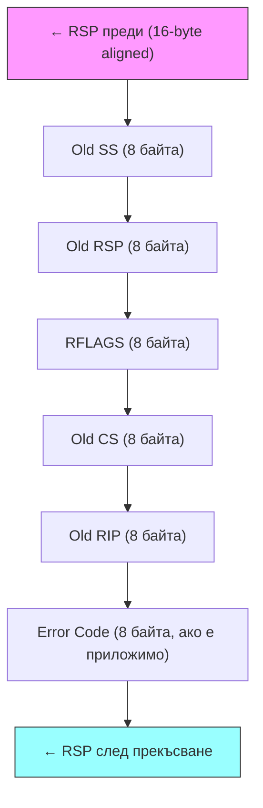

## 1. Видове прекъсвания и изключения. Вектори

### Изключения (Exceptions)

Изключенията са **вътрешни събития**, синхронни с изпълнението на програмата. Три вида:

| Вид                 | Описание                                                                                             | Точка на връщане          |
| ------------------- | ---------------------------------------------------------------------------------------------------- | ------------------------- |
| **Грешки (Faults)** | Откриват се **преди или по** изпълнение на инструкция; инструкцията се **рестартира** след обработка | EIP → грешната инструкция |
| **Капани (Traps)**  | Откриват се **на границата** между инструкции; изпълнението продължава от **следващата** инструкция  | EIP → следваща инструкция |
| **Аборти (Aborts)** | Критични грешки — **не може да продължи** нормалното изпълнение                                      | Не се гарантира           |

### Прекъсвания (Interrupts)

Прекъсванията са **асинхронни сигнали** от хардуер или програма, които спират нормалния поток на изпълнение и пренасочват процесора към **обработваща процедура (ISR — Interrupt Service Routine)**. За разлика от изключенията, прекъсванията са предизвикани от събития **извън текущата инструкция** — например периферно устройство е завършило операция.

**Защо са нужни прекъсванията?**  
Без тях процесорът трябва постоянно да проверява (polling) дали устройството е готово — огромна загуба на процесорно време. С прекъсванията устройството само сигнализира, а процесорът работи с друго до тогава.

**Видове прекъсвания:**

| Вид                    | Вход      | Вектор                 | Маскируемо?           | Описание                                                          |
| ---------------------- | --------- | ---------------------- | --------------------- | ----------------------------------------------------------------- |
| **Маскируемо (INTR)**  | INTR щифт | от контролера (32–255) | **Да** — IF=0 (`CLI`) | Хардуерни прекъсвания от ВУ: клавиатура, диск, мрежа, таймер      |
| **Немаскируемо (NMI)** | NMI щифт  | 2                      | **Не**                | Критични хардуерни грешки: паметна грешка, шинна грешка, watchdog |
| **Програмно**          | `INT n`   | n (0–255)              | —                     | Системни повиквания, BIOS услуги, дебъгинг                        |

**Цикъл на обработка на маскируемо прекъсване (стъпка по стъпка):**

1. Хардуерът активира **INTR** = 1 (изход на i8259A / APIC)
2. Процесорът **завършва текущата инструкция** — прекъсванията не прекъсват по средата на инструкция
3. Процесорът проверява **EFLAGS.IF**: ако IF=0 — заявката се игнорира; ако IF=1 — продължава
4. Процесорът изпълнява **два INTA цикъла**: при втория контролерът поставя **вектора (0–255)** на D0–D7
5. Процесорът **записва в стека**: EFLAGS → CS → EIP (за 64-битов: RFLAGS → CS → RIP)
6. Ако шлюзът е **Interrupt Gate**: IF се изчиства автоматично (нови маскируеми прекъсвания са забранени по вр. на ISR)
7. Процесорът зарежда нов **CS:EIP** от IDT[вектор] и прескача към ISR
8. ISR изпълнява обработката и изпраща **EOI** (End of Interrupt) към контролера (i8259A / APIC)
9. **IRET** → възстановява EIP, CS, EFLAGS (IF=1) от стека; изпълнението се подновява от прекъснатата точка

> **Ключова разлика прекъсвания vs изключения:**  
> Прекъсванията са _асинхронни_ — идват по всяко време от хардуер. Изключенията са _синхронни_ — генерират се детерминирано от конкретна инструкция. Механизмът за обработка (IDT → стек → ISR → IRET) е еднакъв и за двата вида.

### Вектори (Interrupt/Exception Vectors)

Всяко прекъсване/изключение се идентифицира с **вектор (номер) — 0 до 255**:

- Вектори **0–31**: запазени за изключения на процесора (Intel определени)
- Вектори **32–255**: за маскируеми прекъсвания от контролера

**Таблица на стандартните изключения:**

| Вектор | Мнемоника | Тип        | Описание                        |
| ------ | --------- | ---------- | ------------------------------- |
| 0      | #DE       | Fault      | Деление на нула                 |
| 1      | #DB       | Fault/Trap | Тестване (Debug)                |
| 2      | —         | Interrupt  | NMI прекъсване                  |
| 3      | #BP       | Trap       | Прекъсна точка (`INT3`)         |
| 4      | #OF       | Trap       | Препълване (`INTO`)             |
| 5      | #BR       | Fault      | Нарушение на граница (`BOUND`)  |
| 6      | #UD       | Fault      | Невалиден опкод                 |
| 7      | #NM       | Fault      | Устройство недостъпно (FPU)     |
| 8      | #DF       | Abort      | Двойна грешка                   |
| 10     | #TS       | Fault      | Невалиден TSS                   |
| 11     | #NP       | Fault      | Сегментът не е налице           |
| 12     | #SS       | Fault      | Нарушение на стека              |
| 13     | #GP       | Fault      | Общо нарушение на защитата      |
| 14     | #PF       | Fault      | Странично нарушение             |
| 16     | #MF       | Fault      | Грешка на плаваща запетая (x87) |
| 17     | #AC       | Fault      | Нарушение на изравняване        |
| 18     | #MC       | Abort      | Машинна проверка                |
| 19     | #XF       | Fault      | Грешка на SIMD FP               |

---

## 2. Източници на прекъсвания. Приоритети

### Приоритети (от най-висок към най-нисък)

1. **Всички грешки** (с изключение на вектор 1)
2. **Капани** (Traps)
3. **Изключение 1** за текущата инструкция
4. **Изключение 1** за следващата инструкция
5. **NMI** (немаскируемо прекъсване, вход NMI)
6. **INTR** (маскируеми прекъсвания); по-малък номер = по-висок приоритет

**Маскиране:**

- IF=0 (CLI) → INTR прекъсванията са маскирани
- Немаскируемото прекъсване (NMI) се блокира само ако в момента се обработва друго NMI

---

## 3. Системни структури за обработка на прекъсвания и изключения

### IDT (Interrupt Descriptor Table)

- **Таблица с дескриптори на шлюзове** за всеки вектор (0–255)
- До **256 записа** × 8 байта = 2 KB (минимален размер)
- Адресира се от регистъра **IDTR** (32-битов базов адрес + 16-битов лимит)
- Може да бъде навсякъде в паметта

### Алгоритъм при прекъсване/изключение



1. Записва се в стека: **EFLAGS, CS, EIP** (и Error Code при определени изключения)
2. МП получава вектора на прекъсването
3. Чрез вектора се индексира **IDT** → извлича се дескрипторът на шлюза
4. Шлюзът указва CS:EIP на **обработващата процедура**
5. Изпълнява се обработващата процедура
6. Процедурата завършва с `IRET`/`IRETD` → възстановяват се EIP, CS, EFLAGS

---

## 4. Формати на шлюзове в 32- и 64-битов режим

### 32-битов Interrupt Gate

```
Bytes 7–4: Offset[31:16] | P | DPL | 0 | 1110 (тип) | 0 | 0 | 0 | 0
Bytes 3–0: Segment Selector [31:16] | Offset[15:0]
```

| Поле                       | Описание                                                   |
| -------------------------- | ---------------------------------------------------------- |
| **Offset**                 | Адресът на началото на обработващата процедура (CS:Offset) |
| **Selector**               | Селектор на кодов сегмент в GDT или LDT                    |
| **[P](/microprocessor-systems/06-segmentation/)** | Present: P=0 → изключение #NP                              |
| **DPL**  | Минималното CPL, от което може да се извика с `INT n`      |
| **Type**                   | 01110B = 32-bit Interrupt Gate; 01111B = 32-bit Trap Gate  |

**Разлика между Interrupt Gate и Trap Gate:**

- **Interrupt Gate**: при активиране → **IF се нулира** (маскира следващи INTR прекъсвания)
- **Trap Gate**: при активиране → **IF не се нулира** (прекъсванията остават разрешени)

### Task Gate (Шлюз на задача)

- Предизвиква **превключване на задача** при прекъсване
- Съдържа само TSS Selector → МП превключва контекста

### 64-битов Interrupt/Trap Gate (16 байта)

В Long Mode шлюзовете са **16 байта** (разширен Offset до 64 бита):

```
Bytes 15–8: Offset[63:32]
Bytes 7–4:  Offset[31:16] | P | DPL | 0 | Type | IST (3 бита)
Bytes 3–0:  Selector | Offset[15:0]
```

**IST (Interrupt Stack Table)** — поле от 3 бита, указва стек от TSS за задължително превключване при обработка на прекъсване (дори от Ring 0 → Ring 0).

---

## 5. Обслужване на прекъсвания и изключения в 32- и 64-битов режим

### 32-битов режим

**При прекъсване/изключение без превключване на привилегия (CPL = DPL):**



**При прекъсване с превключване на привилегия (CPL > DPL):**



### 64-битов режим (Long Mode)

- **64-битови стойности** за RIP, RSP, CS, SS се записват в стека
- **RSP изравнен на 16 байта** преди записа



### Завръщане с IRET/IRETD/IRETQ

- Възстановява **EIP/RIP, CS, EFLAGS/RFLAGS** от стека
- При NI=1 в EFLAGS → изпълнява превключване на задача (не нормално връщане)

---

## 6. Превключване на стековете при обработка на прекъсвания

### Защо е необходимо?

При прекъсване с превключване на привилегия (от Ring 3 → Ring 0) трябва да се използва **стек с по-висока привилегия**. Потребителският стек не е надежден за ядрото.

### Механизъм в 32-битов режим

- Стековете за нива 0, 1 и 2 са **предварително дефинирани** в **TSS**:
  - `SS0:ESP0` — стек за ниво 0
  - `SS1:ESP1` — стек за ниво 1
  - `SS2:ESP2` — стек за ниво 2
- При прекъсване: МП зарежда SS:ESP от TSS, записва стария SS:ESP+EFLAGS+CS+EIP в новия стек

### Механизъм в 64-битов режим (IST)

В Long Mode TSS съдържа **IST (Interrupt Stack Table)** — 7 указателя към стекове (IST1–IST7). Шлюзът в IDT може да задава кой IST стек да се използва (дори при Ring 0 → Ring 0 преход). Полезно за NMI и #DF обработка.

### Внимание при превключване на SS

При промяна на SS с `MOV SS, AX` + `MOV ESP, value`, прекъсванията между двете инструкции биха довели до невалидно SS:ESP. Затова МП **автоматично маскира** прекъсванията след инструкция, модифицираща SS, до края на следващата инструкция.

---

## Резюме за изпита

> - Изключения: Faults (рестартиране), Traps (следваща инструкция), Aborts (критични)
> - Прекъсвания: INTR (маскируеми, IF флаг), NMI (немаскируемо, вектор 2)
> - Вектори 0–31: системни изключения; 32–255: маскируеми прекъсвания
> - IDT: до 256 шлюза × 8/16 байта; адресира се от IDTR
> - Interrupt Gate → IF=0 (блокира INTR); Trap Gate → IF без промяна
> - При прекъсване: EFLAGS+CS+EIP в стека (+ Error Code при #GP, #PF и др.)
> - Превключване на стек: от TSS (SS0:ESP0 за Ring 0) в 32-бит; IST в 64-бит
> - IRET: възстановява EIP, CS, EFLAGS от стека
>
> [→ Речник на всички съкращения](/glossary/)

---

**Източници:**

- Рускова Н. _Микропроцесорни системи._ ТУ-Варна, 1999 (OCR)
- Intel 64 and IA-32 Architectures Software Developer's Manual, Vol. 3A, Chapter 6 (Interrupt and Exception Handling)
