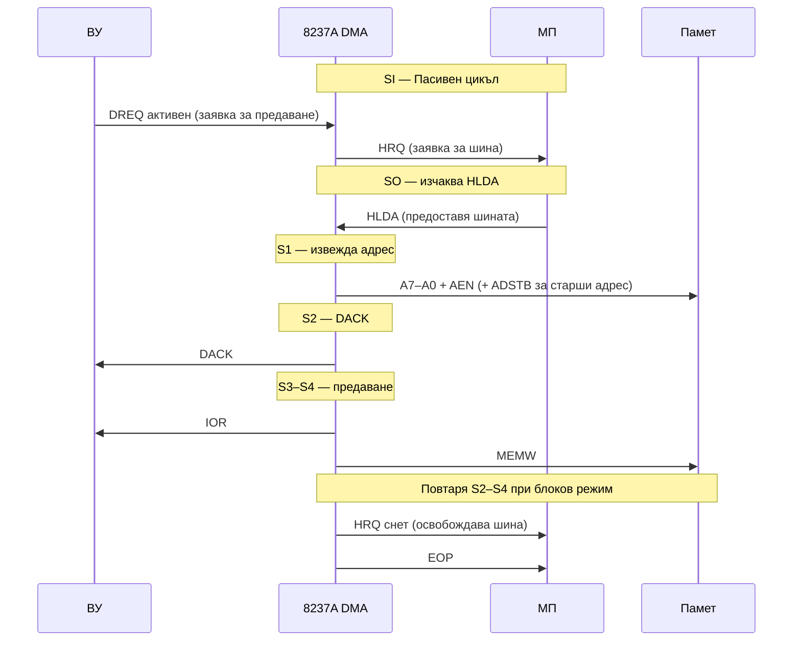

## 1. Концепция за пряк достъп до паметта (DMA)

**DMA (Direct Memory Access)** позволява обмен на данни между входно-изходни устройства (ВУ) и паметта **без намеса на процесора**:

- Процесорът само **стартира** операцията (задава адрес, брой, посока) и **регистрира завършването** й
- DMA контролерът **заема шината** от процесора и изпълнява предаването самостоятелно
- Процесорът и DMA работят **паралелно** — всеки изпълнява своите задачи

**Предимство**: значително по-висока пропускателна способност в сравнение с програмиран В/И (polling) или прекъсвания.

---

## 2. Контролер 8237A — общ преглед

**Intel 8237A** (i8237A) е програмируем DMA контролер, използван в системи на базата на i8086/i286. В 32-битови системи се използват съвместими интегрирани DMA контролери (напр. в PCI чипсети).


### Характеристики

| Параметър                     | Стойност                           |
| ----------------------------- | ---------------------------------- |
| **Брой канали**               | 4 независими                       |
| **Максимален адрес на памет** | 64 KB на канал (16-битов брояч)    |
| **Разширение на адреса**      | Чрез външни регистри на страниците |
| **Каскадно свързване**        | Да (за повече от 4 канала)         |

---

## 3. Вътрешна структура на 8237A

Три основни блока за управление:

### 3.1 Синхронизация и управление

Генерира вътрешни и външни сигнали:

| Сигнал    | Описание                                              |
| --------- | ----------------------------------------------------- |
| **MEMR#** | Memory Read — четене от памет                         |
| **MEMW#** | Memory Write — запис в памет                          |
| **IOR#**  | I/O Read — четене от ВУ                               |
| **IOW#**  | I/O Write — запис към ВУ                              |
| **AEN**   | Address Enable — строб на валиден адрес (A7–A0)       |
| **ADSTB** | Address Strobe — синхронизира старшата част на адреса |
| **READY** | Готовност на паметта/устройството                     |
| **CS#**   | Chip Select — избор на контролера от МП               |

### 3.2 Управление на команди

Декодира командите, изпратени от МП и определя режима на обслужване.

### 3.3 Блок за управление на приоритета

| Сигнал                      | Описание                                   |
| --------------------------- | ------------------------------------------ |
| **DREQ0–DREQ3**             | DMA Request — заявки от ВУ (асинхронни)    |
| **DACK0–DACK3**             | DMA Acknowledge — разрешение за обслужване |
| **HRQ**   | Hold Request — заявка към МП за шина       |
| **HLDA** | Hold Acknowledge — МП предоставя шината    |

### 3.4 Регистри на каналите (4 канала × 4 регистъра)

| Регистър        | Описание                                               |
| --------------- | ------------------------------------------------------ |
| **Базов адрес** | Начален адрес; зарежда се преди операцията             |
| **Базов брояч** | Брой думи за предаване; зарежда се преди операцията    |
| **Текущ адрес** | Адресът на следващия елемент; обновява се автоматично  |
| **Текущ брояч** | Остатъчен брой думи; намалява с 1 след всяко предаване |

> **Базовите** регистри не се променят при изпълнение — служат за автоматично инициализиране. **Текущите** регистри отразяват моментното състояние.

---

## 4. Функциониране — пасивен и активен цикъл

### 4.1 Пасивен цикъл (SI)

Когато няма заявка за обмен, контролерът изпълнява пасивен цикъл:

- Следи DREQ0–DREQ3 от ВУ
- При активен CS# → **режим на програмиране** (МП адресира регистрите)
  - A3–A0 → адрес на регистър
  - IOR#/IOW# → четене/запис
  - D7–D0 → данни
  - Вътрешен тригер за старши/младши байт на 16-битовите регистри

### 4.2 Активен цикъл

При получена заявка DREQ:

```
SO: HRQ активен → изчаква HLDA от МП
S1: Извежда текущия адрес (A7–A0) + управляващ сигнал AEN
    Старшата част на адреса (D7–D0) → запомня се в регистъра на страниците (ADSTB)
S2: DACK активен → ВУ е разрешено
S3–S4: Активни едновременно MEMW# + IOR# (запис от ВУ в памет)
        или MEMR# + IOW# (четене от памет към ВУ)
```

При **блоково предаване**: старшата част на адреса се извежда само веднъж за всеки 256 цикъла — следващите S2-S3-S4 не повтарят S1.



---

## 5. Режими на активен цикъл

| Режим                   | Описание                                                                              |
| ----------------------- | ------------------------------------------------------------------------------------- |
| **Единично предаване**  | При HLDA — едно предаване → освобождава шина; автоматично обновяване на брояча/адреса |
| **Блоково предаване**   | Серия предавания до изчерпване на брояча или сигнал EOP#                              |
| **Предаване по заявка** | Серия предавания до изчерпване на брояча, EOP# или снемане на DREQ                    |
| **Каскаден режим**      | HRQ/HLDA на допълнителния контролер = DREQ/DACK на канал на главния                   |

### Типове предавания

| Тип          | Управляващи сигнали  | Описание                                               |
| ------------ | -------------------- | ------------------------------------------------------ |
| **Запис**    | MEMW# + IOR# активни | ВУ → Памет                                             |
| **Четене**   | MEMR# + IOW# активни | Памет → ВУ                                             |
| **Проверка** | Никакви изходи       | Псевдопредаване — DMA генерира адреси без реален обмен |

---

## 6. Предаване памет → памет

8237A поддържа предаване **памет–памет** с Канал 0 (четене) и Канал 1 (запис):

1. Програмно активиране на DREQ0
2. При HLDA: Канал 0 чете байт → вътрешен буфер
3. Канал 1 записва буфера по текущия адрес на Канал 1
4. При изчерпване на брояча на Канал 1 → EOP# сигнал

Канал 0 може да бъде програмиран с фиксиран адрес — така може да се **инициализира блок памет** с едно и също съдържание.

---

## 7. Програмиране на контролера

### Управляващ регистър (CR) — 8-разреден

| Бит   | Функция                                             |
| ----- | --------------------------------------------------- |
| CR[0] | Разрешава (1) / забранява (0) предаване памет–памет |
| CR[1] | Канал 0 фиксиран адрес (1) / инкрементиращ (0)      |
| CR[2] | Забранява (1) / разрешава (0) контролера            |
| CR[4] | Ротационен (1) / фиксиран (0) приоритет             |
| CR[6] | DREQ активно ниско (1) / високо (0)                 |
| CR[7] | DACK активно ниско (1) / високо (0)                 |

### Регистър на режима (MR) — 8-разреден, на канал

| Бита    | Функция                                                   |
| ------- | --------------------------------------------------------- |
| MR[1:0] | Номер на канала                                           |
| MR[3:2] | Тип предаване: 00=проверка, 01=запис, 10=четене           |
| MR[4]   | Автоинициализация (1=разрешена)                           |
| MR[5]   | Инкрементиране (0) / декрементиране (1) на адреса         |
| MR[7:6] | Режим: 00=по заявка, 01=единично, 10=блоково, 11=каскадно |

### Регистър за заявка (RR) — програмна заявка (немаскируема)

| Бит     | Функция                              |
| ------- | ------------------------------------ |
| RR[1:0] | Номер на канала                      |
| RR[2]   | Вдига (1) / снема (0) бита за заявка |

### Регистър на маските (RM) — маскира заявка по канал

| Бит     | Функция                            |
| ------- | ---------------------------------- |
| RM[1:0] | Номер на канала                    |
| RM[2]   | Установява (1) / снема (0) маската |

### Регистър на състоянието (SR) — само за четене

Показва кой канал е достигнал края на операцията и кой все още обработва заявка.

### Адресация на вътрешните регистри

| Регистър              | Операция     | CS# | IOR# | IOW# | A3  | A2  | A1   | A0     |
| --------------------- | ------------ | --- | ---- | ---- | --- | --- | ---- | ------ |
| CR                    | Запис        | 0   | 1    | 0    | 1   | 0   | 0    | 0      |
| MR                    | Запис        | 0   | 1    | 0    | 1   | 0   | 1    | 1      |
| RR                    | Запис        | 0   | 1    | 0    | 1   | 0   | 0    | 1      |
| RM                    | Запис        | 0   | 1    | 0    | 1   | 0   | 1    | 0      |
| SR                    | Четене       | 0   | 0    | 1    | 1   | 0   | 0    | 0      |
| Текущ адрес (канал n) | Четене/Запис | 0   | x    | x    | 0   | 0   | n[1] | n[0]   |
| Текущ брояч (канал n) | Четене/Запис | 0   | x    | x    | 0   | 0   | n[1] | n[0]+1 |

**Команди** (CS#=0, IOR#=1, IOW#=0):

| A3  | A2  | A1  | A0  | Команда                                     |
| --- | --- | --- | --- | ------------------------------------------- |
| 1   | 1   | 0   | 0   | Нулиране на тригера указател на байтове     |
| 1   | 1   | 0   | 1   | Начално установяване (Master Clear)         |
| 1   | 1   | 1   | 0   | Нулиране на регистъра на маските            |
| 1   | 1   | 1   | 1   | Запис в цялото поле на регистъра на маските |

---

## 8. Адресно пространство в IBM PC

| Адреси          | Описание                       |
| --------------- | ------------------------------ |
| **0000h–000Fh** | DMA 1 (канали 0–3)             |
| **00C0h–00DEh** | DMA 2 (канали 4–7, каскаден)   |
| **0080h–0083h** | Регистри на страниците (DMA 1) |
| **0088h–008Bh** | Регистри на страниците (DMA 2) |

---

## 9. Пример за програмиране (реален режим)

Конфигурация на канал 2 на DMA за четене на 512 байта от дискетно устройство:

```asm
; Канал 2: четене, единично, без автоинициализация, адрес +1
mov al, 46h         ; 01000110B: канал 2, четене, единично, +1
out 00Bh, al        ; записва в регистъра на режима
out 00Ch, al        ; нулира тригера указател на байтове

; Изчисляване на физическия адрес на буфера
mov ax, cs
mov cl, 4
rol ax, cl          ; cx:ax = адрес на сегмента
mov ch, al
and ch, 0F0h        ; ch = старши 4 бита на адреса
add ax, offset BUF  ; добавя отместване
adc ch, 0           ; пренос към страницата

; Запис на адреса
out 04h, al         ; младши байт на адреса → канал 2 (DMA1 = 04h)
mov al, ah
out 04h, al         ; старши байт

; Запис на страницата
mov al, ch
out 81h, al         ; регистър на страниците, канал 2

; Запис на брояча (512 байта - 1 = 511 = 01FFh)
mov ax, 511
out 05h, al         ; младши байт → канал 2 (DMA1 = 05h)
mov al, ah
out 05h, al         ; старши байт

; Разрешаване на канал 2
mov al, 02h         ; снема маската на канал 2
out 0Ah, al

BUF DB 512 DUP(?)   ; буфер
```

---

## 10. Интегрирани DMA контролери (PCI)

В съвременните PCI чипсети (напр. Intel 82371AB / PIIX4) са включени **два съвместими 8237 контролера** — каскадно свързани, с 7 независими канала.

Конфигурационни режими на канал:

- **ISA DMA** — стандартни сигнали DREQ/DACK
- **DMA стил PC/PCI** — PCI линии REQ#/GNT# за PCI базирани ВУ
- **Разпределена DMA (DDMA)** — DMA регистрите са физически в PCI устройство; PIIX4 работи като посредник

---

## Резюме за изпита

> - DMA: обмен памет–ВУ без процесор; МП само стартира и регистрира
> - 8237A: 4 канала; базови + текущи регистри (адрес + брояч) на канал
> - HRQ/HLDA: заявка/разрешение за шина; DREQ/DACK: заявка/разрешение от ВУ
> - Пасивен цикъл: SI (следи DREQ, програмира се от МП)
> - Активен цикъл: SO → S1 (адрес) → S2 (DACK) → S3–S4 (данни) → снема HRQ
> - Режими: единично, блоково, по заявка, каскадно
> - Типове: запис (ВУ→Памет), четене (Памет→ВУ), проверка (псевдо)
> - Автоинициализация: текущи := базови след края на операцията
>
> [→ Речник на всички съкращения](/glossary/)

---

**Източници:**

- Рускова Н. _Микропроцесорни системи._ ТУ-Варна, 1999 (OCR)
- Intel 8237A-5 Programmable DMA Controller Datasheet
- Intel 82371AB PCI-to-ISA/IDE Xcelerator (PIIX4) Datasheet
